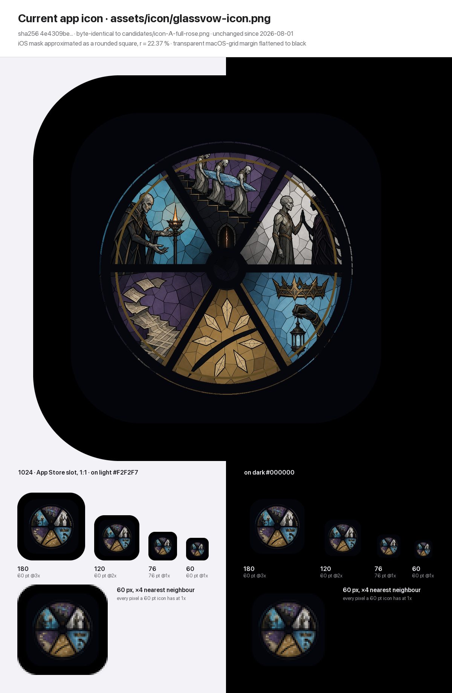
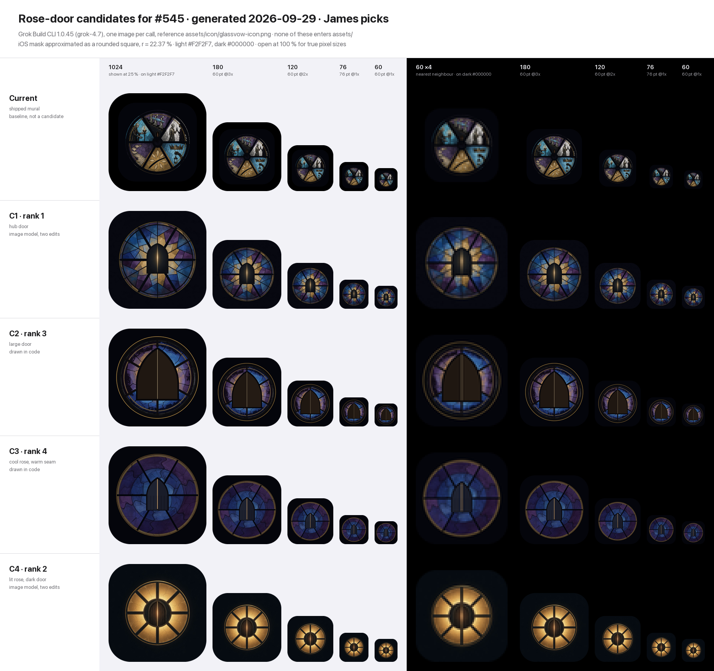
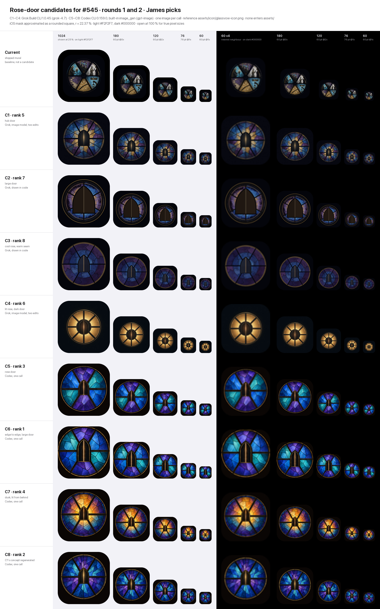

# The app icon against the signed rose-door brief (#545 inspection)

**Status:** inspection complete, 2026-09-29. The shipped icon does not meet the brief. Eight generated candidates from two rounds, C1 to C4 from Grok and C5 to C8 from Codex, wait for James to pick one and sign it at arm's length. The recommendation is C6 (see Round 2). Nothing here enters `assets/`; the shipped `glassvow-icon.png` and `glassvow.icns` are untouched. Owner: James. Author: Claude (Opus 5.5), for #545 under #409.

**Authority.** The brief is #409's icon line, which carries #243's resolution (signed 2026-08-19) unchanged. This record judges the current file against it and does not reopen it.

## What was inspected

| | |
|---|---|
| Shipped file | `assets/icon/glassvow-icon.png`: 1024 × 1024 RGBA, sha256 `4e4309be3af4440673c880d60625a45d45b4495c03efaa3e0120dd7d83a8ba04`. |
| History | Last changed 2026-08-01, when it shipped as a provisional pending James's pick. It is byte-identical to `assets/icon/candidates/icon-A-full-rose.png`. On 2026-08-19 #243 ruled that this file "does not ship", and it has not changed since. |
| What it is | A crop of the in-game Emberglass rose, `assets/art/meta/emberglass-mural.png` under `emberglass-frame.png`, seated on the macOS icon grid by `tools/make_icon_master.py` (824 px live area inside a transparent 100 px margin). It has no generation prompt of its own and no art-ledger row. |
| Earlier candidates | `icon-B-shard-star.png` enlarges the gold pane; `icon-C-lantern.png` shows a crown over a gloved hand holding a lantern. Neither has a door, and C has a hand. |
| Prompt source | `docs/` has no app-icon art bible and the art ledger has no app-icon row, so there is no ledger prompt. The candidates below quote #243's wording instead. |

## How it was rendered

Pillow, from the 1024 master. Each master is flattened opaque on black, because the App Store slot must be opaque, then downsampled with Lanczos to 180 px (60 pt @3x), 120 px (60 pt @2x), 76 px (76 pt @1x) and 60 px (60 pt @1x). Each render is masked by a rounded square whose corner radius is 22.37 % of the side, an approximation of Apple's squircle, and shown on light `#F2F2F7` and dark `#000000`. The first sheet shows the 1024 master at 1:1 across both backgrounds; the candidates sheet shows it at 25 %. The 60 px render is also shown ×4 with nearest-neighbour scaling: exactly the pixels a 60 pt icon has at 1x, readable on any screen. Open the sheets at 100 % for true sizes.



## Verdict, item by item

| Brief item | Verdict | What I saw |
|---|---|---|
| Rose-window identity | **Met** | A circular leaded rose with six spokes and a thin gold ring, in cobalt, violet, gold and pale glass. At 60 px the round wheel of coloured glass still reads as a rose window. |
| A sealed door with a hairline of light | **Not met** | #243 makes the door the hub; here the hub is an empty dark disc. The only door is a scene detail: a 50 × 68 px pointed arch with a 2 px crack of light at the foot of the stairs in the top pane. At 60 px it is about 3 × 4 px and the crack is sub-pixel. |
| One to three legible shapes at 60 pt | **Not met** | At 60 px one shape reads: the wheel. Inside it six colour wedges compete, and every scene breaks into speckle. Neither the door nor the light is among what reads. |
| No figures, no stairs, no five-pane comic | **Not met** | Five of the six panes are the mural's narrative scenes: six robed figures and a gloved hand, three bearers carrying a shard down a staircase, a crown over a lantern, pages rising off a stepped stack. Only the gold shard-star pane is abstract. This is the five-pane comic the brief excludes. |
| Same mark in both locales (no text in the mark) | **Met** | No text, letters or numerals. One `config/icon` serves en and zh-Hant; there is no per-locale icon. |

## The one remaining mismatch

The icon was never remade. The shipped file is still the 2026-08-01 provisional that #243 ruled out, so the rose carries the story mural where the brief wants the rose door: a sealed door at the hub, a hairline of light, and plain glass around it. That single cause fails three items (the door, legibility at 60 pt, and figures, stairs and comic). Rose identity and the text-free mark already hold, and a remake keeps them.

## Outside the brief: the iOS slot

This changes no verdict above; it belongs to the integration step. The iOS export preset sets no icon, so the iOS build falls back to `config/icon`, which is this macOS-grid master with its transparent margin. The App Store 1024 slot must be opaque, and flattened, that margin is black (its RGB is 0, 0, 0). On iOS the rose would fill about 65 % of the tile inside a black band, as the sheet shows. Whichever mark James picks, iOS needs a full-bleed opaque master; the macOS icns can keep the grid.

## Candidates

Four calls on 2026-09-29, one image each; provenance is below. Every request kept the rose and asked for changes only to the hub and the panes. The variants test the two choices that decide legibility at 60 pt: the door's scale (C1 against C2) and the colour strategy (C3 against C4). Two of the four are not image-model output. For C2 and C3 the model kept drawing eight or twelve spokes, so Grok drew the icon itself in Pillow, resampling glass from its own generation.



This is the sheet as round 1 left it, with round 1's ranks. `contact-candidates.png` now shows all eight candidates with the round-2 ranking (see Round 2).

Ranked against the brief: the door and its light at 60 pt first, then rose identity, then fidelity to the reference and fit to the Store slot. "Rose width" is the lit rose as a share of the canvas; iOS masks the corners, never the rose.

| Rank | Candidate | Made by | Rose width | Why this rank |
|---|---|---|---|---|
| 1 | [C1 · hub door](candidate-1-hub-door.png) | Image model, two edits | 79 % | The only candidate that keeps the game's leaded rose, palette and painterly glass while making the door the focal point, and the door reads at every size. Off the reference: eight divisions, not six; a round head, not a pointed arch; the hairline thins to about a pixel at 60 px @1x. |
| 2 | [C4 · lit rose, dark door](candidate-4-lit-rose.png) | Image model, two edits | 66 % | The strongest 60 px read (the lit glass is 2.6× the door's luminance) and the plainest picture of "light the rose, open the sealed door". But at 60 px the door shrinks to a slotted disc, and eight spokes, a wooden door and amber-only glass read as a sun or a lamp rather than the game's glass. |
| 3 | [C2 · large door](candidate-2-large-door.png) | Pillow, from its own generation | 84 % | The most legible door, with six spokes and a pointed arch. But the rose shrinks to a ring around it, and the flat brown door and blotchy glass fall short of shelf finish. |
| 4 | [C3 · cool rose, warm seam](candidate-3-cool-rose.png) | Pillow, from its own generation | 84 % | The right geometry: six spokes, a pointed arch, one warm line. But at 60 px the slate door is only 1.2× the luminance of its glass and nearly vanishes, and the resampling smears the glass. |

Every candidate meets the brief's exclusions: no figures, no stairs, no pane comic, no text. They differ in how well the door, the light and the rose survive at 60 pt, which is what the ranking weighs.

## Provenance

| | |
|---|---|
| Tool | Grok Build CLI 1.0.45, one image per call, through `~/.claude/scripts/subagents/run-grok-media.sh`. The runner picks the newest model in `grok models` at run time and passed `-m grok-4.7`; the session transcripts record it as `grok-4.7-build`. Low reasoning effort, tool use auto-approved. Grok's working directory was a scratch folder outside the repository, and the worktree was clean afterwards apart from this folder. |
| Image path | Grok rewrote each request into its own prompts for Grok Build's Imagine `image_edit` tool, with the current icon as the input image (quoted below). Imagine returned 1024 × 1024 JPEGs. C1 and C4 are the second edit of each, converted to PNG with `sips`. C2 and C3 are Pillow and NumPy drawings Grok wrote after two edits each: glass resampled from its second Imagine output, with ring, spokes, door and hairline drawn in code. |
| Date | 2026-09-29, London time. C1 16:35–16:38; C2 16:39–16:51; C3 16:39–16:48; C4 16:39–16:42. |
| Reference | Each request told the tool to read `assets/icon/glassvow-icon.png` (sha256 `4e4309be…`) at its absolute path in the delivery worktree, and to change only the hub and the panes. |
| Request | Verbatim below. The ledger has no icon prompt, so the request quotes #243's icon wording and #409's restatement. `{OUT}` was each call's absolute output path in the scratch folder. |
| Files here | The four candidate PNGs are the tool's final files byte for byte: 1024 × 1024, opaque RGB, nothing resized or re-encoded. sha256: C1 `1868f205a54b5632a37282c0f8549b3fb2a01c3607bbc280849d6df52beb95b6`; C2 `537b2c322fb58ef69baecebdd1e1bfd6ccb3c310b282e9fc8bc4ce2dec3ca1fd`; C3 `ff2725587066208cc50caa80606dbf4d1a56adbc3f4a8bc33a7b5b44f68d1d79`; C4 `aa0e96dd5b924e183f73f7c4842059f3c9124e4d8ea348d00bfae195954e387a`. |
| Who picks | James. No candidate is accepted, integrated or entered in the art ledger until he picks one and signs it at arm's length. |

The shared request, sent in all four calls:

```text
Generate one image and save it as a PNG at exactly this absolute path: {OUT}
Size: 1024x1024 pixels.

This is the iOS app icon for Glassvow (琉璃誓言), a stained-glass roguelite deckbuilder.

Signed brief (issue #243, verbatim): "Remake the rose window. Hub is the sealed door with a hairline of light. 1–3 shapes readable at 60pt. No figures, no stairs."
The same brief restated in issue #409 (verbatim): "rose window with a sealed door and hairline of light, one to three readable shapes at 60 pt, no figures/stairs/five-pane comic, same mark in both locales."

Reference: first read the current icon at /Users/jamesto/Coding/glassvow/.claude/worktrees/agent-af01b75691af875f3/assets/icon/glassvow-icon.png and use it as the reference. Keep what it gets right: a circular leaded stained-glass rose window with six dark spokes and a thin gold ring, painterly glass texture with dark lead lines, the palette of cobalt blue, violet, amber gold and pale glass, on a near-black night ground (#04050b).

Change only what the brief says is wrong with it:
1. The hub: replace the empty dark centre with a sealed door - a closed, pointed-arch door of two leaves, seen straight on - with one hairline of warm light along the seam where the two leaves meet. The door is the focal point.
2. The panes: remove every figure, hand, face, staircase and scene. The panes become plain, unpictured leaded glass.

Nothing else: no text, letters or numerals; no people; no stairs; no crown, lantern, cards or pages.
Format: a full-bleed opaque square. The night ground runs to all four edges; do not draw a rounded tile, frame, border, drop shadow or transparent margin (iOS applies its own mask later). Centre the rose; its outer ring spans about 84% of the width.
It must still read as one to three shapes - the rose, the door, the line of light - when shrunk to 60x60 pixels.
```

Then one variant line per call, and a closing line (`When done, reply with the absolute path of the saved file.`):

| Call | Variant line |
|---|---|
| C1 | `Variant: the door is about one third of the rose's diameter and sits in the hub; the six panes keep the reference's mix of cobalt, violet and gold as plain glass.` |
| C2 | `Variant: the door is large, about half the rose's diameter, its arch rising into the upper panes; the spokes end at the door's frame; the six panes keep the reference's mix of cobalt, violet and gold as plain glass.` |
| C3 | `Variant: the door is about two fifths of the rose's diameter; every pane is cool cobalt and violet glass, so the hairline of light is the only warm colour in the icon.` |
| C4 | `Variant: the door is about two fifths of the rose's diameter; every pane is warm amber-gold glass, lit as if from behind, around a dark door whose seam carries one pale-gold hairline of light.` |

C1 came back with eight divisions, so calls C2 to C4 add one line after the variant: `Keep exactly six spokes and six panes, as in the reference (not eight).`

**What the tool said and what came back.** Grok's closing summaries are not evidence. For C1 it reported a pointed arch and six panes, and for C4 six spokes; the images show a round-headed door and eight divisions in both. The ranking table records what the images show.

<details>
<summary>What reached the image model: Grok's <code>image_edit</code> prompts, verbatim</summary>

**C1** (session `01a0edce-f36d-7340-acf3-b2046c686060`)

Edit 1, input the current icon, aspect 1:1:

```text
Keep the same circular leaded stained-glass rose window: six dark spokes, a thin gold outer ring, painterly glass texture and dark lead lines, palette of cobalt blue, violet, amber gold and pale glass, centred on a full-bleed near-black night ground (#04050b) that runs to all four edges of a square. The outer gold ring spans about 84% of the width. Replace the empty dark hub with a sealed door seen straight on: a closed pointed-arch door of two leaves, about one third of the rose diameter, dark leaded glass and iron, with one hairline of warm gold light along the vertical seam where the two leaves meet. That door is the focal point. Replace every pane with plain unpictured leaded glass, keeping the reference mix of cobalt, violet and gold as abstract glass only.
```

Edit 2, input its first Imagine output, aspect 1:1:

```text
Keep the same rose window, six dark spokes, thin gold ring, cobalt violet and amber plain glass panes, and the near-black full-bleed night ground. Simplify the central pointed-arch door so both door leaves are plain dark panels with no plants, tracery, or ornaments. Leave only one thin vertical hairline of warm light down the seam where the two closed leaves meet. The door stays about one third of the rose diameter, sealed and seen straight on.
```

**C2** (session `01a0edd2-447b-7480-be1a-f5d690dd9609`)

Edit 1, input the current icon, aspect 1:1:

```text
A square full-bleed app icon on a near-black night ground that runs to all four edges. Keep the same circular leaded stained-glass rose window: six dark spokes, a thin gold outer ring, painterly cobalt blue, violet, amber gold and pale glass with dark lead lines, centred so the outer ring spans about 84 percent of the width. Replace the hub with a large sealed door about half the rose’s diameter: a closed pointed-arch double door of two dark leaves seen straight on, its arch rising into the upper panes, the six spokes ending at the door’s frame, and one hairline of warm light down the seam where the two leaves meet. The six panes are plain unpictured leaded glass in the same cobalt, violet and gold mix.
```

Edit 2, input its first Imagine output, aspect 1:1:

```text
Same painterly stained-glass rose on a flat square of solid near-black #04050b that fills every corner with no rounded tile. Rebuild the window as exactly six panes and exactly six dark spokes, like a pie cut into six equal wedges, one spoke straight up. The hub is a large sealed pointed-arch double door, Gothic lancet arch not a round arch, about half the rose diameter, two closed dark leaves seen straight on, one hairline of warm light only along the vertical seam. Spokes stop at the door frame. Panes are plain unpictured leaded glass in cobalt, violet and amber gold, with a thin gold outer ring spanning about 84 percent of the width.
```

**C3** (session `01a0edd2-4da4-7f80-a279-08f62f26081f`)

Edit 1, input the current icon, aspect 1:1:

```text
A square full-bleed app icon on a near-black night ground (#04050b) that runs to all four edges, no rounded tile, no frame, no border, no drop shadow. Centred is the same circular leaded stained-glass rose window: exactly six dark spokes dividing exactly six panes, a thin gold outer ring spanning about 84% of the width, painterly glass with dark lead lines. Every pane is plain unpictured leaded glass in cool cobalt blue and violet only, irregular glass texture, no pictures inside the panes. The hub is a sealed door, a closed pointed-arch double door of two leaves seen straight on, about two fifths of the rose diameter, dark metal and glass, with one hairline of warm amber light along the vertical seam where the two leaves meet. That hairline is the only warm colour; the rest of the glass stays cool cobalt and violet. The door is the focal point. Gothic cathedral rose-window icon, crisp and readable as three shapes: the rose, the door, the line of light.
```

Edit 2, input its first Imagine output, aspect 1:1:

```text
Same square icon and night ground. Rebuild the rose as exactly six huge wedge panes, like a pie cut into six equal slices, with exactly six thick dark spokes at 12, 2, 4, 6, 8 and 10 o'clock. One single thin gold ring around the outside, spanning about 84% of the canvas width. Cool cobalt and violet painterly leaded glass only, no pictures in the panes. In the centre, a large sealed pointed-arch double door seen straight on, about two fifths of the rose diameter, two closed leaves, and one hairline of warm light only along the vertical seam where the leaves meet. No glowing outline around the arch. Dark lead, full-bleed opaque square.
```

**C4** (session `01a0edd2-5441-70d1-aa91-96b8022dc728`)

Edit 1, input the current icon, aspect 1:1:

```text
A square full-bleed app icon on a near-black night ground (#04050b) that runs unbroken to all four edges. Centred is a circular leaded stained-glass rose window whose thin gold outer ring spans about 84% of the width. Keep exactly six thick dark spokes dividing six panes, painterly cracked glass, dark lead cames, and a thin gold ring. Every pane is plain unpictured warm amber-gold glass, glowing as if lit from behind, with irregular lead lines and no pictures. The hub is a sealed pointed-arch double door seen straight on, about two fifths of the rose diameter, dark iron-brown wood, closed, with one pale-gold hairline of warm light running the full vertical seam where the two leaves meet. The door is the focal point. No people, no text.
```

Edit 2, input its first Imagine output, aspect 1:1:

```text
Same square icon, same near-black full-bleed ground, same amber-gold leaded rose window and thin gold ring. Change the wheel so it has exactly six dark spokes and exactly six large plain amber panes, evenly spaced like a pie cut into six, not eight. Enlarge the sealed pointed-arch double door so it is about two fifths of the rose diameter, still centred and seen straight on, dark wood, one pale-gold hairline of light down the seam, no handles or hinges. Painterly stained glass, no people, no text.
```

</details>

## Round 2: Codex

**Why a second round.** James judged Codex's image generation better and more consistent than Grok's; a probe had already returned real alpha and output faithful to its reference. So a second round went to Codex: four calls on 2026-09-29, one image each, all from one prompt template, each with the shipped icon as the style reference. C5 is the brief as written, and each of the others changes one thing against it, so any difference can be traced to that change.

| Candidate | What it tests | What changes against C5 |
|---|---|---|
| [C5 · rose door](candidate-5-rose-door.png) | The brief as written | Nothing: six spokes, a pointed-arch door at the hub about two fifths of the rose tall, one hairline of warm light, cold cobalt, violet and teal glass, worn gold on the lead, a warm-black surround. |
| [C6 · edge to edge](candidate-6-edge-to-edge.png) | Scale for 60 pt | The rose fills the tile edge to edge, and the door is about 55 % of the rose tall. |
| [C7 · dusk](candidate-7-dusk-rose.png) | Light | The rose is lit from behind at dusk, amber through the panes, with the door dark and the hairline its brightest point. |
| [C8 · C1 regenerated](candidate-8-hub-door-codex.png) | Round 1's leader, remade | Round 1's C1 is passed as a second reference for its composition: the door at the hub about a third of the rose tall, and glass in shards radiating from it. The prompt names C1's faults to correct: eight divisions, a round head, gold panes and a hairline lost at 60 px. It also makes C1 against C8 a like-for-like comparison of Grok and Codex. |



**What came back.** All four hold the brief's geometry, which round 1 never managed with an image model. Each has exactly six spokes (one horizontal, two diagonal), a true pointed arch and a hairline down the whole seam. The glass is unpictured, there are no figures, stairs or text, and every tile is opaque and full-bleed. One deviation from its prompt: C6's leaves carry faint diagonal lead lines where the prompt asked for plain leaves. They show at 1024 and are gone below 180 px.

### The eight ranked

Ranked against the brief as in round 1: the door and its light at 60 pt first, then rose identity, then fidelity to the reference and fit to the Store slot. The two contrast columns are WCAG contrast ratios on the 60 px render. WCAG 2.1 SC 1.4.11 asks 3 : 1 of a graphical object a person must pick out, and only C5, C6 and C8 clear it on both counts.

| Rank | Candidate | Made by | Rose width | Door height | Door against glass, 60 px | Hairline against leaves, 60 px | Why this rank |
|---|---|---|---|---|---|---|---|
| 1 | C6 · edge to edge | Codex, one call | 99 % | 44 % | 4.4 : 1 | 4.4 : 1 | **Reads best at 60 pt.** It has the largest door and is the only candidate at 4 : 1 or better on both counts, and six wedges of the game's glass still read as a rose around it. Against it: the ring touches the tile's edges, and faint lead lines cross the leaves at 1024. |
| 2 | C8 · C1 regenerated | Codex, one call | 87 % | 33 % | 3.4 : 1 | 5.2 : 1 | **The strongest 1024 tile.** Every shard leads the eye to the door, and the tapered hairline reads as light pressing through a seam. It has the brightest hairline at 60 px, but its busier glass leaves the door only just over 3 : 1. |
| 3 | C5 · rose door | Codex, one call | 89 % | 32 % | 4.1 : 1 | 3.4 : 1 | The cleanest reading of the brief, with large, quiet pieces and a crisp hairline. At 60 px its door is small, and the six alternating wedges compete with it where C6's larger door does not. |
| 4 | C7 · dusk | Codex, one call | 87 % | 30 % | 8.5 : 1 | 2.8 : 1 | The most atmospheric tile and the strongest silhouette. But at 60 px the amber glow outshines the hairline, so the icon reads as light behind the door rather than a sealed door with a hairline, and the warm centre drifts toward the sun or lamp that sank C4. The hairline is the brightest point only at 1024, by 1.29×. |
| 5 | C1 · hub door | Grok, image model, two edits | 79 % | 40 % | 3.6 : 1 | 2.7 : 1 | Round 1's leader. The door reads, but it has eight divisions, a round head and a hairline that thins to a pixel: the faults C8 corrects. |
| 6 | C4 · lit rose, dark door | Grok, image model, two edits | 66 % | 43 % | 6.8 : 1 | 2.8 : 1 | A strong silhouette that reads as a sun or a lamp: eight spokes, and a door that shrinks to a slotted disc. |
| 7 | C2 · large door | Grok, drawn in code | 84 % | 65 % | 1.7 : 1 | 1.2 : 1 | The rose shrinks to a ring around a flat brown door, and the hairline is gone at 60 px. |
| 8 | C3 · cool rose, warm seam | Grok, drawn in code | 84 % | 41 % | 1.3 : 1 | 1.6 : 1 | The right geometry, but the slate door all but vanishes into its glass. |

**Recommendation: C6.** The brief's working test is the 60 pt read, and signing at arm's length on a phone is that test. C6 passes it most clearly while keeping the rose and the game's glass. If James weighs the full tile above the small read, C8 is the alternative. If C6's ring touching the tile's edges bothers him at 1024, integration can inset the master a few per cent on its own warm-black ground, with nothing regenerated.

**How it was measured.** The renders are round 1's: flattened on black, resized with Lanczos, masked as above. Rose width is round 1's measure, and it reproduces round 1's 79, 84, 84 and 66 % for C1 to C4. Door height runs from apex to threshold with the frame, as a share of the rose's width, read by hand from each 1024 master on a 32 px grid; C4's door is measured with its dark hub ring, because the two read as one disc. On the 60 px render the door is sampled in the middle of each leaf, clear of the seam and the arch. The glass is sampled in strips beside the door, clear of the horizontal spoke, and the hairline is the brightest of the one or two pixel columns its seam falls in. Every sampled region was checked by eye in an overlay. These ratios replace round 1's door-and-glass figures (C4 2.6×, C3 1.2×), which used a different measure. The 1024 brightest-point check compares the hairline's peak with the 99.5th percentile of the glass.

### Provenance, round 2

| | |
|---|---|
| Tool | Codex CLI 0.159.0, through `~/.claude/scripts/subagents/run-imagegen.sh`, which runs `codex exec` on the newest Terra model at run time: `gpt-5.6-terra`, low reasoning effort, workspace-write sandbox. Codex's working folder was a scratch folder outside the repository; the worktree was clean afterwards apart from this folder. Each candidate is one call to Codex's built-in `image_gen` tool. That tool takes only `prompt`, `transparent_background`, `referenced_image_paths` and `num_last_images_to_include`, so no request could set a size. No call fell back to Cursor. |
| Image model | Each original carries OpenAI's C2PA content credentials: software agent ChatGPT `gpt-image`, action `c2pa.created`, signed by OpenAI OpCo, LLC. |
| Date | 2026-09-29, London time; the four calls ran in parallel. `image_gen` call, then creation time from the C2PA manifest: C5 21:03:26, created 21:03:47; C6 21:03:36, created 21:03:57; C7 21:03:35, created 21:03:55; C8 21:03:58, created 21:04:20. |
| References | Every call passed the shipped `assets/icon/glassvow-icon.png` (sha256 `4e4309be…`) by its absolute path in the delivery worktree as Image 1, the style reference. C8 also passed round 1's `candidate-1-hub-door.png` as Image 2, the concept reference. Neither was edited. |
| What reached the model | Codex passed the C5, C6 and C8 prompts byte for byte, and the tool reported each back unrevised. For C7 Codex dropped the final clause of the Avoid line, "; an empty hub"; the door at C7's hub makes the clause moot. Every call set `transparent_background` to false. |
| Size | The tool returned 1254 × 1254 opaque RGB PNGs. As briefed, each was retried once with the same request and a note that 1024 was required, and all four retries came back at 1254 × 1254 again. A rule was fixed before the retries returned: a retry would replace its first output only at the right size. So the files here are the first outputs, resized to 1024 × 1024 with Pillow 10.4.0's Lanczos and otherwise unchanged. The retries were not used and are not committed. |
| Files here | Tool original (1254) and committed master (1024), sha256. C5 `7f51ced4f96023f3f47fac658b12154b61b744ec81581dd26784813019823aff` and `08370f061e3ad03f9c5bd823db1bdafc9e973ec3ac98aac0cb81812218447bb3`; C6 `567606c45002f1b475698dc3a5db1f7bdf3ffab5408ccde4f6b64d1d44efb808` and `3486af56e3beaa0f92c2a3bac5cad89f01d9085c27347e40e4dbc55c09661cf2`; C7 `e1b9b183117a35752f24159bbd8543dd0e780f3f52258f6805a509709804603d` and `5d4004c03040f08fc05ed07bb19e29c1294b440a3553629b68d3ab198b082f08`; C8 `a750850c5876fb0927099e1b9a6379073e4afd202c9113979edb3cb01bd74832` and `0571953031e0283f138e7ab4955ff0699c76975a617a085e0477b57ea4f96d78`. The originals keep their C2PA manifests, which the resize drops, and stay in Codex's generated-images folder under each session: C5 `01a0eec3-6cc6-7e70-84ee-adad266b9286`, C6 `01a0eec3-7429-72e3-a163-7b2753facdd0`, C7 `01a0eec3-791b-7c33-aa5e-708bb316c6d4`, C8 `01a0eec3-7f36-75a0-a499-4278d43872e5`. Integration can start from the original to carry the credentials into the ledger. |
| Who picks | James, as in round 1. |

<details>
<summary>What Codex received: the request and the four prompts, verbatim</summary>

Every call sent Codex this request. `{OUT}` was the candidate's absolute output path in the scratch folder, `{IMAGES}` its reference lines (`   Image 1 (style reference): <the shipped icon's absolute path>`, and for C8 also `   Image 2 (concept reference): <round 1's C1>`), and `{PROMPT}` its prompt below. The retry inserted one step after step 4: `5. This is a retry: the previous attempt at this request came back at 1254 x 1254 px, and the file must be 1024 x 1024 px. Whatever size the tool returns, copy it unchanged and report that size.`

```text
Generate one image with your built-in image_gen tool and save it as a PNG at exactly this absolute path: {OUT}

Steps:
1. First view the input image(s) at these absolute paths (read-only):
{IMAGES}
2. Make exactly one image_gen call. Pass the input image(s) in referenced_image_paths, in the order listed. Do not ask for a transparent background: this is an opaque App Store icon. Pass the prompt between the markers verbatim.
3. Copy the generated file to the output path unchanged: no resizing, cropping, re-encoding or flattening, and no second generation.
4. Reply with the output path, its pixel size and its colour mode (for example RGB or RGBA).

Write no other file.

--- PROMPT ---
{PROMPT}
--- END PROMPT ---
```

**C5 · rose door**

```text
Use case: stylized-concept
Asset type: the iOS App Store app icon for Glassvow (琉璃誓言), a stained-glass roguelite deckbuilder; a 1024 x 1024 px opaque, full-bleed square master.
Input images: Image 1 is the game's current icon, the STYLE REFERENCE. Take from it the rose's six-spoke layout, how its glass is rendered (painterly stained glass in irregular cut pieces, dark lead cames with narrow worn-gold edge highlights) and its cold cobalt, violet and teal glass. It has four faults this icon must not repeat: five of its six panes tell stories with figures (robed people, a gloved hand, a crown over a lantern, rising pages); one pane holds a staircase; its hub is an empty dark disc; and it sits on a rounded tile inside a transparent margin.
Primary request: remake the rose window so that its hub is a sealed door with a hairline of light. The icon must read as one to three shapes when shrunk to 60 x 60 px: the rose, the door, the line of light.
Subject: a circular leaded stained-glass rose window seen straight on. Exactly six straight dark lead spokes divide it into exactly six equal wedge panes, as in Image 1: one spoke runs horizontally through the hub and the other two cross it at 60 degrees, so one pane sits directly above the hub and one directly below it. A thin worn-gold ring edges the rose. Every pane is plain, unpictured glass. The hub is a sealed door: a closed Gothic pointed-arch (lancet) door of two leaves, seen straight on, standing upright where the spokes meet; the spokes end at its frame. The leaves are plain, dark, almost black glass framed in lead with a worn-gold edge, with no handles, hinges, studs, tracery or keyhole. Along the whole seam where the two leaves meet, from the threshold to the point of the arch, runs one hairline of warm light.
Composition/framing: centred and symmetrical about the vertical axis. The rose's outer ring spans about 86 % of the canvas width, on a dark warm-black surround. The door is about two fifths of the rose's diameter tall.
Lighting/mood: the cold glass is luminous and saturated, clearly lighter than the door, so the door reads as a dark silhouette. The hairline is the only warm light in the picture: pale gold, near-white at its core, crisp and about 1 % of the canvas wide, with a faint warm glow either side so it survives at 60 px. No other light leaves the door: no glow around the arch and no light beneath it.
Color palette: cold cobalt blue, violet and teal glass; worn gold only as thin highlights on the lead and the ring; a near-black door; a dark warm-black surround (about #0c0907).
Materials/textures: painterly stained glass with faint streaks and seeds, dark lead cames with narrow worn-gold edge highlights, as in Image 1. Keep the pieces large, a few to each pane rather than a fine mosaic, and the texture inside each piece quiet, so nothing turns to noise at 60 px.
Constraints: exactly six spokes and six panes (not eight, not twelve); a pointed arch, not a round one; the door is the focal point; one opaque square whose surround runs unbroken to all four edges and corners, with no rounded tile, frame, border, drop shadow or transparent margin (iOS applies its own mask).
Avoid: figures, people, faces or hands; stairs or steps; pictures, scenes or story panes; a crown, lantern, candle, flame, cards, pages, sun or star motif; text, letters, numerals or a signature; an empty hub.
```

**C6 · edge to edge**

```text
Use case: stylized-concept
Asset type: the iOS App Store app icon for Glassvow (琉璃誓言), a stained-glass roguelite deckbuilder; a 1024 x 1024 px opaque, full-bleed square master.
Input images: Image 1 is the game's current icon, the STYLE REFERENCE. Take from it the rose's six-spoke layout, how its glass is rendered (painterly stained glass in irregular cut pieces, dark lead cames with narrow worn-gold edge highlights) and its cold cobalt, violet and teal glass. It has four faults this icon must not repeat: five of its six panes tell stories with figures (robed people, a gloved hand, a crown over a lantern, rising pages); one pane holds a staircase; its hub is an empty dark disc; and it sits on a rounded tile inside a transparent margin.
Primary request: remake the rose window so that its hub is a sealed door with a hairline of light. The icon must read as one to three shapes when shrunk to 60 x 60 px: the rose, the door, the line of light.
Subject: a circular leaded stained-glass rose window seen straight on. Exactly six straight dark lead spokes divide it into exactly six equal wedge panes, as in Image 1: one spoke runs horizontally through the hub and the other two cross it at 60 degrees, so one pane sits directly above the hub and one directly below it. A thin worn-gold ring edges the rose. Every pane is plain, unpictured glass. The hub is a sealed door: a closed Gothic pointed-arch (lancet) door of two leaves, seen straight on, standing upright where the spokes meet; the spokes end at its frame. The leaves are plain, dark, almost black glass framed in lead with a worn-gold edge, with no handles, hinges, studs, tracery or keyhole. Along the whole seam where the two leaves meet, from the threshold to the point of the arch, runs one hairline of warm light.
Composition/framing: centred and symmetrical about the vertical axis. The rose fills the canvas edge to edge: its outer ring touches all four edges, so the dark warm-black surround shows only in the four corners. The door is larger, about 55 % of the rose's diameter tall, its arch rising into the pane above the hub and its threshold resting in the pane below.
Lighting/mood: the cold glass is luminous and saturated, clearly lighter than the door, so the door reads as a dark silhouette. The hairline is the only warm light in the picture: pale gold, near-white at its core, crisp and about 1 % of the canvas wide, with a faint warm glow either side so it survives at 60 px. No other light leaves the door: no glow around the arch and no light beneath it.
Color palette: cold cobalt blue, violet and teal glass; worn gold only as thin highlights on the lead and the ring; a near-black door; a dark warm-black surround (about #0c0907).
Materials/textures: painterly stained glass with faint streaks and seeds, dark lead cames with narrow worn-gold edge highlights, as in Image 1. Keep the pieces large, a few to each pane rather than a fine mosaic, and the texture inside each piece quiet, so nothing turns to noise at 60 px.
Constraints: exactly six spokes and six panes (not eight, not twelve); a pointed arch, not a round one; the door is the focal point; one opaque square whose surround runs unbroken to all four edges and corners, with no rounded tile, frame, border, drop shadow or transparent margin (iOS applies its own mask).
Avoid: figures, people, faces or hands; stairs or steps; pictures, scenes or story panes; a crown, lantern, candle, flame, cards, pages, sun or star motif; text, letters, numerals or a signature; an empty hub.
```

**C7 · dusk** (as sent to Codex; Codex dropped "; an empty hub" before calling the tool)

```text
Use case: stylized-concept
Asset type: the iOS App Store app icon for Glassvow (琉璃誓言), a stained-glass roguelite deckbuilder; a 1024 x 1024 px opaque, full-bleed square master.
Input images: Image 1 is the game's current icon, the STYLE REFERENCE. Take from it the rose's six-spoke layout, how its glass is rendered (painterly stained glass in irregular cut pieces, dark lead cames with narrow worn-gold edge highlights) and its cold cobalt, violet and teal glass. It has four faults this icon must not repeat: five of its six panes tell stories with figures (robed people, a gloved hand, a crown over a lantern, rising pages); one pane holds a staircase; its hub is an empty dark disc; and it sits on a rounded tile inside a transparent margin.
Primary request: remake the rose window so that its hub is a sealed door with a hairline of light. The icon must read as one to three shapes when shrunk to 60 x 60 px: the rose, the door, the line of light.
Subject: a circular leaded stained-glass rose window seen straight on. Exactly six straight dark lead spokes divide it into exactly six equal wedge panes, as in Image 1: one spoke runs horizontally through the hub and the other two cross it at 60 degrees, so one pane sits directly above the hub and one directly below it. A thin worn-gold ring edges the rose. Every pane is plain, unpictured glass. The hub is a sealed door: a closed Gothic pointed-arch (lancet) door of two leaves, seen straight on, standing upright where the spokes meet; the spokes end at its frame. The leaves are plain, dark, almost black glass framed in lead with a worn-gold edge, with no handles, hinges, studs, tracery or keyhole. Along the whole seam where the two leaves meet, from the threshold to the point of the arch, runs one hairline of warm light.
Composition/framing: centred and symmetrical about the vertical axis. The rose's outer ring spans about 86 % of the canvas width, on a dark warm-black surround. The door is about two fifths of the rose's diameter tall.
Lighting/mood: dusk, with the rose lit from behind: warm amber light glows through the panes, so the glass is luminous, amber and honey nearest the door and cooling to the violet and cobalt of Image 1 toward the rim. The door stays dark and unlit, a clean silhouette against the glowing glass. The hairline down its seam is the brightest point in the whole image: near-white gold at its core, brighter than any pane, crisp and about 1 % of the canvas wide, with a faint warm glow either side. No other light leaves the door: no glow around the arch and no light beneath it. The glow stays inside the ring; the surround stays dark.
Color palette: amber and honey light through the glass, blending into violet and cobalt at the rim; worn gold on the lead and the ring; a near-black door; a dark warm-black surround (about #0c0907).
Materials/textures: painterly stained glass with faint streaks and seeds, dark lead cames with narrow worn-gold edge highlights, as in Image 1. Keep the pieces large, a few to each pane rather than a fine mosaic, and the texture inside each piece quiet, so nothing turns to noise at 60 px.
Constraints: exactly six spokes and six panes (not eight, not twelve); a pointed arch, not a round one; the door is the focal point; one opaque square whose surround runs unbroken to all four edges and corners, with no rounded tile, frame, border, drop shadow or transparent margin (iOS applies its own mask).
Avoid: figures, people, faces or hands; stairs or steps; pictures, scenes or story panes; a crown, lantern, candle, flame, cards, pages, sun or star motif; text, letters, numerals or a signature; an empty hub.
```

**C8 · C1 regenerated**

```text
Use case: stylized-concept
Asset type: the iOS App Store app icon for Glassvow (琉璃誓言), a stained-glass roguelite deckbuilder; a 1024 x 1024 px opaque, full-bleed square master.
Input images: Image 1 is the game's current icon, the STYLE REFERENCE. Take from it the rose's six-spoke layout, how its glass is rendered (painterly stained glass in irregular cut pieces, dark lead cames with narrow worn-gold edge highlights) and its cold cobalt, violet and teal glass. It has four faults this icon must not repeat: five of its six panes tell stories with figures (robed people, a gloved hand, a crown over a lantern, rising pages); one pane holds a staircase; its hub is an empty dark disc; and it sits on a rounded tile inside a transparent margin. Image 2 is the leading candidate from the first round, and the CONCEPT this icon regenerates. Keep its composition: the dark door standing in the hub at about one third of the rose's diameter, the rose filling most of the square, and glass cut in shards that radiate from the door toward the ring. Fix its faults: it has eight divisions (this icon has six spokes), a round-headed door (this one is a pointed arch), gold and amber panes (this one's glass is cold blue, violet and teal, with gold only on the lead), a cool blue-black ground (this one's surround is warm black), and a hairline that fades to nothing at 60 px (this one's must survive). Generate it anew rather than editing Image 2.
Primary request: remake the rose window so that its hub is a sealed door with a hairline of light. The icon must read as one to three shapes when shrunk to 60 x 60 px: the rose, the door, the line of light.
Subject: a circular leaded stained-glass rose window seen straight on. Exactly six straight dark lead spokes divide it into exactly six equal wedge panes, as in Image 1: one spoke runs horizontally through the hub and the other two cross it at 60 degrees, so one pane sits directly above the hub and one directly below it. A thin worn-gold ring edges the rose. Every pane is plain, unpictured glass. The hub is a sealed door: a closed Gothic pointed-arch (lancet) door of two leaves, seen straight on, standing upright where the spokes meet; the spokes end at its frame. The leaves are plain, dark, almost black glass framed in lead with a worn-gold edge, with no handles, hinges, studs, tracery or keyhole. Along the whole seam where the two leaves meet, from the threshold to the point of the arch, runs one hairline of warm light.
Composition/framing: centred and symmetrical about the vertical axis, as in Image 2. The rose's outer ring spans about 84 % of the canvas width, on a dark warm-black surround. The door stands in the hub, about one third of the rose's diameter tall.
Lighting/mood: the cold glass is luminous and saturated, clearly lighter than the door, so the door reads as a dark silhouette. The hairline is the only warm light in the picture: pale gold, near-white at its core, crisp and about 1 % of the canvas wide, with a faint warm glow either side so it survives at 60 px. No other light leaves the door: no glow around the arch and no light beneath it.
Color palette: cold cobalt blue, violet and teal glass; worn gold only as thin highlights on the lead and the ring; a near-black door; a dark warm-black surround (about #0c0907).
Materials/textures: painterly stained glass with faint streaks and seeds, dark lead cames with narrow worn-gold edge highlights, as in Image 1. Cut the glass in shards that radiate from the door toward the ring, as in Image 2, but keep the texture inside each piece quiet, so nothing turns to noise at 60 px.
Constraints: exactly six spokes and six panes (not eight, not twelve); a pointed arch, not a round one; the door is the focal point; one opaque square whose surround runs unbroken to all four edges and corners, with no rounded tile, frame, border, drop shadow or transparent margin (iOS applies its own mask).
Avoid: figures, people, faces or hands; stairs or steps; pictures, scenes or story panes; a crown, lantern, candle, flame, cards, pages, sun or star motif; text, letters, numerals or a signature; an empty hub.
```

</details>

## The decision left for James

Pick one of the eight and sign it at arm's length on a phone, or reject them all by naming the brief criterion they miss; #545 allows no further aesthetic round without one. The recommendation is C6, with C8 the alternative. After a pick the rest is integration under #545: the full-bleed iOS master, the macOS grid master through `tools/make_icon_master.py`, the icns through `tools/make_icon.sh`, and the art-ledger row. That row carries the pick's request, its prompts and its hash from this record, and for a Codex pick the C2PA credentials of its original.
