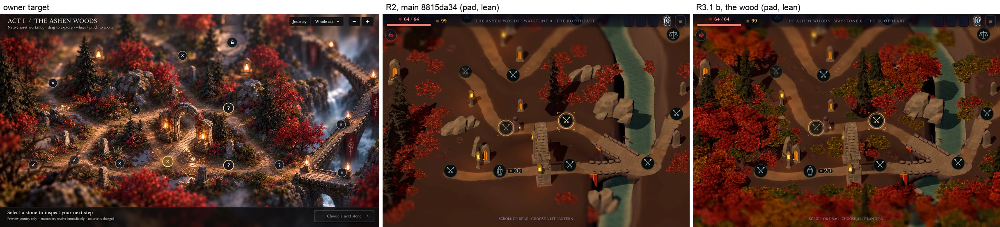
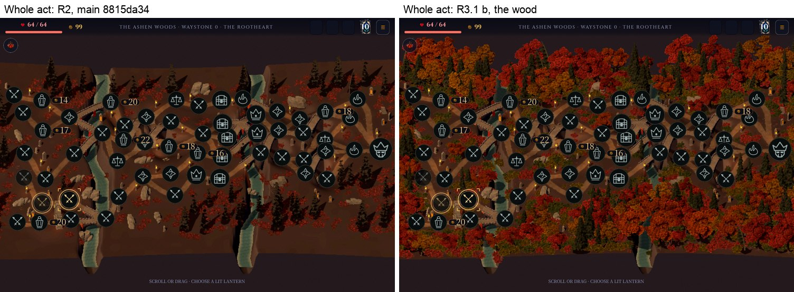
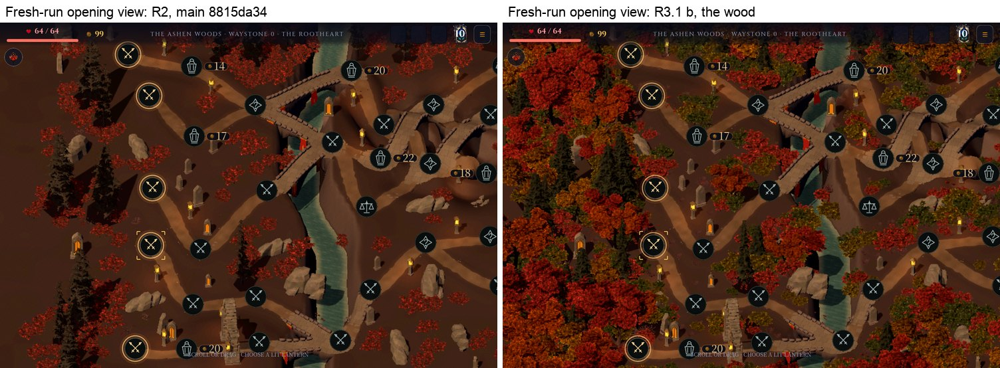
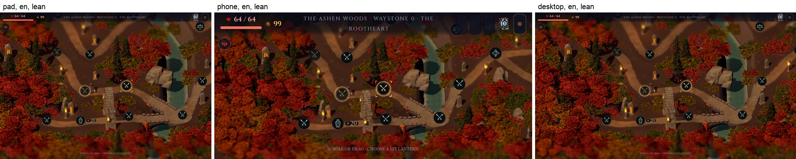
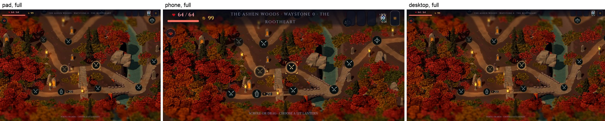
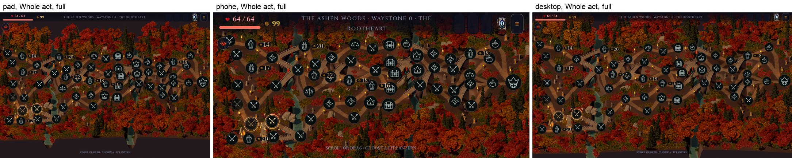
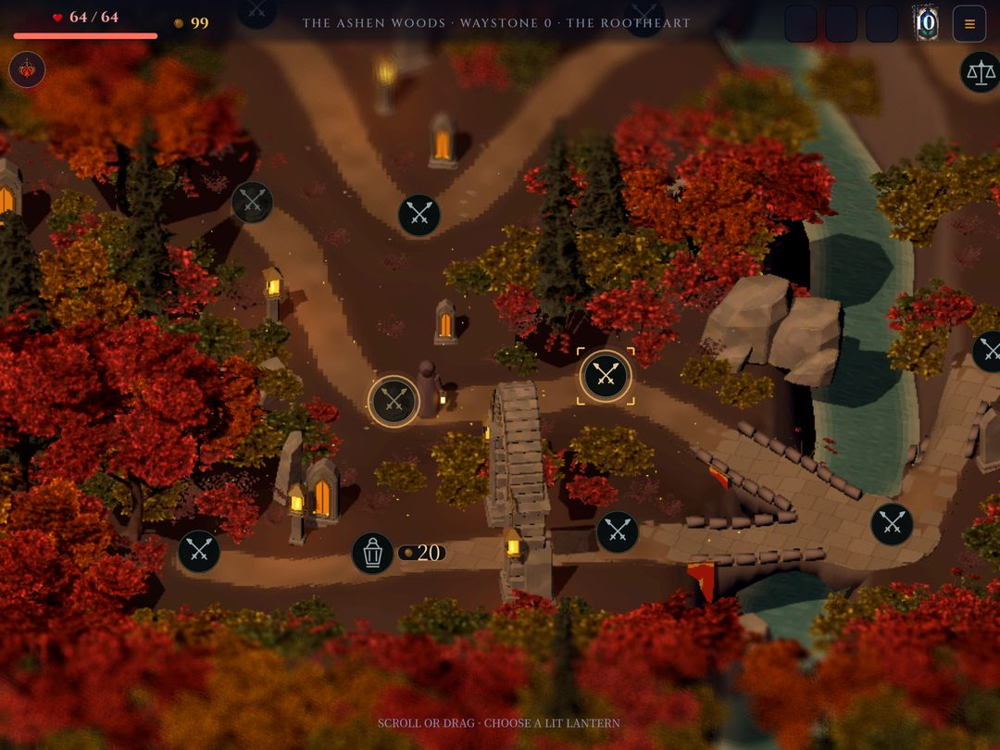

# R3.1 b: the wood (issue #660)

Branch `map/r3-1b-wood-2026-10-03`, from main `8815da34` (R2). R3.1 is built
as two independently mergeable halves; this is B, the woodland. A, the 2D
reclaim (film grain and tilt-shift), is a separate branch. Nothing here
touches the 2D composite, `domain/`, the save schema, the layout or its
digests (`a3ecf0fb…af83c` for seed 1 in every capture), route ids or
behaviours.

The plan is the R3 judge's staged plan, step R3.1 (the research result is in
the lane's scratch, `r3-research-result.md`): promote the impostor runtime
from `spike/map-impostor-2026-10-03` (`59e363ee`), give it art direction
against the owner's target, carry R2's review notes, and hold the device gate.

## What changed

| Commit | What |
|---|---|
| `52e26398` | Reduce Motion holds the whole land still from its first frame: the lantern flames (flipbook and flicker), the lamp pools, the real lamp lights and the land's settle frames. The land's motion is one global shader uniform, `land_motion`. |
| `f11570e9` | The impostor bake and pack (`tools/map_atelier/journey/impostors/`) and the v1 atlases (`assets/art/map-journey/impostors/`), lane picks. |
| `76de88ce` | The impostor runtime: `impostor_atlas.gd`, `wood_planting.gd`, `impostor_wood.gd`, `impostor.gdshader`; the kit hands its seven foliage kinds to the wood. Tests: `tests/test_map_wood.gd`. |
| `993f9cd3` | The wood checks a river bank exactly instead of widening the water. |
| `b1561b62` | `test_map_open_cache`'s binding check runs on the painted landscape again (on main it died on a null node since R1, a SCRIPT ERROR in every full run). |
| `5771e0dd`, `af34d97a` | Planting cost: deck samples spaced along each bridge, the fit test's pitch and tile shifts worked out once. |

## The look

Packed wood to the frame's edges, in the target's autumn: dark spruce in
groves, crimson broadleaf, rust and amber crowns, olive and dark undergrowth
among the red, and large crowns along the bottom of the frame that enter the
tilt-shift's blur. The roads, every waystone and its touch square, the
bridges, the lanterns, the arch and the shrines stay in sight.

What is still far from the target, and belongs to later steps: the floor (flat
warm brown, R3.2), rocks and cliffs (R3.3), white water (R3.4), the set
pieces (R3.5), and the light and lens finish (R3.6). Within the wood itself
the v1 sources limit the look (below).

## How the wood is drawn

The journey camera never turns and is orthographic at one pitch, so a plant
is only ever seen from one direction: a card facing the camera, painted with
the plant as baked from that direction, is the mesh's own picture at every
zoom stop and pan. One card per plant, through MultiMesh, one draw per 16 m
cell, each draw's cards nearest first so depth rejects what they hide (the
costly ground under them is never shaded). The cards are lit by the land's
key light through the baked world normal, with the plant's own crown shadow
as ambient occlusion; opaque cones (conifers) and eggs (broadleaf) cast the
woodland's shadows on the land. The kit keeps every placement it made; it no
longer loads or batches its seven foliage kinds, which the wood draws as cards
where they stand.

## Where the wood stands (`wood_planting.gd`)

Every rule reads grids made once per land, the candidate masks: water and
clearances on a 0.5 m ground grid, the roads' distance field the ground
already paints with (8 texels a metre), and on a 0.25 m picture-plane grid the
least depth of everything the wood must not hide. A candidate costs a few
array reads; nothing queries the land's geometry per candidate.

- Trunks stand at least 1.15 m from a road's centreline (the worn core is
  about 0.6 m either side, its verge about 1 m); undergrowth at least 0.8 m,
  on the verge. Distances are measured from the road's edge in this sense: a
  crown may overhang a verge, but never hides the centreline (a 0.3 m lane
  either side of it) behind it.
- Nothing stands in the river or on its wet bank (checked exactly beside
  the water), within 1.9 m (trees) or 1.5 m (undergrowth) of a bridge deck,
  ramp or approach (the land's bridge chains), within 2.6 m of an abutment,
  on a waystone, or on the kit's stones, posts, arch and shrines.
- On the picture plane no crown hides a bridge deck and its parapets, a
  lamp's flame, the gateway arch or a memorial shrine behind it, nor covers a
  waystone's stone or its touch square from in front. The touch square is
  the reference shape's (the pad's and the desktop's: 60 px of 820 at the
  Journey zoom, 1.4 m). The phone's touch floor is 60 px of a 390 px stage,
  about 3 m of land: kept clear, it would empty about a third of every view;
  see the pin contrast below.
- A crown that does not fit is tried smaller once (undergrowth twice, then
  as the low fern): the big crowns stand where there is room.
- Deterministic from fixed seeds and the land itself, as the kit's own
  planting is.

## Art direction on the v1 sources

Against the owner's target (`target/owner-target-act1-2026-10-03.png`):

| Direction | Built | Measured (seed 1, Mac, pad, lean, Journey, 2,806 plants) |
|---|---|---|
| Dark conifers 35–40% of trees | the kit's three conifers, the spruce and spire baked from stacked turned copies so they read full; groves by a slow field | 41% (test band on seed 717: 33–46%) |
| Crimson broadleaf ≤ 40% | `ember-oak`, `ember-round` | 33% |
| Rust and amber about 20% | `rust-oak`, `amber-round` (repainted leaves, more orange so the grade does not turn them red) | 26% |
| Olive and dark undergrowth | `olive-heath`, `dark-copse`, and half the kit's red heath and copse repainted | 48% of the undergrowth |
| Crown scale 0.7–1.4 | tried large first, then 0.72 of that, never below 0.7 | all fill trees in range (test) |
| Clearance from the road's edge | above | no centreline hidden (test, against the roads themselves) |
| Bridge ramps, arch, shrines in the footprints | above | (test) |
| A dense near band | a second, offset lattice of large crowns along the land's south edge | large crowns along the frame's bottom (frames) |
| Flutter ≤ 4% of woodland pixels in 0.6 s | the spike's UV flutter removed; the gust sway at half the kit foliage's | 2.7% on the Mac, 3.7% on the iPad 8 (the spike 11.9%, R2's meshes 2.8%) |
| Planting off the GDScript hot path | the candidate masks above | 52 ms planting and 9 ms of draws on the M1 Max build worker; 65–71 and 12–15 ms on the iPad 8 |
| Canopy cover ≥ 45% in the safe frame | | 46.1% Journey, 44.9% Whole act, 42.8% fresh-run view (R2 16%) |
| Red share 15–30% by colour mask | | 22.6% Journey, 18.4% Whole act, 18.3% fresh (the target 11.8% by the same mask) |

The colour mask (`tools/wood_metrics.py.txt`) counts hue 340–14°,
saturation ≥ 0.72, value ≥ 0.12 in the safe frame; the warm brown ground
(hue 17–25°, saturation 0.55–0.69) stays out of it. Cover is the share of the
safe frame's pixels that change when the wood's cards are hidden.

### What the v1 sources cannot reach, and what Blender must craft

The v1 sources are the kit's own models. They reach the density, the mix and
the palette, not the target's crafted foliage:

- **Broadleaf crowns** are heath and copse leaf clumps arranged in sprays on
  the kit's bare conifer snag. From the Journey view they read as lumpy
  crowns with gaps; at Close they are clumps of twigs, with no branch
  structure and a conifer's trunk. Each needs a crafted model: a trunk that
  forks into three to five limbs and twigs, leaf-cluster cards along the
  twigs with maple-like leaves, and gaps through which branches show. Kinds:
  crimson spray broadleaf (about 6 m), scarlet round (4.5 m), rust oak
  (6 m), red sapling (3 m), bare birch.
- **Conifers** are the kit's sparse cards on a trunk, stacked for fullness.
  The target's spruce needs tiered, whorled branches with drooping layered
  needle sprays: a tall spruce (7–9 m), a mid fir (5–6 m), a wind-bent pine.
- **Undergrowth** is the kit's heath, copse, bramble and fern, two of them
  repainted. It needs red bramble, olive fern fronds, dark heath, an
  ember-berry bush, grass clumps and pale ash flowers (0.4–1.2 m).

Each is a recipe entry in `tools/map_atelier/journey/impostors/
bake_impostors.gd` pointing at the new GLB (polycount is free at bake time),
baked at 3–4 yaws in the four passes and packed: a data-only re-bake. The
runtime does not change.

## R2's review notes, carried

- (a) Under Reduce Motion the lantern flames no longer flicker: each holds one
  frame of its flipbook at a steady brightness; the lamp pools painted into
  the ground stop flickering with them, and the desktop's real lamp lights
  stop breathing. R2's plan kept lantern flicker as the one motion Reduce
  Motion allowed; this carries the reviewer's fix, so only the water keeps
  its cadence.
- (b) MapScene applies `LandMotion` on every journey frame, so the land never
  moves on its settle frames before the first rest tick.
- (c) `LAND_HIGH` (12 m) holds: the tallest crown the wood can plant (a
  conifer at 1.4, 8.86 m to the tip of its shadow cone) on the highest upland
  of any Act I land (2.87 m, sampled over the whole map, not one fixture
  land) is 11.72 m. `test_map_wood` pins it.

## Gates

### The device gate (iPad 8, A12)

QA app (`io.fol2.glassvow.qa`) only, installed from each build under the
shared batch lock (owner `map-r31b`, 23:14–23:33), lean profile, pad, seed 1,
`--map --map-wood-probe` (a QA-only probe hooked into `application/main.gd`
in the measurement worktrees, never committed as code: `tools/
qa_wood_probe.gd.txt`, `tools/probe_patch.py.txt`). Control: main
`8815da34`; candidate: `af34d97a` (production code identical to this
branch's head). Builds reinstalled in blocks (control, then candidate; the
candidate ran later and warmer). Every row echoes its launch's nonce; none
failed the check. 600-frame holds at the production rest cadence and live
(the stage forced to render every frame after every other script's
`_process`, so `WorldMapScreen._sync_world_live` cannot put it back), three
launches per build, at four views: Journey mid-route (two steps in), the
fresh-run opening view, Whole act and a river-framed Journey view. The first
launch after each install (pipeline compiles) is kept apart. Rows:
`device/batch1/*.jsonl`; summary: `device/summary.txt`.

| View, mode | Control mean (ms) | Candidate mean | Control p95 | Candidate p95 | Control missed | Candidate missed |
|---|---|---|---|---|---|---|
| Journey, cadence | 16.746 / 16.858 / 16.802 | 16.660 / 16.660 / 16.660 | 20.50 / 20.86 / 20.67 | 18.78 / 18.85 / 18.77 | 6 / 7 / 5 | 0 / 0 / 0 |
| Journey, live | 16.661 / 16.662 / 16.660 | 16.661 / 16.660 / 16.663 | 17.64 / 17.78 / 17.55 | 18.52 / 17.68 / 17.68 | 0 / 0 / 0 | 0 / 0 / 0 |
| Opening, cadence | 17.969 / 17.826 / 17.692 | 16.661 / 16.664 / 16.666 | 24.70 / 24.44 / 25.69 | 19.72 / 19.36 / 19.64 | 27 / 24 / 34 | 0 / 0 / 0 |
| Opening, live | 17.783 / 18.170 / 16.659 | 16.658 / 16.662 / 16.662 | 22.80 / 24.48 / 19.11 | 19.41 / 19.35 / 19.14 | 13 / 26 / 0 | 0 / 0 / 0 |
| Whole act, cadence | 18.862 / 20.048 / 21.626 | 16.662 / 16.661 / 16.667 | 27.48 / 27.48 / 27.61 | 20.12 / 19.93 / 19.83 | 78 / 120 / 174 | 0 / 0 / 0 |
| Whole act, live | 16.689 / 16.691 / 16.717 | 16.661 / 16.661 / 16.658 | 19.26 / 19.56 / 19.22 | 19.49 / 19.27 / 19.44 | 0 / 1 / 0 | 0 / 0 / 0 |
| River, cadence | 16.745 / 16.995 / 16.941 | 16.656 / 16.659 / 16.662 | 20.13 / 21.11 / 21.71 | 18.65 / 18.56 / 18.67 | 6 / 16 / 12 | 0 / 0 / 0 |
| River, live | 16.666 / 16.662 / 16.690 | 16.662 / 16.663 / 16.661 | 17.64 / 17.46 / 17.85 | 17.60 / 17.68 / 17.77 | 0 / 0 / 1 | 0 / 0 / 0 |

(The control's opening-view rows are from the batch log: a reused label kept
only the last launch's file.)

Every candidate mean is at the vsync (16.656–16.667 ms) and no candidate
hold misses a frame, at every view and both modes; main misses 5–174 frames
per hold at the rest cadence. At the cadence the candidate's p95 is 1.5–7.7
ms lower than main's at every view. Live, the p95 matches main's within the
spread at Whole act and the river; at Journey two launches match (17.68
against 17.55–17.78) and one reads 18.52.

Stage at the Journey view: 80 draws and 57k primitives against main's 87 and
72k; shadow pass 71 draws and 33k primitives against 63 and 29k. Whole act:
219 draws and 107k against 236 and 129k; shadow 207 and 58k against 182 and
44k.

### The GPU budget line (Metal System Trace)

One trace per build, plus the candidate with the wood hidden for its hold
(`--trace-kill=wood`), recorded with the trace spike's tooling (`xctrace
record --all-processes`, the Metal System Trace template, 4 s mid-hold at the
Journey view, the stage forced live; `tools/frames.py.txt`, `tools/
roles.py.txt`, `tools/xtable.py.txt`, `tools/analyse_run.zsh.txt`). The
reference clock is the control's film-grain passes (the frame's last two
renders, which this branch does not touch: 3.22 ms, the spike's normalised
3.25); every run is scaled by its own grain time
(`device/trace/attribution.txt`).

| Run | Clock factor | Main 3D pass (V + F) | Shadow passes | GPU busy per frame |
|---|---|---|---|---|
| Control, main `8815da34` | 1.000 | 1.91 + 4.09 = 6.00 ms | 0.70 ms | 13.54 ms |
| The wood | 0.758 (78% of the hold at the Minimum state) | 0.53 + 2.59 = 3.13 ms | 0.78 ms | 10.03 ms |
| The wood, hidden | 0.972 | 0.65 + 4.11 = 4.76 ms | 0.79 ms | 12.56 ms |

The wood's own line, shown against hidden in the same build: the main pass
−1.64 ms and the shadow passes −0.01 ms. Drawing 2,806 cards costs less than
the ground they cover, because the cards draw nearest first and the A12's
hidden-surface removal skips the ground shader beneath them (the trace
spike's finding, now on the production path). Against main, the kit's
foliage meshes' vertex work is gone (1.91 → 0.53 ms) and the main pass
falls by 2.87 ms. Caution: the clock moved between the Minimum and Medium
states within holds, and another 2D pass that should be constant
normalises to 3.23, 3.27 and 3.66 ms across the three runs, so the
whole-frame figures carry about ±12%; the main-pass difference is larger
than that.

| Gate | Target | Result |
|---|---|---|
| Mean frame interval | ≤ 16.70 ms | 16.656–16.667 ms at every view and mode (main: 16.66–21.63) |
| p95 | ≤ control | cadence: lower at every view; live: matched at Whole act and the river, at Journey 17.68 / 17.68 / 18.52 against 17.55–17.78 |
| Missed (> 25 ms) | ≤ control | 0 in every candidate hold (main 0–174) |
| Cards for the wood | ≤ 1.3 ms at the reference clock | −1.64 ms in the main pass (a saving: the cards hide the ground's costlier shading), ±0.0 in the shadow passes; against main, the main pass 6.00 → 3.13 ms (above) |
| Cold open | ≤ +0.15 s | +84 ms: 4,930 ms mean to the land ready over 10 launches against 4,846 over 7 (the wood's build on the A12 worker: planting 65–71 ms, draws 12–15 ms; the kit's main-thread preload 52 → 26–30 ms) |
| Payload | ≤ +7 MB | +4.7 MiB (`mac/payload.txt`) |
| VRAM | ≤ +8 MiB | +4.5 MiB (video_mib 254.1 → 258.6) |
| Canopy cover in the safe frame | ≥ 45% | 46.1% at Journey; 44.9% Whole act, 42.8% fresh-run view (Mac, pad, lean) |
| Red share by colour mask | 15–30% | 22.6% at Journey; 18.4% Whole act, 18.3% fresh-run view |
| Woodland motion | ≤ 4% of woodland pixels in 0.6 s | 3.7% on the iPad 8 (stage images), 2.7% on the Mac |
| Reduce Motion | verified on the device | 0.21% of woodland pixels change in 0.6 s with Reduce Motion on (3.7% off) |
| Pins | legible, contrast floor | see the pin contrast below: unchanged at pad and desktop against main, lower at the phone |
| No crown on a centreline, seat or touch square | | pinned by `test_map_wood` against the roads and seats themselves |

## Mac proof

At `af34d97a`, the A12 Metal condition (`GODOT_MTL_DISABLE_ARGUMENT_BUFFERS=1`
with `--rendering-driver metal --rendering-method mobile` passed to godot
directly): 0 shader errors and 0 script errors in every capture, at pad,
phone and desktop, lean and full, Journey and Whole act, in en and zh-Hant
(`mac/proof-run.txt`).

Reduce Motion: 0.06% of woodland pixels change in 0.6 s with the air hidden
(motion on: 2.7%); on the iPad 8, 0.21% (motion on: 3.7%).

**Pin contrast.** R2's script (`proof/r2/pin_contrast.py.txt`, the rim band
against the land just outside each pin), on R2's own mount (the screen and
HUD mounted directly, lean, seed 1, two steps in: `tools/look2.gd.txt`,
`frames/pin-contrast-mounts.jpg`), measures main `8815da34` today at a rim
minimum of 1.02 (pad), 1.10 (phone) and 1.03 (desktop): R2's recorded floors (2.17, 1.41, 1.18) are not
reproducible on main itself. Like for like, the wood measures 1.01, 1.02
and 1.01, and the disc against the land is unchanged at every shape (1.18,
1.00, 1.18 against main's 1.18, 1.00, 1.18). The pad's and desktop's lowest
pin is the same pin on main. The phone's falls from 1.10 to 1.02 where a
crown now stands in the land just outside a pin (the phone's pin covers
1.4 m of land); a wider clearing round every seat did not raise it and cost
cover. Open issue below.

Mutation checks: every new assertion fails when the behaviour it pins is
broken (`mac/mutations.txt`, 25 of 26; the one not caught is an adapted count
in `test_map_title_road`, whose behaviour `test_map_wood` pins).

Payload (`mac/payload.txt`): `assets/art/map-journey` 5.8 → 10.4 MiB, the pck
estimate 272.3 → 277.0 MiB (+4.7 MiB). The group's budget rises from 6 to 11.

## Open issues

1. **Recording the trace.** In the first batch every `xctrace record` timed
   out ("Timed out waiting for device to boot") while the QA app ran; a
   recording with nothing launched worked. As the trace spike did, a
   `devicectl` screenshot just before the recording lets it attach
   (`tools/lib.zsh.txt`); the traces come from a second, short batch under
   the lock (00:08–00:19), each build reinstalled. The screenshot and the
   recording's start cost the traced holds 1–3 missed frames; the gate's
   frame rows come from the first batch, which took neither.
2. **Pin contrast.** R2's floors are not reproducible on main with R2's own
   method (above). Like for like, the wood leaves the pad's and desktop's
   lowest pin where main has it and lowers the phone's (1.10 → 1.02): the
   protected touch square is the pad's 1.4 m, and on the phone a pin covers
   1.4 m of land itself. The pins read clearly in every frame here; the
   floor needs re-baselining (method and pins) before it can gate.
3. **Live p95 at Journey.** Two of three candidate launches match main
   (17.68 against 17.55–17.78); one read 18.52. Means, misses and every
   cadence p95 are better. The candidate block ran after the control's, on
   a warmer device; there was no soak (R3.6).
4. **The v1 sources.** Broadleaf crowns are composed from the kit's leaf
   clumps on a conifer snag, and the conifers are the kit's sparse cards
   stacked: at Close they read as clumps, not crafted trees. The crafted
   Blender sources each kind needs are listed above; each is a data-only
   re-bake.
5. **Payload left on the table.** The kit's seven foliage GLBs (about 7.6
   MB of source) are no longer loaded at run time but are still exported
   (the bake and the kit's greybox path read them). Excluding them from the
   iOS preset would more than pay for the atlases; it is an export-preset
   change for the release owner, not made here. The shelf packer fills 79%
   of the albedo atlas; a skyline packer would save about 0.5 MB.
6. **Close zoom on the desktop's full profile.** The atlas holds 56 texels a
   metre, about 1:1 for the lean stage at Close; the desktop's full stage at
   Close is slightly soft, and the cards' cut edges do not use alpha to
   coverage.
7. **The fresh-run opening view's cover** is 42.8% (the gate is set at the
   Journey view's safe frame, 46.1%): the opening frames more roads and
   seats.
8. **The ground does not know the fill.** The paint's woodland litter tint
   (`bind_habitat`) still follows the kit's own foliage only; the floor
   (R3.2) should take the wood's plants.
9. **`test_map_open_cache`** died on a null node on main since R1 (a SCRIPT
   ERROR in every full run): fixed here in its own commit (`b1561b62`).
   Branch A meets the same line; keep one fix.
10. **Measurement worktrees.** The device builds came from scratch worktrees
    (`r31b/ctl-wt` at `8815da34`, `r31b/dev-wt` at the head) with the probe
    hook applied uncommitted; this branch never carries it. The QA app on
    the iPad is left with this lane's last build.
