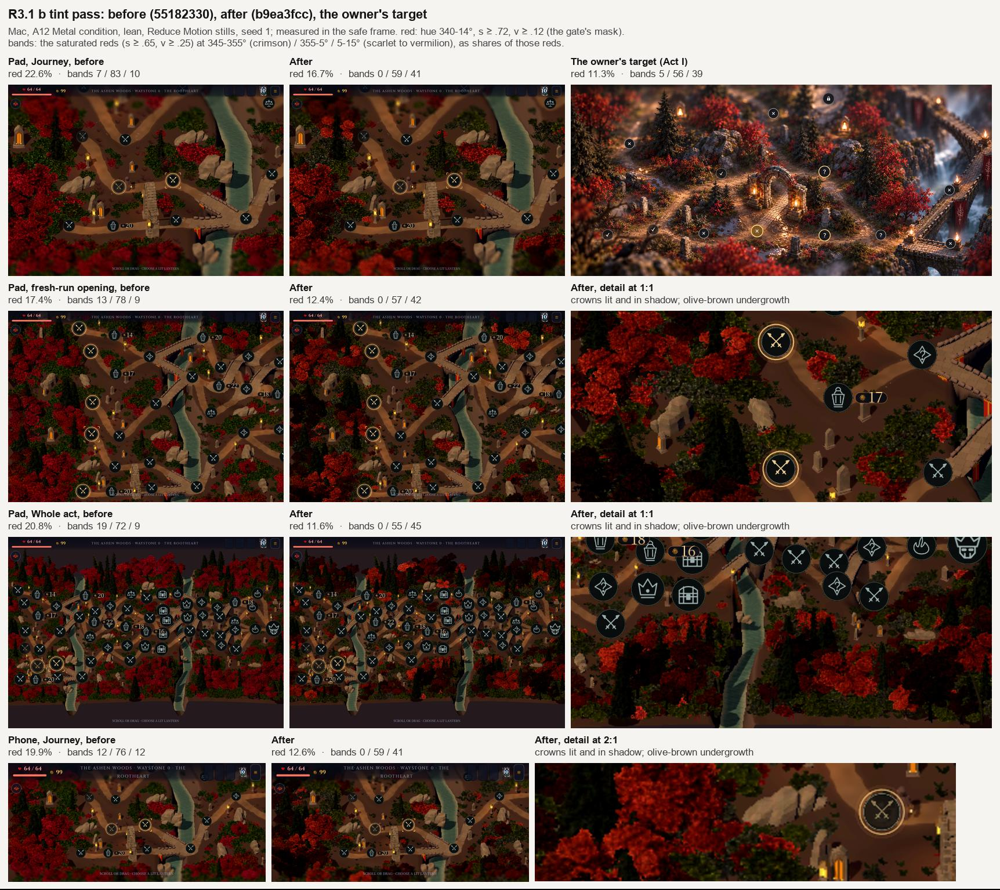
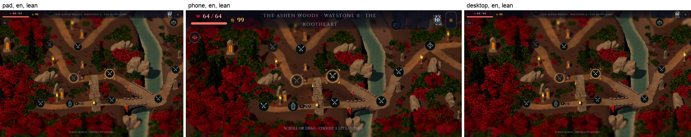
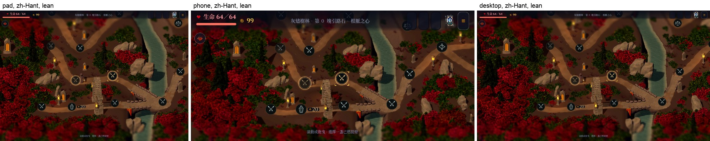
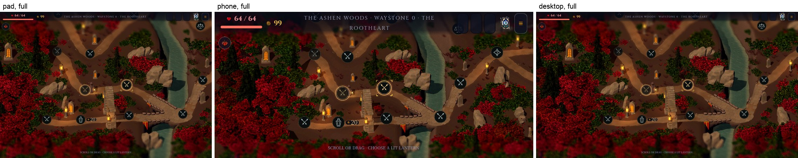
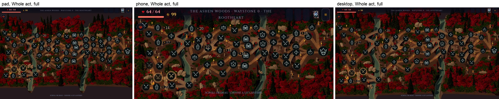
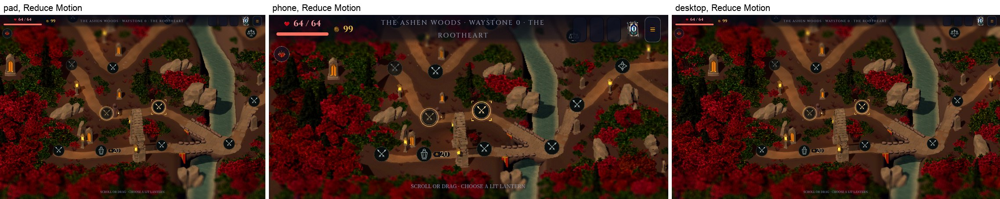
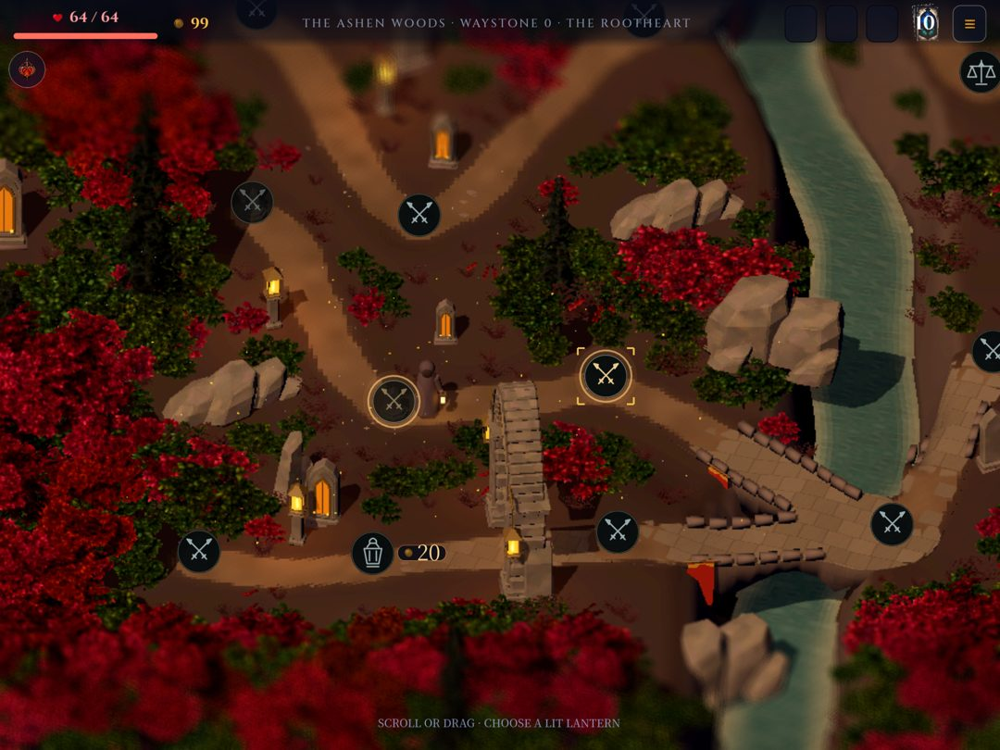

# R3.1 b: the wood (issue #660)

Branch `map/r3-1b-wood-2026-10-03`, from main `8815da34` (R2). R3.1 is built
as two independently mergeable halves; this is B, the woodland. A, the 2D
reclaim (film grain and tilt-shift), is a separate branch. Nothing here
touches the 2D composite, `domain/`, the save schema, the layout or its
digests (`a3ecf0fb…af83c` for seed 1 in every capture), route ids or
behaviours.

The plan is the R3 judge's staged plan, step R3.1 (the research result is in
the lane's scratch, `r3-research-result.md`): promote the impostor runtime
from `spike/map-impostor-2026-10-03` (`59e363ee`), give it art direction
against the owner's target, carry R2's review notes, and hold the device gate.

The branch was reviewed adversarially at `fbf0fc65`; the fix round below
answers every finding (its production code is final at `21b4cdab`). The art
decision then asked for a tint pass on an independent designer's must-fixes
([below](#art-decision)): `b9ea3fcc` re-tints the wood, data only. The
pass changes only the colour each card already carries, so it leaves the
shader, the draws and the fix round's device rows as they were. Evidence for
the colour is
under [`tint-pass/`](tint-pass/), for everything else under
[`fix-round/`](fix-round/); the first round's files (`device/`, `mac/`,
`frames/`, `tools/`) are kept as the record of `af34d97a`, and their numbers
are superseded where this page gives new ones.

## What changed

| Commit | What |
|---|---|
| `52e26398` | Reduce Motion holds the whole land still from its first frame: the lantern flames (flipbook and flicker), the lamp pools, the real lamp lights and the land's settle frames. The land's motion is one global shader uniform, `land_motion`. |
| `f11570e9` | The impostor bake and pack (`tools/map_atelier/journey/impostors/`) and the v1 atlases (`assets/art/map-journey/impostors/`), lane picks. |
| `76de88ce` | The impostor runtime: `impostor_atlas.gd`, `wood_planting.gd`, `impostor_wood.gd`, `impostor.gdshader`; the kit hands its seven foliage kinds to the wood. Tests: `tests/test_map_wood.gd`. |
| `993f9cd3` | The wood checks a river bank exactly instead of widening the water. |
| `b1561b62` | `test_map_open_cache`'s binding check ran on the painted landscape again (on main it died on a null node since R1, a SCRIPT ERROR in every full run). Superseded on the rebase: main carries the same fix from R3.1 a (#674), and `55182330` keeps main's. |
| `5771e0dd`, `af34d97a` | Planting cost: deck samples spaced along each bridge, the fit test's pitch and tile shifts worked out once. |
| `abed6306` | Fix round: the picture-plane grid in its own file (`wood_sight.gd`), no behaviour change. |
| `d9939e61` | Fix round: the atlas takes each texture from the loader once, and a texture that cannot load ends the wait (the land opens without its woodland); `Kit.preload_ms` counts the atlas. |
| `e5bbee23` | Fix round: rocks, rivers and each shape's touch squares kept in sight, the kit's own foliage under the same rules, an exact fit test, the mix steered by plants and by canopy, per-kind tints, denser undergrowth. |
| `08b32b3f` | Fix round: 0.35 m of a road's worn core kept in sight either side of the centreline (was 0.5 m). |
| `21b4cdab` | Fix round: matte cards (Lambert, no direct specular): cheaper on the A12, and the crowns' lit sides no longer turn orange. Re-anchors one doc citation Main's added line moved. |
| `b9ea3fcc` | Tint pass: the crimson crowns and the red undergrowth scarlet to vermilion, each pair running from a crown in shadow to a lit one; the olive and dark undergrowth and the fern a dark, low-chroma olive-brown; `BRIGHTNESS` 0.65–1.15. Data only (`ImpostorWood.TINTS`). |

## The look

The tint pass's frames on their own are under `tint-pass/frames/`; the fix
round's sheets beside R2 (`fix-round/frames/`) show the wood before it.

Packed wood to the frame's edges in the target's autumn: scarlet to
vermilion broadleaf crowns, some lit and some in shadow, dark spruce, dark
olive-brown undergrowth with scarlet sprigs among it, rust and amber crowns
as a deep minority, and large crowns along the bottom of the frame that
enter the tilt-shift's blur. The roads, every waystone and its touch square,
the bridges, the lanterns, the arch, the shrines, the rock outcrops and both
rivers stay in sight.

What is still far from the target, and belongs to later steps: the floor
(flat warm brown, R3.2), rock and cliff materials (R3.3: the outcrops show
now, but beige and faceted), white water (R3.4), the set pieces (R3.5), and
the light and lens finish (R3.6). Within the wood itself the v1 sources
limit the look (below).

## How the wood is drawn

The journey camera never turns and is orthographic at one pitch, so a plant
is only ever seen from one direction: a card facing the camera, painted with
the plant as baked from that direction, is the mesh's own picture at every
zoom stop and pan. One card per plant, through MultiMesh, one draw per 16 m
cell, each draw's cards nearest first so depth rejects what they hide (the
costly ground under them is never shaded). The cards are lit by the land's
key light through the baked world normal (Lambert, no direct specular), with
the plant's own crown shadow as ambient occlusion; opaque cones (conifers)
and eggs (broadleaf) cast the woodland's shadows on the land. Each kind has a tint pair on its baked
colours (`ImpostorWood.TINTS`). The kit keeps every placement it made; it no
longer loads or batches its seven foliage kinds, which the wood draws as
cards where they stand.

The atlas loads on the loader's threads while the kit's scenes are held
(`Kit.preload_step`), each texture taken once (`ImpostorAtlas.Take`). An
atlas that cannot load is reported once and the land opens without its
woodland, rather than holding the map's opening.

## Where the wood stands

`wood_planting.gd` plants; `wood_sight.gd` holds what must stay in sight on
the picture plane. Every rule reads grids made once per land (water and
clearances on a 0.5 m ground grid, the roads' distance field the ground
paints with, and on a 0.25 m picture-plane grid the least depth of
everything the wood must not hide). A candidate costs a few array reads.

- Trunks stand at least 1.15 m from a road's centreline, undergrowth at least
  0.6 m (the worn core is about 0.6 m either side).
- Nothing stands in the river or on its wet bank (checked exactly beside the
  water), within 1.9 m (trees) or 1.5 m (undergrowth) of a bridge deck, ramp
  or approach, within 2.6 m of an abutment, on a waystone, or on the kit's
  stones, posts, arch and shrines.
- On the picture plane no card hides what stands behind it: a road's
  centreline and 0.35 m of its core either side, a bridge deck and its
  parapets, a lamp's flame, the gateway arch, a memorial shrine, the kit's
  rocks from their foot to near their top (undergrowth may grow at the foot),
  and the rivers' water 1 m either side of each line (the water is 2.4 m
  either side: a crown may overhang its edge, never roof it). No crown in
  front of a waystone covers its stone or its touch square.
- The touch square is the shape's own (`WoodPlanting.stage_shape`, set by
  Main): 60 px of 820 at the Journey zoom on the pad and the desktop, 1.4 m;
  60 px of 390 on the phone, 3 m. A device's class fixes which shapes it can
  show (a phone only the phone's; a pad or a desktop never the phone's, and
  theirs share one square), so a land never outlives its squares. Unset
  (tests and tools), the widest.
- The fit test counts every silhouette row across a grid cell, so a small
  card whose rows are finer than the cell cannot slip past.
- The kit's own foliage passes the same rules where it stands: tried
  smaller, undergrowth as the low fern, or left out (18–37 of 381–473 per
  land across six seeds). The kit's placements themselves never move.
- A crown that does not fit is tried smaller once (undergrowth twice, then as
  the low fern, at the least a 0.4 tuft): the big crowns stand where there is
  room.
- Deterministic from fixed seeds and the land itself.

## Art direction on the v1 sources

Against the owner's target (`target/owner-target-act1-2026-10-03.png`). The
tree mix is steered toward the direction's shares over every tree planted so
far, the kit's own conifers included; the fill is planted in a seeded random
order so the steering favours no part of the land.

| Direction | Built | Measured |
|---|---|---|
| Dark conifers 35–40% of trees | the kit's three conifers, the spruce and spire baked from stacked turned copies; groves by a slow field; tall (0.75 to 1 of the scale range) | 37.7–39.2% across seeds 1, 717, 2, 3, 42, 1234 (`fix-round/probe/`) |
| Crimson broadleaf ≤ 40% | `ember-oak`, `ember-round`, tinted scarlet to vermilion, from a crown in shadow to a lit one (tint pass) | 35.9–38.9% |
| Rust and amber about 20% | `rust-oak`, `amber-round`, the lower half of the scale range, tinted deep and dull | 21.9–26.3% (with conifers and crimson each at most 40%, the rest is at least 20%) |
| By the canopy each family shows (front-most card over the whole land) | | crimson 51–57%, conifers 22–30%, rust and amber 17–21% of the tree canopy across the six seeds (in the first round rust and amber showed the most canopy, conifers 15% of the land's cover) |
| Olive and dark undergrowth | `olive-heath`, `dark-copse`, 70% of the kit's red heath and copse repainted; a dark, low-chroma olive-brown (tint pass) | 57.7–59.2% of the undergrowth |
| Crown scale 0.7–1.4 | | every fill crown in range (test) |
| Clearance from the road's edge | above | no card hides a centreline (the wood probe at six seeds; `test_map_wood` at seed 717) |
| Bridge ramps, arch, shrines in the footprints | above | no card hides a deck or a flame (the same) |
| A dense near band | a second, offset lattice of large crowns along the land's south edge | large crowns along the frame's bottom (frames) |
| Flutter ≤ 4% of woodland pixels in 0.6 s | the gust sway at half the kit foliage's | 1.7% on the Mac, 3.6% on the iPad 8 (stage images, `fix-round/device/batch7/`) |
| Planting off the GDScript hot path | the candidate masks above | 86 ms planting on the M1 Max build worker; 105–111 ms planting and 17–19 ms of draws on the iPad 8's worker |

Colour against the target, by the same masks on the safe frame (Mac, A12
Metal condition, lean, Reduce Motion stills, seed 1;
`tint-pass/tools/bands.py.txt`, figures in `tint-pass/measure.txt`).
Before is the head before the tint pass (`55182330`), after is `b9ea3fcc`:

| | Target | Pad, Journey | Pad, fresh-run opening | Pad, Whole act | Phone, Journey |
|---|---|---|---|---|---|
| Red share (hue 340–14°, s ≥ 0.72, v ≥ 0.12) | 11.3% | 22.6 → 16.7% | 17.4 → 12.4% | 20.8 → 11.6% | 19.9 → 12.6% |
| Saturated reds (s ≥ 0.65, v ≥ 0.25) by hue: 345–355° / 355–5° / 5–15° | 5 / 56 / 39 | 7 / 83 / 10 → 0 / 59 / 41 | 13 / 78 / 9 → 0 / 57 / 42 | 19 / 72 / 9 → 0 / 55 / 45 | 12 / 76 / 12 → 0 / 59 / 41 |
| Saturated reds, share of the frame | 11.8% | 15.6 → 9.8% | 12.6 → 8.4% | 15.0 → 6.2% | 14.3 → 7.2% |
| Saturated orange (hue 14–45°, s ≥ 0.72) | 4.1% | 4.9 → 5.3% | 5.1 → 5.3% | 3.1 → 3.2% | 5.1 → 5.1% |
| The frame's median value | 0.286 | 0.263 → 0.255 | 0.243 → 0.235 | 0.165 → 0.141 | 0.255 → 0.243 |

The reds moved from crimson to the target's scarlet and vermilion. Of the
saturated reds, the crimson band (345–355°) fell from 7–19% to none (the
target keeps 5%), and the scarlet-to-vermilion band (5–15°) rose from 9–12%
to 41–45% (the target's 39%). The designer measured 20 / 67 / 13 on the
iPad 8's screenshot of the fix round's head; the device was not measured
again (this pass is Mac only). Saturated orange rose by up to 0.4 points,
mostly from the fern's lit olive tips (+0.26 at the pad's Journey); the
crowns add 0.06. By family at the pad's Journey, the red pixels fell from
12.4 to 10.1 points in the crimson crowns, 4.4 to 2.6 in rust and amber, 3.9
to 3.6 in the red undergrowth and 1.1 to none in the fern.

The red share fell by 5 to 9 points in every view, to within 1.3 points of
the target everywhere but the pad's Journey, where the dense near band of
large crowns fills the frame's foot. What is left there is a mask effect a
tint cannot reach. The journey grade's contrast of 1.2 about mid-grey
(`MapJourneyLandscape.light`) sends a display channel below about 0.08 to
zero: before the pass the median crown pixel read red 0.28, green 0.00,
blue 0.01, so a dark crown reads at full saturation whatever its albedo.
The target's red-hued pixels lie mostly at s 0.5–0.72, the wood's at
s ≥ 0.85. A tint takes a crown out of the mask only by darkening it below
v 0.12 (the crowns in shadow) or by lifting green and blue about 3.3 times
over red, which turns the crowns dusty pink (tried and rejected; every
candidate is in `tint-pass/rounds.txt`). The wood's bright saturated reds
now sit below the target's (9.8% against 11.8%) and its dark ones above:
lifting the dark reds' floor in the grade belongs to the light and lens step
(R3.6), with the golden rims.

**The red-share gate, re-anchored on the target.** The old band, 15–30%,
lay wholly above the target's 11.3%. The gate is now the target's 11.3%
± 5 points in each view (6.3–16.3%). Five points is the spread that framing
alone gives one tint across the pad's three views (5.2 points before the
pass, 5.1 after), so a view inside the band cannot be told from the target
by framing; a wider band would pass the head's own fresh-run opening
(17.4%), which the designer judged too red. At `b9ea3fcc` three views meet
it and the pad's Journey misses it by 0.4 points (16.7%).

### What the v1 sources cannot reach, and what Blender must craft

The v1 sources are the kit's own models. They reach the density, the mix and
the palette, not the target's crafted foliage:

- **Broadleaf crowns** are heath and copse leaf clumps arranged in sprays on
  the kit's bare conifer snag. From the Journey view they read as lumpy
  crowns with gaps; at Close they are clumps of twigs, with no branch
  structure and a conifer's trunk. Each needs a crafted model: a trunk that
  forks into three to five limbs and twigs, leaf-cluster cards along the
  twigs with maple-like leaves, and gaps through which branches show. Kinds:
  crimson spray broadleaf (about 6 m), scarlet round (4.5 m), rust oak
  (6 m), red sapling (3 m), bare birch.
- **Conifers** are the kit's sparse cards on a trunk, stacked for fullness.
  The target's spruce needs tiered, whorled branches with drooping layered
  needle sprays: a tall spruce (7–9 m), a mid fir (5–6 m), a wind-bent pine.
- **Undergrowth** is the kit's heath, copse, bramble and fern, two of them
  repainted. It needs red bramble, olive fern fronds, dark heath, an
  ember-berry bush, grass clumps and pale ash flowers (0.4–1.2 m).

Each is a recipe entry in `tools/map_atelier/journey/impostors/
bake_impostors.gd` pointing at the new GLB (polycount is free at bake time),
baked at 3–4 yaws in the four passes and packed: a data-only re-bake. The
runtime does not change. The rust and amber recipes brighten their leaves
×1.3 and ×1.55 (`LEAVES`), which the runtime tints now pull back; a re-bake
should fold the tint into the recipe.

## Art decision

On 4 October 2026 at 11:31 BST the owner delegated R3.1 b's design
decisions, the wood's art and the pins' contrast, to the orchestrator, who
might consult an Opus designer. The orchestrator's call:

- **The wood ships as the lane's pick, which the owner may re-pick.** The
  choice was delegated, not made by the owner; nothing here closes it.
- **An independent Opus designer** reviewed the wood against the owner's
  target, from crops and colour counts of the fix round's frames (among
  them the iPad 8's screenshot), and set three must-fixes. The orchestrator adopted them as
  the tint pass, `b9ea3fcc`, data only on the same shader:
  1. *Re-tint the reds from crimson toward scarlet and vermilion*: blue
     below 1.0 and green cut less hard; the pairs' low ends and
     `BRIGHTNESS` put a share of crowns in shadow, so the mat breaks up and
     the red share falls toward the target; no push into orange; the kind
     mix kept. Done for `ember-oak`, `ember-round`, `ash-heath` and
     `ash-copse`. Against red, blue now sits at 0.91 (lit) and green is
     lifted to 1.13 rather than cut less hard: a cut green is clipped to
     nothing by the grade and the crown stays pure red (round A in
     `tint-pass/rounds.txt`: green at 0.75–1.0 of red moved the 5–15° band
     only to 13–17%). Each pair runs from a crown in shadow (0.12–0.15) to a
     lit one, and `BRIGHTNESS` widens to 0.65–1.15. Rust and amber, which
     the old green cut also turned red, are darker and keep their place as
     the deep minority. The hue bands now match the target's within 5
     points (0 / 59 / 41 against 5 / 56 / 39 at the pad's Journey); the red
     share fell 5–9 points in every view (above); saturated orange rose by
     up to 0.4 points, from the fern, not the crowns. The mix itself is
     untouched: `test_map_wood` passes unchanged (it pins the mix and the
     canopy shares, never the tints).
  2. *Undergrowth to a dark, low-chroma olive-brown, its share kept.* Done
     for `olive-heath` and `dark-copse` (blue lifted so the lit tips read
     olive, not yellow-green: their median hue went from 67° to 52°, their
     upper tenth from 89° to 62°) and for `ash-fern`, the kit's fern and
     the fill's fallback, which read as red-brown tufts along the roads.
  3. *Records*: this section, the [re-anchored red-share
     gate](#art-direction-on-the-v1-sources), and the pins' contrast as a
     tripwire ([open issue 2](#open-issues)).
- **Follow-ups the designer named, outside this pass**: the golden rims on
  the crowns' lit sides (the light and lens step, R3.6), and the pins'
  background-independent token design (issue #679, before R3.2).
- **What the pass found** (for the orchestrator): the grade's contrast,
  not the tint, holds the pad's Journey 0.4 points above the red-share
  band ([open issue 11](#open-issues)).
- **The orchestrator's ruling on that miss** (4 October 2026): the band
  stays as set before the measurement; it is not widened to admit 16.7%.
  The miss is recorded as a known residual of one view, owned by the light
  and lens step (R3.6), which must bring the pad's Journey inside 6.3–16.3%
  by lifting the grade's floor. The wood ships as the lane's pick with it,
  because every other view meets the band, the hue bands match the
  target's, and the remaining tint moves would make the wood darker or
  pink. The device re-check of this head also reads the hue bands on the
  iPad 8, which showed more crimson than the Mac before the pass.

## R2's review notes, carried

- (a) Under Reduce Motion the lantern flames no longer flicker: each holds one
  frame of its flipbook at a steady brightness; the lamp pools painted into
  the ground stop flickering with them, and the desktop's real lamp lights
  stop breathing. R2's plan kept lantern flicker as the one motion Reduce
  Motion allowed; this carries the reviewer's fix, so only the water keeps
  its cadence.
- (b) MapScene applies `LandMotion` on every journey frame, so the land never
  moves on its settle frames before the first rest tick.
- (c) `LAND_HIGH` (12 m) holds: the tallest crown the wood can plant (a
  conifer at 1.4) on the highest upland of any Act I land (sampled over the
  whole map, not one fixture land) is 11.72 m. `test_map_wood` pins it.

## Gates

### The device gate (iPad 8, A12)

QA app (`io.fol2.glassvow.qa`) only, under the shared batch lock (owner
`map-r31b`), lean profile, pad, seed 1, `--map --map-wood-probe` (a QA-only
probe hooked into `application/main.gd` in the measurement worktrees, never
committed as code: `fix-round/tools/qa_wood_probe.gd.txt`). Control: main
`8815da34`; candidate: `21b4cdab`. The two builds were reinstalled
**interleaved** (control, wood; wood, control; control, wood), each from its
signed ipa (`qa_export.sh --no-install`; every install checks the ipa's bundle
id), and after each install: a first launch (kept apart: the open after an
install), the Journey (two steps in), Whole act and river-framed holds, and
the fresh-run opening holds. 600 frames per hold at the production rest
cadence and live (the stage forced to render every frame after every other
script's `_process`, so `WorldMapScreen._sync_world_live` cannot put it back).
Every row echoes its launch's nonce; none failed the check. Batch 7, 03:38–
04:03 (`fix-round/device/batch7/`, summary `summary.txt`).

| View, mode | Control mean (ms) | Candidate mean | Control p95 | Candidate p95 | Control missed | Candidate missed |
|---|---|---|---|---|---|---|
| Journey, cadence | 17.104 / 16.858 / 16.773 | 16.662 / 16.662 / 16.661 | 23.04 / 20.86 / 20.33 | 18.54 / 18.61 / 18.61 | 16 / 7 / 4 | 0 / 0 / 0 |
| Journey, live | 16.656 / 16.661 / 16.660 | 16.662 / 16.662 / 16.662 | 17.66 / 17.59 / 17.51 | 17.61 / 17.63 / 17.80 | 0 / 0 / 0 | 0 / 0 / 0 |
| Opening, cadence | 17.416 / 17.040 / 16.964 | 16.662 / 16.660 / 16.665 | 24.28 / 22.61 / 22.57 | 19.78 / 19.68 / 19.81 | 24 / 14 / 11 | 0 / 0 / 0 |
| Opening, live | 16.661 / 16.717 / 16.661 | 16.663 / 16.662 / 16.666 | 19.16 / 19.14 / 19.16 | 19.21 / 19.27 / 19.08 | 0 / 1 / 0 | 0 / 0 / 0 |
| Whole act, cadence | 20.984 / 20.549 / 20.573 | 16.662 / 16.667 / 16.657 | 27.56 / 27.49 / 27.40 | 20.40 / 20.40 / 20.04 | 150 / 134 / 136 | 0 / 0 / 0 |
| Whole act, live | 16.689 / 16.698 / 16.662 | 16.662 / 16.662 / 16.660 | 19.03 / 19.79 / 19.24 | 19.66 / 19.66 / 19.51 | 0 / 0 / 0 | 0 / 0 / 0 |
| River, cadence | 16.885 / 16.910 / 17.076 | 16.662 / 16.663 / 16.663 | 21.09 / 21.50 / 22.03 | 18.50 / 18.68 / 18.63 | 9 / 10 / 14 | 0 / 0 / 0 |
| River, live | 16.663 / 16.662 / 16.662 | 16.660 / 16.662 / 16.661 | 17.55 / 17.48 / 17.71 | 17.53 / 17.68 / 17.70 | 0 / 0 / 0 | 0 / 0 / 0 |

Every candidate hold is at the vsync (16.657–16.667 ms) with no missed
frame, at every view and both modes; main misses 4–150 frames per hold at
the cadence. At the cadence the candidate's p95 is 1.7–7.2 ms lower than
main's at every view. Live, both are vsync-bound: the candidate's p95 sits within
0.05 ms of main's at Journey (median of launches 17.63 against 17.59) and
the opening (19.21 against 19.16), 0.13 ms above at the river and 0.42 ms
above at Whole act.

Before the cards turned matte (`08b32b3f`, batch 4 and the batch 5 trace
launch, `fix-round/device/batch4/`, `batch5/`), two of five candidate launches
ran tens of seconds of missed frames at Journey and Whole act (Journey live
19.37 ms mean, 50 missed; Whole act live 24.85 ms, 267 missed), then
recovered; the control never did. The trace of one shows why: the GPU spent
88% of the hold at its Minimum performance state, where the frame took
15.0 ms (p95 18.7 ms), although at the reference clock it was cheaper than
main's. The A12's governor settles at its lowest state when a frame just
fits there; main's heavier frame keeps it at Medium. Matte cards take
shader ALU off every woodland fragment; at `21b4cdab` none of four launches
(three measuring launches and the trace launch's 45 s hold) repeated it.

### The GPU budget line (Metal System Trace)

One trace per build, plus the candidate with the wood hidden for its hold
(`--trace-kill=wood`), recorded with the trace spike's tooling (`xctrace
record --all-processes`, the Metal System Trace template, 4 s mid-hold at the
Journey view, the stage forced live), scaled to the reference clock by each
run's own film-grain passes (the frame's last two renders, untouched by this
branch; the first round's control, 3.39 ms) (`fix-round/device/
trace-attribution.txt`). The candidate's recording ended after 29 stage
frames ("Device got disconnected"); its probe row over the same 45 s hold
reads 2,699 frames, mean 16.675 ms, one missed.

| Run (batch 7) | Clock factor | Main 3D pass (V + F) | Shadow and pre-main renders | GPU busy per frame |
|---|---|---|---|---|
| Control, main `8815da34` | 1.007 (88% Medium) | 1.92 + 4.12 = 6.03 ms | 0.71 ms | 13.38 ms |
| The wood, `21b4cdab` | 0.758 (85% Minimum) | 0.54 + 2.60 = 3.15 ms | 0.73 ms | 10.39 ms |
| The wood, hidden | 0.884 (64% Minimum) | 0.59 + 3.86 = 4.45 ms | 0.73 ms | 11.91 ms |

The wood's own line, against itself hidden: the main pass −1.30 ms, the
shadow and pre-main renders ±0.00 ms, the whole frame −1.52 ms. Against
main the main pass falls by 2.88 ms. The cards draw nearest first and the
ground shader beneath them is skipped. Caution, as in the first round: a
2D pass that should be constant normalises within about ±12% across runs,
and 29 frames are a thin sample; the main-pass difference is larger than
either.

| Gate | Target | Result |
|---|---|---|
| Mean frame interval | ≤ 16.70 ms | 16.657–16.667 ms at every view and mode (main: 16.66–20.98) |
| p95 | ≤ control | cadence: lower at every view; live: within 0.05 ms at Journey and the opening, +0.13 ms at the river, +0.42 ms at Whole act (all vsync-bound) |
| Missed (> 25 ms) | ≤ control | 0 in every candidate hold (main 0–150) |
| Cards for the wood | ≤ 1.3 ms at the reference clock | −1.30 ms in the main pass, ±0.00 ms in the shadow renders (a saving) |
| Cold open | ≤ +0.15 s | +45 ms on later launches: 4,683 ms mean to the land ready over six launches against 4,638 over six (the wood on the A12 worker: planting 105–111 ms, draws 17–19 ms; the kit's main-thread preload, the atlas included, 27–40 ms against main's 46–53). The first open after an install is separate: open issue 1. |
| Payload | ≤ +7 MB | +4.7 MiB: the iOS pck estimate 272.3 → 277.0 MiB (`tools/payload_report.py`; the atlases did not change in the fix round) |
| VRAM | ≤ +8 MiB | every reading reported: the control's 27 hold starts 254.1–254.7 MiB, the candidate's 27 258.6–260.7 MiB; +4.5 MiB median (+3.9 to +6.6 across the extremes) |
| Canopy cover in the safe frame | ≥ 45% | flat-magenta count: 45.4% Journey, 45.8% fresh-run opening, 43.9% Whole act (18% of whose safe frame is off the land); phone Journey 44.3% |
| Red share by colour mask | the target's 11.3% ± 5 points in each view (6.3–16.3%; [re-anchored](#art-direction-on-the-v1-sources)) | after the tint pass: 16.7% pad Journey (missed by 0.4), 12.4% fresh-run opening, 11.6% Whole act, 12.6% phone Journey (before: 22.6, 17.4, 20.8, 19.9%) |
| Woodland motion | ≤ 4% of woodland pixels in 0.6 s | 3.6% on the iPad 8 (stage images), 1.7% on the Mac |
| Reduce Motion | verified on the device | 0.53% of woodland pixels change in 0.6 s with Reduce Motion on (3.6% off); 0.14% on the Mac |
| Pins | a tripwire, not a legibility gate: no rim minimum below its re-baseline, pad 1.10, phone 1.05, desktop 1.10 (R2's method and mount at `55182330`; open issue 2) | after the tint pass: pad 1.11, phone 1.05, desktop 1.11 (`tint-pass/pin-contrast.txt`). The fix round, against main like for like: pad 1.02 → 1.09, desktop 1.03 → 1.09, phone 1.10 → 1.06 |
| No crown on a centreline, seat or touch square | | none at six seeds, against the roads, decks, flames, rivers, rocks and seats themselves, at the pad's and the phone's touch squares; pinned by `test_map_wood` |

## Mac proof

At `21b4cdab`, the A12 Metal condition (`GODOT_MTL_DISABLE_ARGUMENT_BUFFERS=1`
with `--rendering-driver metal --rendering-method mobile` passed to godot
directly): 0 shader errors and 0 script errors in every capture, at pad,
phone and desktop, lean and full, Journey and Whole act, in en and zh-Hant,
and under Reduce Motion (`fix-round/mac/proof-run.txt`). The tint pass
changes only data; its captures at `b9ea3fcc` (the four views above and R2's
pin mount at the three shapes) and every candidate it tried read 0 shader
errors and 0 script errors.

Mutation checks: each new assertion fails when its behaviour is broken
(`fix-round/mac/mutations.txt`: 19 of 19 at `08b32b3f`; `21b4cdab` changed
only the cards' shading, which no assertion reads).

## Review round (`fbf0fc65`): dispositions

Thirteen findings from two lenses (art direction and readability; evidence,
performance and lifecycle). Each was checked against the head before it was
fixed: the wood probe (`fix-round/tools/wood_probe.gd.txt`) reproduced the
first lens's numbers exactly at seed 1 (108 centreline samples hidden by
adopted kit plants, 3 deck samples, river cuts 23% and 40% hidden, 19 of 22
rocks at least half hidden, 34 of 57 seats with a crown over the phone's
touch square). Every finding was real; none is rejected.

| # | Finding | Disposition |
|---|---|---|
| 1 | The wood buries the act's rock outcrops | Fixed (`e5bbee23`): the kit's slate rocks are kept in sight from the foot to near the top; a low scree's body is at least two grid cells tall. 0 rocks at least half hidden at six seeds (was 19 of 22 at seed 1). `test_map_wood` checks every card against the rocks themselves. |
| 2 | The wood roofs over the rivers | Fixed (`e5bbee23`): the water is kept in sight 1 m either side of each river's line (the water reaches 2.4 m). 0% of either river's line hidden at six seeds (was 23% and 40%). The test samples the line and 0.75 m either side. |
| 3 | Adopted kit foliage never passes the fit test; the test skips it | Fixed (`e5bbee23`): the kit's foliage passes the fill's rules where it stands (tried smaller, as the low fern, or left out: 18–37 plants per land); the test checks every card. 0 centreline, deck or flame samples hidden at six seeds (was 108 and 3 at seed 1). |
| 4 | By area the mix inverts the art direction; an orange carpet | Fixed (`e5bbee23`): the mix is steered over every tree planted, rust and amber take the lower half of the scale range, each kind has a tint. With matte cards (`21b4cdab`), saturated orange 22.5% → 4.8% of the Journey frame (target 4.1%), the crimson band 0% → 10.8% (target 5.5%), red and orange 94% → 62% of the woodland's pixels. By canopy crimson leads (51–57% of the tree canopy), rust and amber 17–21%, conifers 22–30%; the test pins the canopy shares. |
| 5 | `seat_square` protects only the pad's touch square; the contrast record understated the drop | Fixed in part. The touch square is now the shown shape's (finding 10). The record now carries the like-for-like numbers at every pin (`fix-round/mac/pin-contrast.txt`): the rim minimum is main 1.02 → 1.09 on the pad, 1.03 → 1.09 on the desktop, 1.10 → 1.06 on the phone, at the final head. The phone's one lower pin (1.10 → 1.06) has crowns behind its stone, inside the ring the method samples 16–28 px out; behind a stone a crown covers neither the stone nor its touch square, and keeping that ring clear of every card costs most of the phone's cover (measured; not taken). Open issue 2. |
| 6 | The mix test's bands are wider than the brief | Fixed (`e5bbee23`): conifers 35–40%, crimson at most 40%, rust and amber 15–27% (with conifers and crimson each at most 40%, the rest is at least 20%), olive and dark undergrowth at least half; plus the canopy shares. Seed 1 is now 39.2 / 38.9 / 21.9%. |
| 7 | The cover gate misses at the fresh-run view and Whole act | Measured again with the R3 research's own method, the flat-magenta count (the cards drawn flat magenta, counted in the safe frame; `fix-round/tools/look3.gd.txt`). Journey 45.4%, fresh-run opening 45.8%: met. Whole act 43.9%: missed, with 18% of its safe frame off the land (the land itself is about 53% covered). The first round's pixel-difference metric under-counted dark cards (at 0.06 it reads 39.4, 39.8 and 38.9% today); it is reported beside, not used. Open issue 3. |
| 8 | `prepare_step` could drop a texture and hang the map's opening | Fixed (`d9939e61`): `ImpostorAtlas.Take` keeps each texture it took, and a missing or failed texture settles the take; the land then opens without its woodland. Three tests; each fails when its behaviour is mutated. |
| 9 | Live p95 at Journey over control; builds installed in blocks | Re-measured with installs interleaved (batches 4 and 7, `fix-round/device/`). At the final head every candidate hold is at the vsync with no missed frame; the cadence p95 is lower at every view, and live it sits within 0.05 ms of main's at Journey and the opening (vsync-bound; +0.13 ms at the river, +0.42 ms at Whole act). Before the cards turned matte, two of five candidate launches ran tens of seconds of missed frames with the GPU held at its Minimum state, which block-ordered rows could not have told from drift; that is why the cards are matte (`21b4cdab`). See the device gate above. |
| 10 | Phone touch squares covered | Fixed (`e5bbee23`): the wood keeps the shown shape's touch squares clear (Main sets `WoodPlanting.stage_shape`): 3 m on the phone, 1.4 m on the pad and desktop. 0 of 57 phone touch squares covered on the phone's land (was 34); the pad's keeps the pad's squares. |
| 11 | The first launch after install is 4–6 s slower, set aside | Real, diagnosed, not fixed. After installing the wood over main, the first map open has one long main-thread frame as the land first draws: 3.8, 0.4, 2.0 and 1.6 s in four such installs, none in a fifth (the boot rows list every frame over 50 ms). Installing the wood over the wood, or main over the wood, gives none (eight installs). The atlas takes 9–12 ms and is not it: with the land opened without its woodland (`--probe-nowood`, diagnosis only) the long frame is 2.9 s. The cost is the first compile of the land shaders this branch changes: `terrain_paint`, `foliage`, `flame` and `banner` now read the global `land_motion` (`52e26398`, R2's Reduce Motion notes), with the cards' new shader on top. Every player's first map open after updating to this build would stall once, for one to four seconds on the A12. Open issue 1. |
| 12 | `Kit.preload_ms` never counted the atlas | Fixed (`d9939e61`): every preload step is timed whole; the rows carry the atlas's own part (`ImpostorAtlas.prepare_ms`, 9–12 ms on the iPad 8), and the probe's boot row lists every frame over 50 ms with both figures at that frame. |
| 13 | The VRAM claim left out readings | Every reading is now reported: the control's 27 hold starts read 254.1–254.7 MiB and the candidate's 27 read 258.6–260.7 MiB (`fix-round/device/batch7/summary.txt`): +4.5 MiB median, +3.9 to +6.6 MiB across the extremes, inside the +8 MiB budget. The first round's Mac readings (+22 MiB in one launch) were window-size dependent desktop-profile figures at an older head; the iPad rows are the gate's. |

## Open issues

1. **The first map open after an update stalls once.** One main-thread frame
   of 0.4–3.8 s as the land first draws, after installing this build over
   main (finding 11): the first compile of the land shaders this branch
   changes (`terrain_paint`, `foliage`, `flame`, `banner` read the global
   `land_motion`; the cards' shader is new). Later opens are +45 ms against
   main. The remedy is to compile the land's materials before the map
   opens, by drawing them once behind the title or the opening, which sits
   with lane R1.1's title warm and prefetch; any later change to these
   shaders will cost the same once. Not fixed here.
2. **Pin contrast on the phone: re-baselined as a tripwire.** R2's
   recorded floors (pad 2.17, phone 1.41, desktop 1.18) were measured
   before R2's own camera change; main measured 1.02, 1.10 and 1.03 by R2's
   method and mount at the fix round. Like for like the wood raised the
   pad's and the desktop's minimum (1.09, 1.09) and lowered the phone's
   (1.06): one pin whose sampled ring, 16–28 px out, holds crowns standing
   behind its stone. Clearing that ring of every card costs more than half
   the phone's cover. Decided under the [art decision](#art-decision): the
   floor is re-baselined at `55182330` (rim minimum pad 1.10, phone 1.05,
   desktop 1.10) as a tripwire, so a later change that lowers a minimum must
   explain it, but the figure certifies no legibility. Its cause is the
   pin's translucent dimmed state, through which the land shows; the fix is
   the tokens' own design, one background-independent design for every
   state (issue #679, before R3.2). The tint pass reads 1.11, 1.05 and 1.11.
3. **Whole act cover** is 43.9% by the flat-magenta count against the 45%
   gate; 18% of its safe frame lies off the land, whose own cover is about
   53%. Journey (45.4%) and the fresh-run opening (45.8%) meet it. The
   pixel-difference metric of the first round reads 37–40% at all three: it
   misses dark cards over dark ground.
4. **The A12's governor.** At the final head no launch dropped frames, but
   the margin is the governor's: at the Journey view the wood's frame is
   light enough that the GPU sits at its Minimum state for 85% of a hold
   (13.7 ms there, p95 15.7 ms). Branch A's 2D reclaim takes about 4 ms off
   that frame; until it lands, more cards or costlier card shading would
   bring back the bursts of missed frames seen at `08b32b3f`.
5. **The v1 sources.** Broadleaf crowns are composed from the kit's leaf
   clumps on a conifer snag, and the conifers are the kit's sparse cards
   stacked: at Close they read as clumps, not crafted trees. The crafted
   Blender sources each kind needs are listed above; each is a data-only
   re-bake.
6. **Payload left on the table.** The kit's seven foliage GLBs (about 7.6 MB
   of source) are no longer loaded at run time but are still exported (the
   bake and the kit's greybox path read them). Excluding them from the iOS
   preset would more than pay for the atlases; it is an export-preset change
   for the release owner, not made here.
7. **Close zoom on the desktop's full profile.** The atlas holds 56 texels a
   metre, about 1:1 for the lean stage at Close; the desktop's full stage at
   Close is slightly soft, and the cards' cut edges do not use alpha to
   coverage.
8. **The ground does not know the fill.** The paint's woodland litter tint
   (`bind_habitat`) still follows the kit's own foliage only; the floor
   (R3.2) should take the wood's plants.
9. **`test_map_open_cache`** died on a null node on main since R1 (a SCRIPT
   ERROR in every full run). Closed: R3.1 a (#674) fixed it on main, and on
   the rebase this branch dropped its own fix for main's (`55182330`).
10. **Measurement worktrees.** The device builds came from scratch worktrees
    (`r31b/ctl-wt` at `8815da34`, `r31b/dev-wt` at the head) with the probe
    hook applied uncommitted; this branch never carries it. The QA app on
    the iPad is left with this lane's control build (main `8815da34` plus
    the probe).
11. **The red share at the pad's Journey** is 16.7%, 0.4 points above the
    re-anchored band (6.3–16.3%); the other three views meet it. The tint
    has done what it can: the journey grade's contrast clips a dark crown's
    green and blue, so every crown not dark enough to leave the mask counts
    at full saturation, where the target's dark reds are muted. Lifting
    that floor is a grade change for the light and lens step (R3.6), which
    owns the crowns' golden rims too; more tint would only darken the wood
    further or turn it pink (`tint-pass/rounds.txt`).

### First round (`af34d97a`, superseded)

The first round's device rows (`device/batch1/`, block-ordered installs),
traces (`device/trace/`), Mac timings and proof (`mac/`) and frames
(`frames/`) are kept as its record. Their gate figures describe a planting
the fix round replaced and are superseded by the tables above.

