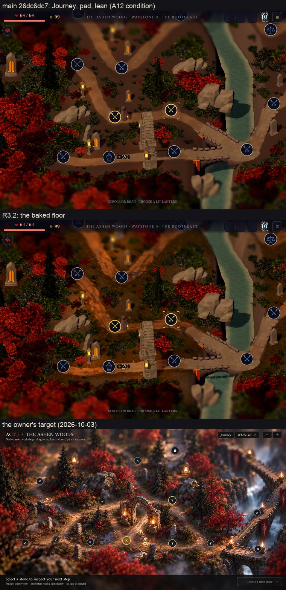

# R3.2: the floor (issue #660)

Branch `map/r3-2-floor-2026-10-05`, from main `26dc6dc7`. Main has since
gained `3a98b5f9`, which touches only the agent evals and shares no file with
this branch. This is step R3.2 of the R3 plan. Act I's forest floor is baked
once per land at run time, behind the veil, into a top-down world-space
picture, and the live floor draws one sample of it.

Nothing here touches `domain/`, the save schema, the layout or its digests
(`a3ecf0fb…af83c` for seed 1 in every capture), route ids, tokens, pins or
other screens.

## What changed

| Commit | What |
|---|---|
| `b4a90eda` | The floor's art (`assets/art/map-journey/floor/`): four ground covers (moss, litter, soil, road), a 4×4 scatter atlas (pebbles, twigs, leaves, clumps) and a tiled micro detail. The deterministic recipe and its sources are in `tools/map_atelier/journey/floor/`. These are lane picks, with rows in `docs/art-ledger.md`. |
| `aa25a625` | The bake: `floor_plan.gd` (on the land's worker), `floor_stage.gd`, `floor_bake.gd` and `floor_warm.gd`, with its shaders (`floor_ground.gdshaderinc`, `floor_paint.gdshader`, `floor_mask.gdshader`, `floor_caster.gdshader`, `floor_mip.gdshader`). `terrain.gd` keeps its paint, its chunks and its height span. |
| `ece5e529` | The runtime: `land_floor.gd` and `floor.gdshader`. The map, the prefetch and the land carry the bake, and the pilgrim gets its blob shadow. |
| `97bb6aae` | `tests/test_map_floor.gd`, and `tools/check_floor_bake.gd`, the windowed GPU proof. |
| `d3365402`, `ddecbc38` | The map probe (`tools/map_trace/probe.gd`) times the opens and the bake, and reports the RenderingDevice's memory. It gains `--reopens` and several held views. |
| `ad956d8c` | Tuning against the target: the moss reaches further and the pools burn lower. |
| `8b3b0240`, `441bff8d` | Density goes from the plan's 20/10 texels a metre to 18/8, then 16/8 ([video memory](#video-memory)). The bake now sets up a frame before its first draw, after one 100.1 ms frame on the iPad 8. |
| `45cb1380` | The prefetch's bake, under the lit title, is paced to one tile a frame. Its worst frames were 81–83 ms; they are now 24.7–48.0 ms. |
| `fbc9a41f` | Puddles at Close read as flat slate-blue or pale slabs with square corners. They now use layered noise turned off the grid, with soft rims, and a sheen broken by the micro detail ([frame](frames/puddles-before-after.jpg)). |
| `2b411b4f` | The `map-journey` payload budget goes from 11 to 12 MiB: the floor's art packs to 1.17 MiB. |

## The look

The flat warm-brown ground is gone. It is replaced by:

- moss and ash soil in drifts, with red litter under the crowns;
- ragged road edges with grown-in verges, wheel ruts and a grown-over crown;
- puddles lying in the ruts;
- soft, dappled key shadows from every tree, rock, stone, post and building;
- contact shade at every base;
- a warm pool round every lamp, which flickers with that lamp's own flame.

The pilgrim stands on a soft blob and warms the road round it with its
lantern.

Sheets cover every stop at both shapes, main on the left of each pair:

| Act | Pad | Phone |
|---|---|---|
| I | [`act1-pad.jpg`](frames/act1-pad.jpg) | [`act1-phone.jpg`](frames/act1-phone.jpg) |
| II | [`act2-pad.jpg`](frames/act2-pad.jpg) | [`act2-phone.jpg`](frames/act2-phone.jpg) |
| III | [`act3-pad.jpg`](frames/act3-pad.jpg) | [`act3-phone.jpg`](frames/act3-phone.jpg) |
| IV | [`act4-pad.jpg`](frames/act4-pad.jpg) | [`act4-phone.jpg`](frames/act4-phone.jpg) |

Each covers seeds 1–3. The other frames are:

- Close, against main: [`close-main-r32.jpg`](frames/close-main-r32.jpg);
- Whole act, against main: [`whole-main-r32.jpg`](frames/whole-main-r32.jpg);
- close crops at 2×: [road and verge](frames/crop-road-verge.jpg), [a lamp's pool](frames/crop-lamp-pool.jpg), [rock shadows](frames/crop-rock-shadows.jpg), [the pilgrim and a bridge](frames/crop-pilgrim-bridge.jpg) and [a shrine and its pools](frames/crop-shrine-pools.jpg);
- the iPad 8 itself: [`ipad8-journey-441bff8d.jpg`](frames/ipad8-journey-441bff8d.jpg).

The iPad 8 screenshot is from the build before the puddle fix. It matches
the Mac's A12-condition capture, smooth road edges included.

Acts II–IV are unchanged. Against main, 0–1.2% of pixels differ at any stop
([`mac/stops-pixel-diff.txt`](mac/stops-pixel-diff.txt)). That is main's own
run-to-run noise: a second run of main at Act II, seed 1, differs from its
first by 719–1,491 pixels a stop and matches the branch exactly at two stops.

The floor is still far from the target in two ways:

- **The road is too orange.** It reads warmer and more saturated along its
  whole length than the target's pale grey-beige gravel, where only the
  lamps' pools are warm. The road cover and its tint (`road_tint`,
  `cover_saturation.w` in `floor_paint.gdshader`) are the knobs. This is an
  art call for the owner or R3.6's grade.
- **Lamp posts throw no visible key shadow.** Main's live lamp posts throw a
  hard one. In the bake, the lamp's own pool, which is emission, fills the
  post's key shadow.

## How the floor is drawn

**The plan (worker thread)**: `FloorPlan.build`, `presentation/map/landscape/floor_plan.gd:55 (build)`, is built
with the land and reads what the land already holds:

- every tree's light-facing shadow card (undergrowth casts none: wide, low
  cards facing one way streaked);
- radial stamps for the 2D fields pass: litter reach and foot for trees;
  reach, foot and an offset shade for shrubs; grit and foot for rocks; a foot
  for stones and seats. This is how the floor takes the wood's plants;
- every lamp's flame (at most 48);
- the ground's height span.

**The bake (main thread, a step a frame)**: `FloorBake.advance`,
`presentation/map/landscape/floor_bake.gd:104 (advance)`, works in a private World3D under the root. It uses
orthographic top-down views, the land's own key light (`presentation/map/landscape/floor_stage.gd:62 (light_up)`)
and the land's ambient, through a linear tonemap at exposure 0.5.

1. A 2D pass lays the fields at 8 px/m: woodland litter reach, rock grit, and
   contact occlusion with shrub shade.
2. The lit pass draws the ground chunks with `floor_paint.gdshader` at
   16 px/m, in 960×600 tiles, two a frame. Its pieces:
   - the four covers, each sampled twice and mixed;
   - four scatter layers from the atlas, for the pebbles, twigs and leaves;
   - a relief from the covers' own shading;
   - contact occlusion;
   - every lamp's pool, analytic and as emission, because Mobile lights a mesh
     with at most eight omni lights.

   Every static caster casts into it with a soft key shadow
   (`SHADOW_QUALITY_SOFT_HIGH` for the bake only, then restored), through the
   view's own shadow map:
   - the terrain's stonework, the kit and the waystones, as shadow-only copies;
   - the woodland's cards.
3. The mask pass, at 8 px/m, keeps the pool's share of the light, the phase of
   the lamp that lights it most (the flame's own hash) and the wet.

Each view is copied on the GPU (`RenderingDevice.texture_copy`) into the
floor's own RGBA8 textures, which carry an sRGB view. A mip chain of nested
2D views averages each level as light. There is no CPU readback.

**The floor (runtime)**: `floor.gdshader` is unshaded and takes no shadows.
Its fragment cost is:

- one sample of the picture;
- one sample of the mask;
- one sample of the micro detail.

On top of those it adds:

- the pools' flicker, from the flame's wave;
- the puddles' sheen and glints;
- the pilgrim's carried light.

The global `land_motion` (Reduce Motion) holds the pools steady and puts the
glints out.

`LandFloor._apply`, `presentation/map/landscape/land_floor.gd:114 (_apply)`, then does three things:

- it swaps every chunk's material (`draw_floor`);
- it puts out the road details the bake drew;
- it stops every live caster but the gateway arch, the slate outcrops and the
  bridges' parapets (`presentation/map/landscape/land_floor.gd:153 (quiet)`). Their live shadows give
  them form and fall on the decks and on each other, none of which is floor.

The pilgrim casts no live shadow and stands on its blob
(`presentation/map/landscape/pilgrim.gd:114 (ground_blob)`).

**When it bakes**:

- **Cold open**: before the land is attached, behind the veil
  (`presentation/map/map_scene.gd:1188 (in _poll_journey)`).
- **Map waiting on the land**: inline, keeping `landscape_pending` true
  (`presentation/map/map_scene.gd:1163 (in _bind_journey)`, `presentation/map/map_scene.gd:600 (in _process)`).
- **Journey prefetch under the title**: as its own `BAKING` step, paced to a
  tile a frame (`presentation/map/map_journey_prefetch.gd:232 (in _advance)`).

`MapJourneyPrefetch.prime` draws `FloorWarm` on the title's frame 0
(`presentation/map/map_journey_prefetch.gd:152 (in prime)`), so the bake's and the floor's pipelines join
the title's warm-up. The fallback is the old ground: where nothing can bake
(headless, Compatibility) or the bake fails, the ground keeps
`terrain_paint` and its live shadows.

**Terrain_paint lite on Act I**: on a baked floor the ground no longer
draws it. It stays for the fallback and for the bridge decks.

**Acts II–IV keep their floors.** They are not journey lands. Their maps are
the painted landscapes, which have no terrain chunks, kit, woodland or lamps
for the bake to read. The same bake would need their own 3D lands, which no
R3 step builds, so it does not apply cheaply.

## Gates (iPad 8, QA app, interleaved with main)

Each figure below is graded on the batch median of batch D2, the final head
`2b411b4f`. Batch D2 ran three interleaved installs each of main (`26dc6dc7`)
and the branch, one QA build each. Install 1 runs the boot, the opens with
six reopens, and 600-frame rests at the cadence and live at Journey, river,
Close and Whole. Install 2 runs the opening view.

Every launch is in [`device/batchD2/summary.txt`](device/batchD2/summary.txt)
and its rows. The earlier batches are kept as the record of the changes they
drove:

| Batch | Build | What it was |
|---|---|---|
| A | `ad956d8c` | 20/10 texels a metre |
| B2 | `ddecbc38` | traces |
| C | `ddecbc38` | 18/8 texels a metre |
| D | `441bff8d` | 16/8 texels a metre, paced; the same footprint as the head |

| Gate | Branch (median; every launch) | Main | Verdict |
|---|---|---|---|
| Floor fragment ≤ 0.9 ms at the reference clock | **0.051 ms** (main pass F 1.476 ms with the ground, 1.425 without; D2, one trace each, 298 and 307 stage frames). Earlier builds: 0.093 (D), 0.111 (B2) | Main's ground: 1.131 ms (2.551 − 1.420, B2) | Pass |
| Bake ≤ 0.4 s with a warm pipeline cache, no frame > 100 ms | Boots: **199.8 ms** (216.4, 183.5, 198.5, 199.8, 200.0); worst frame 70.1 ms. Cold opens: 125.7, 143.8, 148.2; worst frame 64.9 ms. Prefetch, paced, under the title: worst frame 26.7, 48.0, 33.3 ms (main 17.8–18.1) | — | Pass. **Outlier**: dev1-l1's boot, the first launch after the floor's shaders changed, on the `--map` path that skips the warm-up: 3249.6 ms, with frames 500.4, 2166.0 and 496.4 ms (the compile; cold cache) |
| The bake's pipelines inside the shader warm-up | `FloorWarm` runs in `prime()`. On the Mac, with a fresh shader cache, the first bake frame is 48.6 and 69.8 ms after it, against 131.8 and 119.1 ms without ([`mac/warm-up.txt`](mac/warm-up.txt)) | — | Wired and proven on the Mac. **Not measured on the device's title path** (risk 3) |
| Live shadow pass ≤ 15k primitives | **3,758–5,754** across the five views (5–13 draws). Journey: 5,031 | 28,130–58,014 (55–204 draws) | Pass |
| VRAM ≤ +20 MiB | Journey hold: 282.2, 296.0, 288.2 → **288.2**, **+14.9**. Boot: 282.2, 280.1, 295.9, 282.0, 279.9, 280.1 → 281.1 (+15.8) | Hold 273.3 ×3; boot median 265.3 | Pass on D2. **Batch D: +22.4** (see [below](#video-memory)) |
| Transient peak ≤ +40 MiB, freed within 10 frames | Cold-open peaks: 312.1, 326.1, 318.1 → **+27.6**. Ten frames later: 282.2, 296.2, 288.2, the steady figure | Peaks 290.5 ×3 | Pass |
| Cold open ≤ 2.6 s | **2535.7 ms** (2644.9, 2515.5, 2535.7) | 2334.9 (2465.4, 2265.7, 2334.9) | Pass, by 64 ms. **Outlier**: dev1-l1 at 2644.9. In batch D the median was 2598.8 (2598.8, 2399.9, 2613.7) |
| Warmed open ≤ 200 ms | **99.3 ms** (99.3, 103.7, 97.9) | 102.3 | Pass |
| Reopen ≤ 60 ms | **45.5 ms** over 18. Branch: 65.6, 41.9, 45.6, 39.7, 37.2, 40.6, 61.5, 47.4, 54.1, 34.4, 46.2, 46.0, 61.9, 56.4, 45.3, 35.9, 35.1, 40.6 | 42.5 over 18. Main: 59.5, 57.9, 42.0, 43.0, 34.3, 57.0, 58.6, 39.7, 36.0, 39.4, 23.1, 44.5, 59.7, 44.1, 59.7, 39.0, 38.7, 39.9 | Pass. **Outliers**: 65.6, 61.5 and 61.9 ms (main's batch D had 64.0) |
| Rest at vsync, 0 missed, every view | Every view (Journey, river, Close, Whole, opening), at the cadence and live, every launch: means 16.657–16.667 ms, **0 missed**. p95 at Journey: 17.05 at the cadence, 17.13 live | Main's one miss: ctl1 at Whole, live (a 43.0 ms frame) | Pass |
| Payload ≤ 6 MB (floor tiles and decal atlas) | **1.17 MiB** (ETC2 with mips: five 512² textures at 174,828 bytes, the atlas at 349,604). The iOS pck estimate goes from 276.3 to 277.5 MiB | — | Pass ([`mac/payload.txt`](mac/payload.txt)) |
| Layout digests unchanged | `tests/test_map_layout_fast.gd` passes. Every capture's digest is `a3ecf0fb…af83c` | — | Pass |

The batch-A rise in the opening view's p95, from 17.2 to 19.2 ms, is gone.
In D2 it is 19.08 on the branch against 19.41 on main.

### Video memory

On the iPad the counter (Metal's `currentAllocatedSize`) moves in steps of
about 6 MiB, independent of the build:

- main holds at 267.3 or 273.3;
- the branch holds at 282–284, 288–290 or 296.

The floor's own two textures are 8.9 MiB at 16/8 texels a metre. The rest of
its cost is pipelines, buffers and the Metal heap. At 20/10 that remainder
was about 7 MiB: the device's +21.8 less the 14.8 MiB that freeing the two
textures returned on the Mac.

| Batch | Build | Branch | Main | Median delta |
|---|---|---|---|---|
| D | `441bff8d` | 289.8, 289.7, 283.8 | 273.3, 267.3, 267.3 | **+22.4** |
| D2 | `2b411b4f` | 282.2, 296.0, 288.2 | 273.3 ×3 | **+14.9** |

`441bff8d` has the same footprint as D2's build. Pooled over every launch at
16/8 against every launch of main in C, D and D2 (6 against 9), the delta is
**+15.7**. Per pair, the delta is +16.5 in both of batch D's same-step pairs.
D2's pairs read +8.9, +22.7 and +14.9, because main held on one step while
the branch took three.

The gate passes on the final batch and on the pooled median. It sits within
one step of the line, so a single batch can read over it (risk 1).

## Visual proof and conditions

- **The A12 condition**
  (`GODOT_MTL_DISABLE_ARGUMENT_BUFFERS=1 --rendering-driver metal --rendering-method mobile`)
  at the head:
  - pad, phone and desktop, lean and full, and zh-Hant: **no "Error compiling shader"** and no script error;
  - the token gate's stop captures for every act, seed and shape: Act I none either.

  Acts II–IV show 10 lines a run on both builds. They are main's own: the
  `map_mineral` shader's `SAMPLER_LINEAR_WITH_MIPMAPS_ANISOTROPIC_REPEAT` at
  sampler(17), out of the A12's 0–15. See
  [`mac/a12-condition.txt`](mac/a12-condition.txt) and
  [frame](frames/a12-condition-shapes.jpg).

  The floor binds no anisotropic or repeating-mipmap sampler beyond the A12's
  slots (a test asserts it). Because the A12 cannot filter R32F, it reads the
  roads' R32F distance field with a hand-written bilinear filter: its first
  device run showed stair-stepped road edges.
- **Reduce Motion** at Close, two frames 1.5 s apart: with Reduce Motion on,
  10,191 pixels change, all of them water, and **0 change on the floor**.
  With it off, 108,752 change, the pools and the grain among them
  ([`mac/reduce-motion.txt`](mac/reduce-motion.txt),
  [frame](frames/reduce-motion-close.jpg)).
- **The token gate** (`tools/map_token_gate.gd`), re-run for both builds,
  every act, seed and shape: **0 failed** in all 48 runs. Act I's worst
  margin is 1.020–1.023 (main 1.015–1.026), with the same counts measured
  ([`mac/token-gate.txt`](mac/token-gate.txt)).
- **The GPU proof** (`tools/check_floor_bake.gd`) passes under the A12
  condition at the head ([`mac/floor-bake-check.txt`](mac/floor-bake-check.txt)):
  - the picture is 1536×960 with 11 mip levels, each the mean (as light) of the one below;
  - there is no seam between tiles;
  - the mask holds 21 lamp phases and standing water;
  - the bake takes six frames inline and eight paced;
  - its textures are freed with the land.
- **Mutation proof**: 26 of 27 mutations of `test_map_floor.gd`'s subject
  were caught. The survivor led to a stricter test, which a re-run caught.
  Both later checks of the GPU proof (pacing, the set-up frame) were caught
  too ([`mac/mutations.txt`](mac/mutations.txt)).

## Core gate

At `2b411b4f`, the code-final head, all of these pass
([`mac/core-gate.txt`](mac/core-gate.txt)):

- `godot --version` (4.7.2.stable);
- `tools/check_imports.sh`;
- `tools/check_scripts.sh` (479 scripts OK);
- `godot --headless -s res://tests/run_all.gd` (PASS, 148 tests);
- the CI-selected specialist checks: store exclusion, export paths, dev
  tools, benchmark freeze, anchors, map assets and map quality v2.

## Judgement calls

1. **16 and 8 texels a metre**, not the plan's 20 and 10. At 20/10 the
   floor's whole video-memory cost was +21.8 MiB at the median. Side by side
   at Close and Journey, 16 cannot be told from 18 or 20: the stage's own
   scale, the tilt-shift band and the live micro detail decide the grain.
2. **The lamp pools are analytic.** They are worked out in the bake's shader
   with Godot's own omni attenuation and are not real lights: Mobile lights a
   mesh with at most eight. The live flicker reads each pool's own flame
   phase from the mask.
3. **Five live casters remain**: the gateway arch, the three slate outcrop
   kinds and the bridges' parapets. They give their own forms and the decks
   their shadows. Everything else casts into the bake only, which brings the
   live shadow pass from 28–58k primitives to 4–6k.
4. **The pilgrim's blob** replaces its live shadow. Its carried light warms
   the road round it.
5. **The prefetch bakes paced, the cold open does not.** Under the lit title
   the prefetch bakes a tile a frame. Behind the veil, two a frame keeps the
   cold open inside 2.6 s.
6. **The puddles were reworked**, because at Close they read as slabs.
7. **The payload budget was raised.** Raising the group's budget by 1 MiB is
   the honest record of 1.17 MiB of new art; it does not hide it.
8. **Acts II–IV keep their floors** (above).

## Open risks

1. **Video memory sits one Metal allocation step under the line.** It is
   +14.9 on the final batch and +15.7 pooled, but +22.4 in batch D. A further
   2–3 MiB of margin would cost picture density: 14/6 texels a metre would
   save about 2.4 MiB.
2. **The cold open costs +200 to +250 ms over main.** The bake is 126–148 ms
   of that; the rest is the plan and height span on the worker. The median
   was 2535.7 ms in D2 and 2598.8 ms in D: inside 2.6 s, with little margin.
3. **The title path's warm-up is not measured on the iPad.** The QA probe
   boots with `--map`, which skips the warm-up. On that path, the first launch
   after the floor's shaders change compiled for 3.2 s in the bake's frames.
   On the title path, `FloorWarm` moves that compile to the title's frame 0,
   behind the launch screen, once per shader change.
   - `enemy_view.gd` records a cheaper pattern on this engine: making the
     materials compiles on worker threads, where drawing them waits.
   - That pattern could move this compile off frame 0 if the device shows it
     long.
4. **Reopen outliers**: 3 of 18 reopens were over 60 ms (65.6, 61.5, 61.9),
   against a median of 45.5. Main showed one in batch D (64.0).
5. **The art is a set of lane picks.** The road reads too orange against the
   target, and the lamp posts' key shadows are filled by their pools (above).
6. **Pre-existing, not this branch's**:
   - the exit-time "1 resources still in use" and an occasional "Texture RID
     leaked at exit" line, which main shows in the same runs;
   - main's `map_mineral` A12 shader errors in Acts II–IV;
   - water that still moves under Reduce Motion.

## Files

The evidence folders:

- `device/` holds batch summaries A, C, D and D2, with every launch. D2's
  probe rows are under `device/batchD2/rows/`. The Metal System Trace pass
  tables and their read at the reference clock are in `device/traces/`.
- `mac/` holds the A12 condition, the token gate, Reduce Motion, the GPU
  proof, the warm-up, the payload, the mutations and the stops' pixel diff.
- `frames/` holds the sheets, the crops, the conditions and the iPad 8
  screenshot.
- `tools/` holds the lane's scratch harnesses (never part of the game):
  - `look.gd` and `cap.sh` for the captures;
  - `batch*.zsh` and `common.zsh` for the device batches, which run the QA app
    only, under the device lock;
  - the summarisers;
  - `sheets.py`;
  - `mutate.py`;
  - `warm_then_map.gd`;
  - `paced.gd`.

The measurements took these paths:

- **Device figures**: `tools/map_trace/probe.gd` (`--map-trace-probe --map-lean --seed=1 --shape=pad-landscape --map-steps=2 --opens --reopens=6 --holds=cadence,live --probe-view=journey,river,close,whole`).
- **Traces**: `--holds=live --hold-frames=2400`, with and without
  `--trace-kill=ground`, read by
  `tools/map_trace/roles.py --ref-pass tonemap --ref-ms 0.270`.
