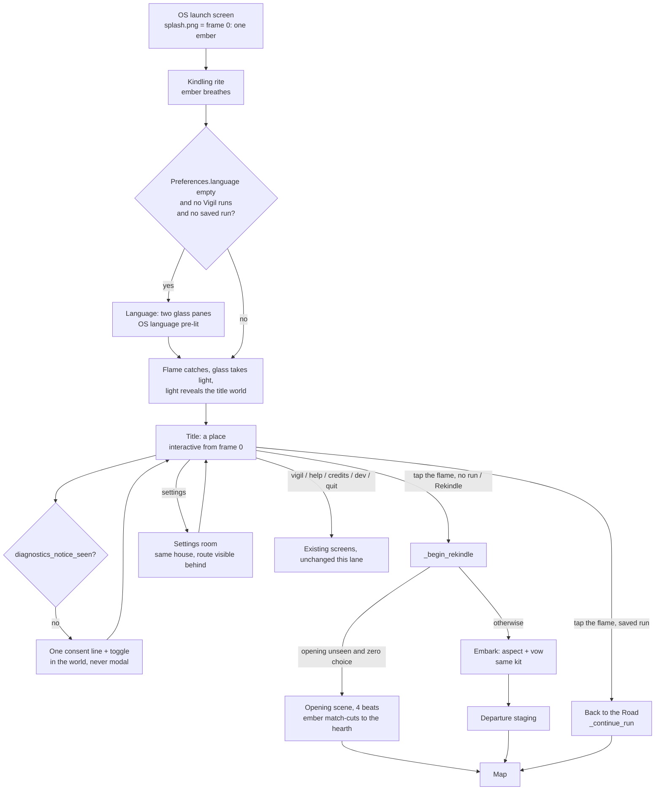
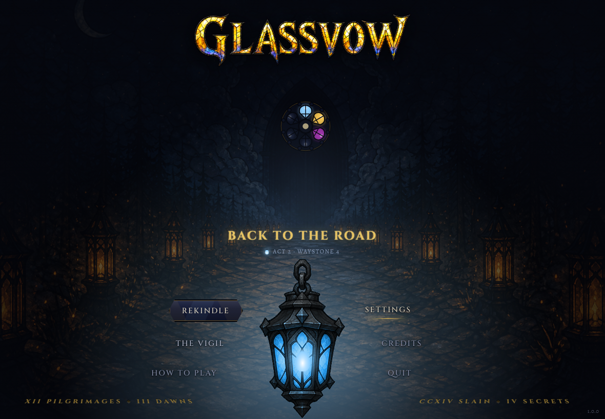
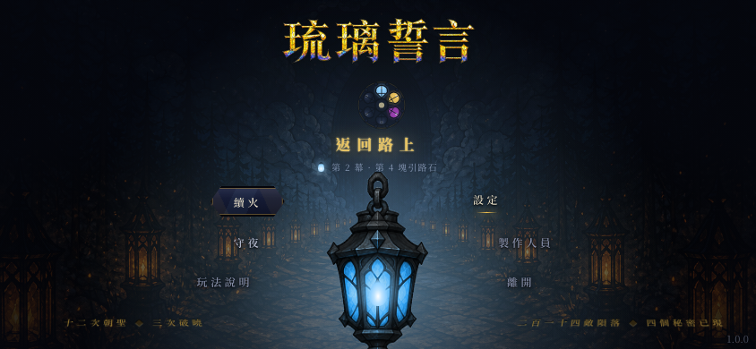
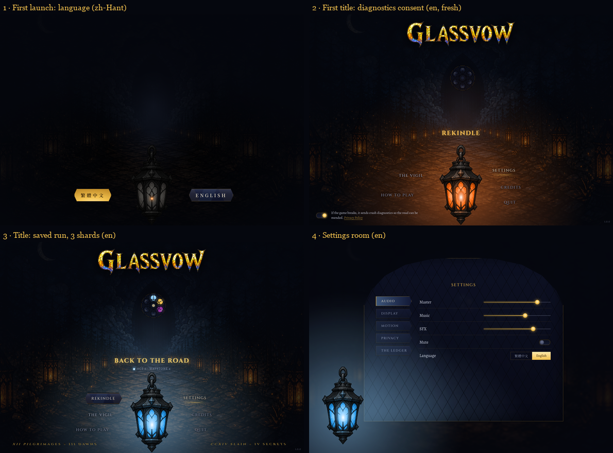
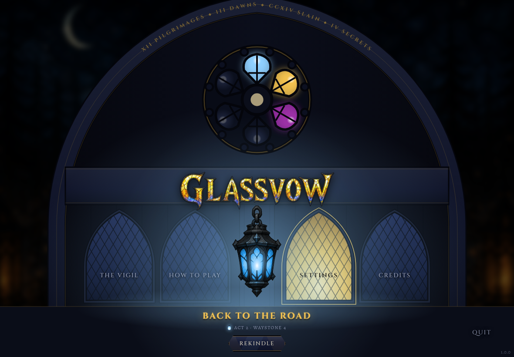
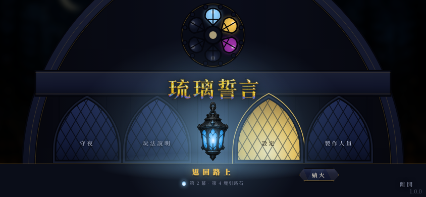
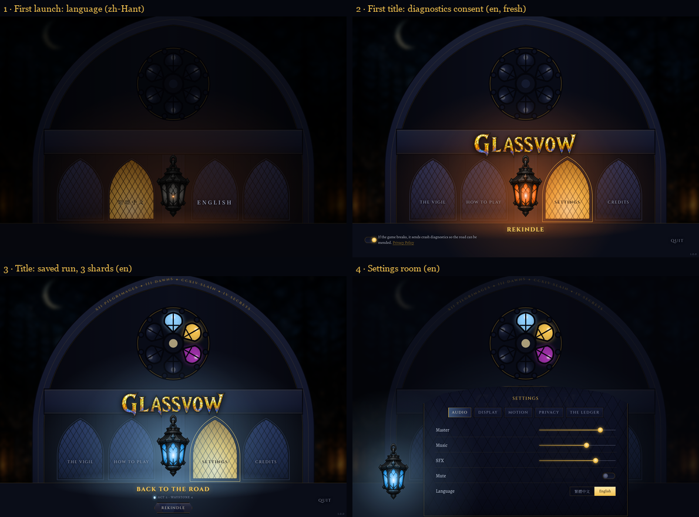
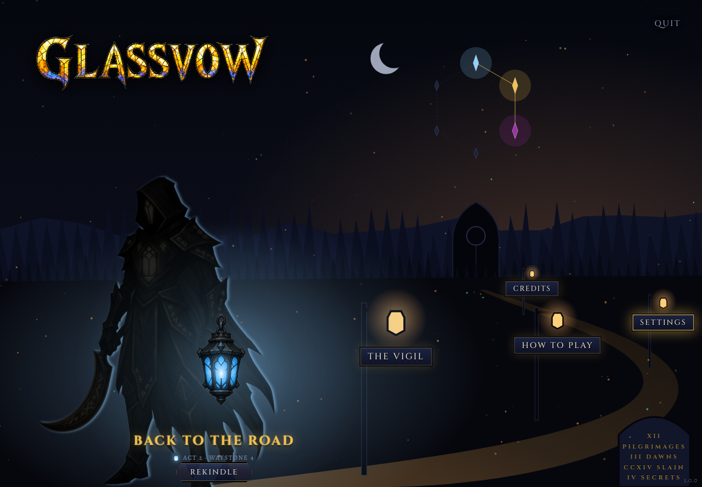
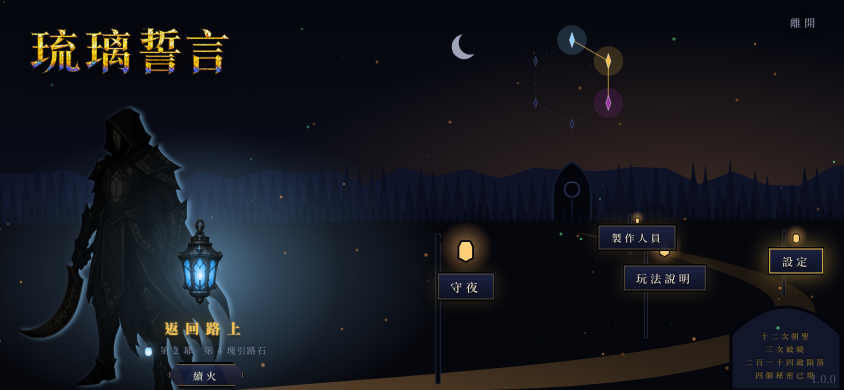
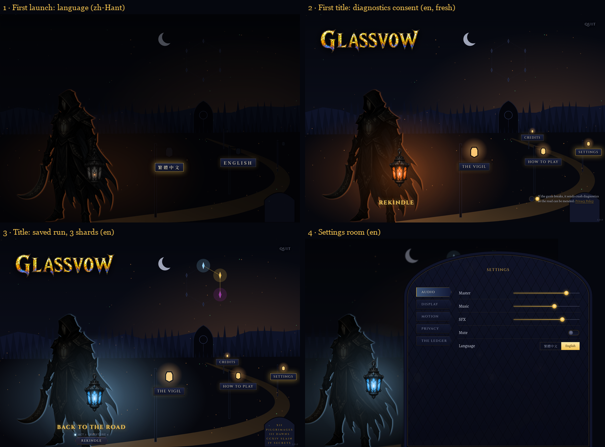

# Opening, start menu and start-up settings: concept dossier

Phase 1 of the opening lane, 2026-10-02. Owner instruction: James, 18:25 BST
("completely re-design … modern, stunning … very intuitive … immersive …
a unified interface engine too … AAA grade"). The binding vision is the lane
brief §2: the lantern is the interface, launch is a kindling, the title is a
place, history is in the picture, first launch happens in the world, settings
is a room in the same house, motion is ceremony and there is one engine.

This folder holds **direction**, not production. The mocks are HTML built
with the shipped fonts (`assets/fonts`), the shipped tokens (`RunStyle`,
`GlassStyle`, `TitleWorld`, `LanternFlame.COLOUR`) and shipped art. Phase 2
re-derives geometry in Godot and replaces stand-in art.

**Decided 2026-10-02 (orchestrator):** Concept **A, Held Light**, with both
borrowings (C's lamplighter chain during the reveal, B's carved-stone
deeds). **Phase 2 is built** — see §16 for what shipped, the evidence and
what stays open. §1 to §15 are the Phase 1 dossier, kept as written.

## 0. One correction to the lane spawn

The spawn asked for phone mocks at 390×844 portrait. Glassvow does not ship
portrait: `docs/design/2026-08-18-landscape-only.md` is the authority, and
`StageShape.REFERENCES` holds `phone-landscape` at **844×390**. Every phone
mock here is 844×390 landscape. Pad is the identity shape, 1180×820.

## 1. Flow



Route ids and behaviours are untouched: `continue / begin / vigil / help /
settings / credits / dev / quit` still reach `_continue_run`,
`_begin_rekindle` (and its Embark skip rule), `_show_settings`, the language
transaction `Main._on_language_changed` and the two-step `_confirm_reset`.
`rose` (the Vigil opened on the Rose Window) stays reachable from the rose.

## 2. The spine all three concepts share

Each concept is a different picture and a different motion language around
the same truths. These are not open questions.

| Vision point | How it is met, in every concept |
|---|---|
| The lantern is the interface | The primary action is the lantern's flame. Tap it: **Back to the Road** with a saved run, **Rekindle** without one. With a saved run, Rekindle drops to a secondary glass pane. |
| History is in the picture | The title flame is `Flame.read(content, saved)` drawn by the shipped `LanternFlame` shader, the same flame as the combat HUD and `RunLantern`. `Main._show_title` already loads `saved`, so this costs no new I/O. Shards held (`_vigil.shards`) light panes of the six-pane rose. Deeds become a carved inscription in Roman numerals (zh-Hant: Chinese numerals), not a stats line. A fresh install is a cold lantern, a dark rose and no inscription. |
| The flame is shown, not named | The "Back to the Road" sub-label reuses the shipped key `ui.hud.actWaystone` ("Act 2 · Waystone 4" / 「第 2 幕 · 第 4 塊引路石」) plus a flame glyph in the run's colour. It never prints "Frostlight" or a tier word: the flame lock says the player is never told and discovers it. |
| First launch is in the world | No modal and no "Settings" word. Language is two glass panes; diagnostics is one sentence with one toggle. Both are part of the kindling shot (§9). |
| Settings is a room in the same house | Same tokens, same glass, same lantern; the title world stays visible, dimmed, behind it. Sections are leaded panes. Erase-all keeps `_confirm_reset`. |
| Motion is ceremony, never friction | The title is interactive from its first frame. Every rite completes on one tap, and that first tap only completes the rite, so an impatient tap can never start a run by accident. Reduced motion lands every state whole (§7). |
| One engine | Everything is built from the Leadlight kit (§8). |

Utilities are quiet words, unboxed, as decided on 2026-08-14 (variant B,
"Ceremonial"). Only glass is boxed.

## 3. Concept A: Held Light (recommended)





**Composition.** First person, one vertical axis: wordmark, then the sealed
door with its rose, then the name plaque, then the hero's lantern held at
chest height in the foreground. Choices float in two short arcs in the
lantern's light, three to a side, nearest the flame most lit. The deeds are
carved into the road's two near flagstones, in perspective, lit by the
lantern.

**Hero treatment.** The lantern is the largest object on screen and the only
saturated light. The run's flame colours the road; the door waits in fog.

**Motion language: light reach.** Everything exists by its distance from the
flame. The kindling grows a radial reveal outwards from the flame; the
words brighten as the light reaches them; the flame breathes and the pool
breathes with it. Settings: the lantern is lowered to the left and its light
falls on a leaded window set into the gatehouse wall.

**First launch.** Near-black road, a cold lantern with one ember, and two
glass panes either side of it at flame height. On the first title, the
consent line sits where the deeds will one day be carved.

**Costs and risks.** Lowest. It keeps `TitleWorld` (procedural, measured),
reuses `LanternFlame` and its shader, and needs one new hero lantern painting
(§11). Risk: the composition is centred and symmetrical, so it must earn its
drama from light and motion, not from layout.

## 4. Concept B: The Sealed Door





**Composition.** Frontal and monumental. The door the whole game walks
towards fills the frame. Its rose window, very large, is the six shards; the
deeds are carved around its arch; the wordmark is cut into the lintel; the
four utilities are its four leaded lancets; the hero's lantern hangs from an
iron hook on the central mullion. The name plaque and Rekindle stand on the
threshold step.

**Hero treatment.** The door is the hero and the lantern is its key. The
endgame mirror is the strongest of the three: six panes at 244 px across on
pad.

**Motion language: lead-line tracing.** Light travels along the leading.
Kindling: the ember catches, then molten light runs up the hook, along the
lintel and round the tracery; held panes fill one by one; each lancet fills
from the bottom like poured glass. Settings: the vestry window opens below
the rose, which stays lit above the room.

**First launch.** The two lancets beside the hook carry the languages (OS
default pre-lit). Consent is carved on the threshold step.

**Costs and risks.** Highest art cost: a hero door façade at production
quality and a replacement for `TitleWorld` as the title backdrop. On phone,
four lancets across 844 px leave 130 px each, so English labels run at 11 px
(the floor). The lantern is subordinate to the door, which weakens "the
lantern is the interface". The 08-14 wordmark loses its sky.

## 5. Concept C: The Long Road





**Composition.** Lateral and cinematic. The pilgrim stands at the road's near
end, lantern held out; the road sweeps across the frame and back to a small
door on the horizon. The utilities hang as glass signs from lamp posts along
the road. The six shards are a constellation above the door. The deeds are
carved on a milestone in the corner.

**Hero treatment.** Character first: the hero figure, rim-lit by their own
flame, is the anchor. Closest to a Hades or Darkest Dungeon II title.

**Motion language: the lamplighter chain and a travelling camera.**
Kindling: the pilgrim's flame catches, then the posts light one after
another down the road to the door, each sign appearing as its lamp lights.
Screens are places along the road: settings is a camera dolly to the
waystone shrine, whose arched window is the room.

**First launch.** The two nearest posts carry the languages; consent sits on
the blank milestone.

**Costs and risks.** A back-view pilgrim painting per class (Duskblade now,
Ashwarden in 1.1), layered landscape art, lamp-post sprites and a dolly
camera on `TitleWorld`. Sign placement is depth-ordered, so labels collide
whenever the road changes; zh-Hant and English widths differ by 2×. Phone is
the weakest of the three: the far signs sit at 10 to 11 px. The mock uses the
front-facing Duskblade art mirrored as a stand-in.

## 6. Side by side

| | A Held Light | B The Sealed Door | C The Long Road |
|---|---|---|---|
| Hero object | the lantern | the door | the pilgrim |
| Camera | first person, axial | frontal, monumental | lateral, travelling |
| Choices | words in the lantern's light | lancets in the door | signs on lamp posts |
| Shards | rose on the distant door | huge rose, door crown | constellation |
| Deeds | carved flagstones | carved arch | milestone |
| Motion language | light reach (radial) | lead-line tracing | lamplighter chain, dolly |
| Phone legibility | good (12 to 17 px) | tight (11 px labels) | weakest (10 to 11 px) |
| New art | 1 hero lantern | door façade, backdrop | pilgrim per class, landscape, posts |
| Reuses `TitleWorld` | yes | no | yes, with a dolly |
| "Lantern is the interface" | literal | partial | strong but shared with the figure |

## 7. Motion spec

Curves name the Godot pair (`Tween.TransitionType` + `EaseType`). Every rite
completes on one tap (or any key / button), cross-fading to its end state in
`skip` time. Reduced motion (`Preferences.active.reduce_motion`) replaces
every travel, scale and radial with an opacity change of at most 150 ms, or
lands the state instantly, and never adds a wait.

| # | Transition | Duration | Curve | Tap-skip | Reduced motion | Idle motion (at rest) |
|---|---|---|---|---|---|---|
| T0 | OS launch screen → first Godot frame | 0 (the splash *is* frame 0: black, one ember at the flame's seat) | none | n/a | same | OS launch screen: static by platform (one frame); Godot's first frame is the ember, which flickers |
| T1 | Kindling: ember breathes 0 to 0.4 s; flame catches 0.4 to 0.9; glass takes light 0.9 to 1.5; the world revealed 1.5 to 2.4; wordmark lit 1.9 to 2.4 | 2.4 s (A); B tracing 2.8 s; C chain 2.6 s | catch: BACK/OUT (overshoot 1.15); glass: SINE/IN_OUT; reveal: QUINT/OUT | completes in 120 ms; the tap does not choose | title lands whole with a 150 ms fade | the rite itself; the ember flickers before it catches |
| T2 | Language panes rise (first launch only; the rite holds at 0.4 s) | 320 ms, 12 px rise + fade | QUINT/OUT | n/a (waits for input) | panes appear whole | ember flicker and its light on the road; the road's ash faintly through the dark; the pre-lit pane breathes |
| T2b | Language chosen: the chosen pane flares, the other sinks and fades, the rite resumes | 180 ms flare, 320 ms sink | CUBIC/OUT, CUBIC/IN | completes | chosen state lands; rite resumes | as T2 until the rite resumes |
| T3 | Consent line appears (first title only) | 320 ms fade, with the last 30% of T1 | SINE/OUT | completes with T1 | appears whole | the title's idle (T10) behind the consent line |
| T4 | Focus (keyboard, pad, hover) | 180 ms | CUBIC/OUT | n/a | instant | — |
| T5 | Press | 90 ms down to 0.97 with a glass flare; release 180 ms | QUAD/OUT; BACK/OUT | n/a | flare only | — |
| T6 | Title → Back to the Road | flame flares 180 ms, then light floods outwards from the flame (inverse iris) 480 ms; the save load starts on the tap and runs under the cover; the map plays its existing 450 ms screen-in | CUBIC/IN for the flood | the second tap skips the flood; the load is never waited on longer than it takes | 150 ms fade to cover | the flood itself; the map's own idle after |
| T7 | Title → Rekindle → opening (first run) | push into the lantern 600 ms (scale 1.0 → 1.6, flame fills the frame), then the opening's existing `wake` (2.6 s) starts from the same orange: the ember match-cuts to the hearth fire | QUINT/IN | skips to beat 1 | cut to beat 1 | the opening's idle (T9) |
| T7b | Title → Rekindle → Embark (later runs) | the room motion of T8 (Embark is built from the same kit) | as T8 | as T8 | as T8 | Embark: the room's light drifts and breathes on the leaded glass, the leading glints, the road behind breathes |
| T8 | Title → Settings room | world dims to 0.62 over 320 ms; room rises 480 ms (A: from the lantern's light; B: the vestry opens; C: camera dolly 600 ms); lantern glides to its seat 480 ms | QUINT/OUT | completes | room appears whole, 150 ms | the room's light drifts and breathes on the leaded glass, the leading glints; the title behind keeps breathing (it is never frozen under the room) |
| T8b | Settings room → title | 320 ms, the reverse | CUBIC/IN | completes | instant | the title's idle (T10) |
| T9 | Opening beat 4 title card → departure / map | the card uses the wordmark's glass type; exit is the lantern's light flooding outwards from the hero's lantern seat, 480 ms | CUBIC/IN | skips | 150 ms fade | between lines: embers and motes drift; a hearth beat's firelight breathes on the plate |
| T10 | Idle (title at rest) | flame breath 2.8 s loop; light pool ±4%; ash weather as today | SINE/IN_OUT | n/a | flame flicker only, no pool breath, no weather drift | flame breath; light pool ±4%; ash weather and motes; lamplighter flicker on the painted lanterns; held shards pulse in the rose; the camera breathes and answers the pointer |

No screen of the lane is a still frame while it waits for input (owner
ruling, 2026-10-02): every state lists what moves at rest in the last column,
all of it draw-only. Reduce Motion stops all of it but the flame's flicker
(the ember, the flame in the glass); the eye still answers the pointer, as
shipped.

Budget rule: no rite exceeds 3 s, none is replayed in a session (the second
title of a session lands the world already lit; only the flame breathes), and
no wait is ever added in front of a load.

## 8. The interface engine: Leadlight

Named for the leaded window: every surface in Glassvow is glass held in
lead. It pays the unpaid 2026-08-14 decision 2 (one canonical Theme from the
tokens, every Control type, one lantern focus ring) and adds the motion and
transition vocabulary.

### 8.1 Tokens (`LeadlightTokens`)

Values are the shipped ones; Leadlight becomes their single home and
`RunStyle` / `GlassStyle` constants become aliases (`const GOLD: Color =
LeadlightTokens.GOLD`), so no screen changes when the kit lands.

| Group | Tokens |
|---|---|
| Night | `VOID #05070e`, `INK #0b0e1a`, `FOG #141a2e`, `LEAD #04050b`, `PANEL rgba(14,18,34,.86)` |
| Light | `GOLD #f2c14e`, `GOLD_DIM #9c7c34`, `EMBER #ff9a4d`, `PARCHMENT #e8dfc8`, `TEXT #d7dcea`, `TEXT_DIM #8b93ad`, `GLASS #8fd0ff`, `DANGER #ff8d8d` |
| Flame | read from `LanternFlame.COLOUR` (Frostlight `#8fd0ff`, Hearthfire `#f2c14e`, Eclipse `#9c2fa6`, Kindling `#e8702a`, Soot `#8a6e52`), never copied |
| Type roles | `primary` Cinzel 700, 0.16 em (zh: Noto Serif TC Black, 0.42 em); `label` Cinzel 500, 0.14 em (zh SemiBold, 0.30 em); `carved` Cinzel 700, 0.32 em, gold at 55%; `read` Alegreya 400 (zh Regular). Faces always via `GlassStyle.face()`, so the CJK and symbol fallback chain is untouched. |
| Type scale (pad / phone) | plaque 24 / 17, pane 15 / 12, quiet word 15 / 12, carved 14 / 11, read 16 / 14, caption 12 / 10. The floor is 10 px on phone and nothing interactive drops below 11 px. |
| Spacing | 4, 8, 12, 16, 24, 32, 48, 64 |
| Radii | `glass 0` (lead-cut panes use polygons, not radii), `pane 14` (shipped), `control 12`, `pill 999` |
| Materials | `glass_cold` (indigo gradient with a lead rim and gold-dim inner line), `glass_lit` (amber radial from below), `glass_flame` (tinted by the flame colour), `lead` (2 px `LEAD` + 1 px `GOLD_DIM` at 50%), `quarry` (diamond leading, 30 px), `stone` (the door and wall gradient) |
| Hit floor | `RunStyle.hit_floor` stays the 44 px touch rule |

### 8.2 Motion vocabulary (`LeadlightMotion`)

Durations `TICK 0.09`, `QUICK 0.18`, `SETTLE 0.32`, `CEREMONY 0.6`, `RITE ≤ 3.0`;
`SKIP 0.12`; `REDUCED_FADE 0.15`. Curves `REVEAL` (QUINT/OUT), `EXIT`
(CUBIC/IN), `BREATH` (SINE/IN_OUT), `CATCH` (BACK/OUT). Helpers, all reading
reduce-motion in one place: `enter(node, kind)`, `exit(node, kind)`,
`focus(node, on)`, `press(node)`, `breathe(node, property, amount)`.
`LeadlightRite` is a skippable timeline of steps whose `skip()` seeks every
step to its end value; the kindling, the first launch and the opening
hand-off are rites.

### 8.3 Components

| Component | Is | Used by |
|---|---|---|
| `LeadlightLantern` | the primary action: lantern art + `LanternFlame` + light pool; takes a flame reading | title, settings (as the room's light), embark |
| `LeadlightPane` | secondary action, a leaded lozenge (cold / lit) | title Rekindle, first-launch languages, embark |
| `LeadlightWord` | quiet unboxed utility word with the gold hairline focus | title utilities, settings footer |
| `LeadlightPlaque` | the lit name label that belongs to the lantern, optional sub-label | title, embark, opening title card |
| `LeadlightToggle` | glass switch, ember knob when on | settings, first-launch consent |
| `LeadlightSlider` | gold track, lantern disc grabber (the shipped `GlassStyle.disc`) | settings |
| `LeadlightChoice` | segmented glass choice | settings language, embark vow |
| `LeadlightRow` | label + control, 48 px (44 on phone), lead hairline separator | settings, embark |
| `LeadlightSheet` | the room: an arched leaded window with quarry glazing and a framing per concept | settings, embark, credits later |
| `LeadlightRose` | six leaded panes drawn with `_draw`; lit by `Vigil.shards` | title (and the Vigil later) |
| `LeadlightInscription` | carved text on stone (perspective or path) | title deeds |

Every component draws with `_draw` or `StyleBoxFlat`. None reads
`hint_screen_texture`, none needs a 3D material, so the A12 sampler limit and
the one-backbuffer rule are untouched.

### 8.4 File plan

```
presentation/ui/
  leadlight_tokens.gd      tokens, type roles, materials (StyleBox factories)
  leadlight_theme.gd       the canonical Theme; GlassStyle.theme() delegates here
  leadlight_motion.gd      durations, curves, reduce-motion-aware helpers
  leadlight_rite.gd        skippable timeline
  leadlight_shapes.gd      lozenge, lancet, arch, rose polygons (pure, testable)
  components/              the eleven components above, one file each
presentation/title/
  title_screen.gd          the title as a place (replaces ChoiceScreen's "title" variant)
  kindling.gd              the launch rite
  first_light.gd           language panes + consent line
presentation/run/settings_panel.gd   rebuilt on the kit; class, signals and Main API unchanged
tests/test_leadlight_*.gd  tokens alias the shipped values; reduce-motion lands end
                           state with no tween; rite skip seeks to end; shapes pure
```

`ChoiceScreen` keeps its other variants; its title branch is removed only
after `TitleScreen` passes its tests. Other screens migrate later, not in this
lane.

### 8.5 TransitionLayer is extended, not duplicated

`TransitionLayer` keeps ownership above every route and keeps its
benchmark-cited constants frozen. Three additions:

- `flood(at: Vector2, time)`: the inverse iris (light grows from a point),
  from the existing `IRIS_SHADER` with an `invert` uniform; draw-only.
- `flare(at: Vector2)`: the existing bloom leaf with a centre parameter
  instead of the fixed `BLOOM_CENTRE`.
- `skip()`: completes every running leaf at its end value (the rite tap).

New durations come from `LeadlightMotion`. Grain stays the only
`hint_screen_texture` reader.

## 9. First launch, both locales

**Detection uses existing keys only** (no save or `Preferences` change):

- Language panes show when `Preferences.language == ""` **and** the Vigil has
  no runs **and** there is no saved run. An existing player whose language
  was never set gets the resolved language persisted silently instead of a
  new question after an update.
- The OS language (`Preferences.resolve_language("", OS)`) is pre-lit, so one
  tap on it, or on the flame, accepts and persists it through
  `Main._on_language_changed`.
- The consent line shows on the first title while
  `diagnostics_notice_seen == false`; once the line is lit on screen (the
  rite's reveal has run, or the title landed lit) the title calls
  `Preferences.mark_diagnostics_notice_seen()`, as the Settings first-panel
  notice does when shown — never at build, so the title held at the ember
  for the language does not spend it (PR #650 review). The default stays on
  (posture B, `DEFAULT_DIAGNOSTICS`). Toggling calls
  `Preferences.set_diagnostics_enabled` and shows the shipped
  `ui.settings.diagnosticsNote` ("Takes effect on the next launch.").
  Today a new player never sees this notice until they open Settings, so the
  flow improves on the shipped behaviour. It is not a legal review.

| Key | en | zh-Hant | Status |
|---|---|---|---|
| `ui.language.en` / `ui.language.zhHant` | English / 繁體中文 | English / 繁體中文 | shipped |
| `ui.firstLight.diagnostics` | If the game breaks, it sends crash diagnostics so the road can be mended. | 遊戲若出錯，會傳送當機診斷資料，好讓這條路得以修補。 | **PROPOSED**, for the story skill. Every zh-Hant glyph is already in the locale corpus, so the Noto Serif TC subset does not change. An earlier draft (破損 / 報告) failed that check. |
| `ui.settings.privacyPolicy` | Privacy Policy | 私隱政策 | shipped |
| `ui.settings.diagnosticsNote` | Takes effect on the next launch. | 將於下次啟動遊戲時生效。 | shipped |
| `ui.hud.actWaystone` (title sub-label) | Act {act} · Waystone {n} | 第 {act} 幕 · 第 {n} 塊引路石 | shipped, reused |
| deeds in numerals | XII pilgrimages · III dawns · CCXIV slain · IV secrets | 十二次朝聖 · 三次破曉 · 二百一十四敵隕落 · 四個秘密已現 | **PROPOSED** formatting of the shipped `ui.brand.stats` / `ui.brand.secrets` text: needs a numeral formatter, not new words |

No banned vocabulary appears in the proposed copy. The tagline
(`ui.brand.tagline`) leaves the title. The design is wordless where it can
be.

## 10. Opening scene re-staging (presentation only)

The script is canon and is not touched. Staging only:

1. **Title → beat 1.** On the first run, Rekindle pushes into the lantern
   (T7), and the ember match-cuts to the hearth fire of `opening-hearth.png`
   under the existing `wake` transition.
2. **Beat 2 kindle hand-off.** The Keeper's `kindle@keeper` effect plays the
   same `Kindling` rite the launch played, in the same colour, timed to
   "It burns what you carry." The player has now seen the lantern light
   twice and been told why once.
3. **Beat 4 title card.** "The Vigil begins." is set in the wordmark's glass
   type, using the `LeadlightPlaque` primary role.
4. **Exit.** The light floods outwards from the hero's lantern seat (T9)
   into the departure staging or the map.

## 11. Asset commissions

Every candidate and a labelled contact sheet go in this folder; the pick
lands in `assets/` marked "lane pick, owner re-pick open", with a ledger row
carrying the exact prompt. Image prompts are prefixed with the house style
block recorded through `docs/art-ledger.md`.

| # | Asset | Tool | Concept | Draft prompt or method |
|---|---|---|---|---|
| 1 | `assets/art/title/splash.png`: frame 0, one ember | deterministic script (no model): `VOID` field, ember radial at the flame seat's normalised position for the identity shape | all | n/a: scripted, so frame 0 and the first Godot frame register to the pixel |
| 2 | Title hero lantern, 1024×1536, transparent, as two layers: iron and lead frame; glass luminance | `image-gen`; glass layer split by colour key in a script | A (and B, C at smaller size) | "A Gothic hexagonal iron lantern held at chest height, front three-quarter view, centred, chain ring on top, pointed-arch glass panes in thick black lead came with worn gold edging, the glass neutral pale grey hammered glass with no colour and no flame (tinted in engine), soft warm rim light from below, matches the attached lantern icon's shape language" + reference `assets/art/ui/lantern.png` |
| 3 | Rose window panes at title scale | none: drawn by `LeadlightRose` with `_draw`, coloured from the six Emberglass masks | all | n/a |
| 4 | Door façade, 2360×1640 (B only) | `image-gen` | B | "Frontal view of a colossal sealed Gothic door at night, a great six-petal rose window above a carved lintel, four tall leaded lancets in the door leaves, an iron hook on the central mullion, deep indigo stone, empty glass openings (black) for engine-drawn panes" |
| 5 | Pilgrim seen from behind, per class (C only) | `image-gen` | C | "The Duskblade seen from behind and three-quarter left, standing on a rise, hooded, cloak blown right, holding a lantern out at arm's length in the right hand, no lantern art (engine-drawn)"; again for the Ashwarden in 1.1 |
| 6 | Kindling motion reference, 5 s | `grok-media` (video) | all | "Total darkness; a single orange ember inside a Gothic iron lantern catches into a small flame; the stained-glass panes take the light; light spreads over wet cobbles towards a distant sealed door with a rose window; locked camera; 24 fps" (reference only, never shipped) |
| 7 | SFX `kindleCatch` (1.6 s) | ElevenLabs | all | "single ember breathing in darkness, faint crackle, a soft airy whoosh as a small flame catches, intimate close-mic, no music" |
| 8 | SFX `glassTakesLight` (2.0 s) | ElevenLabs | all | "warm resonant glass hum swelling as light fills stained glass, soft crystalline shimmer, bowed-glass tone, gentle, no music" |
| 9 | SFX `paneRise` (0.6 s) | ElevenLabs | all | "a small glass pane sliding into a lead frame, soft chime with a tiny metallic tick" |
| 10 | SFX `paneChoose` (0.7 s) | ElevenLabs | all | "a bright clear glass chime with a soft warm flare, a satisfying confirmation, short tail" |
| 11 | SFX `roomOpen` / `roomClose` (1.0 / 0.8 s) | ElevenLabs | all | "an old wooden shutter swinging open in a stone gatehouse, muffled, distant night wind" / the closing variant |
| 12 | ~~Music: `kindling` intro~~ — **dropped** 2026-10-02 (owner ruling: no new music; the rite and the title use the shipped `title` cue) | — | — | — |

The shipped `kindle.mp3`, `ember.mp3`, `click.mp3` and `hover.mp3` stay; the
new SFX cover what the pack has no word for (glass taking light, a room). The
pack becomes an addendum with its own `pack_id` bump; v1 bytes stay
untouched.

## 12. Performance plan

**Question.** Does the new start-up stay inside rc-bar P2 (cold launch →
title interactive is report-only for this RC; frame pacing P95 ≤ 16.67 ms is
gated) on the iPad 8 (A12)?

**Design rules that make the answer likely yes.** The title is interactive
from its first frame, and the kindling never gates input or loading. No new
`hint_screen_texture` reader. No 3D. One new large texture (the hero
lantern, VRAM-compressed); everything else is `_draw`. `TitleWorld` is kept
(A).

**Measurement, before and after, on the Mac:**

1. A tooling launch flag `--launch-timing` makes `Main` print
   `LAUNCH title_interactive_ms=<Time.get_ticks_msec()>` on the first frame
   on which the title accepts input, then quit. Tooling launches never touch
   the player's save (the dev-boot profile rule).
2. Eleven launches each on `origin/main` and on the lane head, the first
   discarded:
   `GODOT_MTL_DISABLE_ARGUMENT_BUFFERS=1 godot --rendering-driver metal --path . -- --launch-timing`.
   Report the median and P90, with wall-clock from `/usr/bin/time` beside it.
3. `tools/bench_title.gd`, modelled on `bench_flame.gd`: 10 s of warm-up, then
   30 s of the title at rest and 10 kindling rites, with per-frame CPU and GPU
   times and P50 / P95 / P99 for each shape and both locales.
4. Every new shader is checked with the same `GODOT_MTL_DISABLE_ARGUMENT_BUFFERS=1
   tools/shot.sh --rendering-driver metal …` capture.
5. Optional device confirmation on the iPad through the existing devicectl
   recipe if the Mac margin is under 2×.

**Pass rule.** Title-interactive no later than `origin/main` + 50 ms
(median). Title P95 on the Mac no worse than `origin/main` and ≤ 8 ms, which
leaves headroom for the A12.

## 13. Recommendation

1. **A, Held Light.** It is the vision taken literally: the lantern is the
   largest thing on screen, its flame is the run's real `Flame.read` reading
   through the shipped shader, and tapping it is the game's first verb. It
   is the most legible on phone, reuses `TitleWorld` and `LanternFlame`, and
   needs one painting. Its symmetry is the risk, so Phase 2 takes two things
   from the others: C's lamplighter chain, as `TitleWorld`'s eight existing
   lantern pairs lighting in sequence towards the door during the reveal,
   and B's carved-stone treatment for the deeds.
2. **B, The Sealed Door.** The most striking still and the strongest
   endgame mirror; the right answer if the title should advertise the Rose
   Window. It costs a façade painting, retires `TitleWorld` as the title
   backdrop, and is tight on phone.
3. **C, The Long Road.** The most cinematic in motion, but character art per
   class, depth-sorted signs that collide across locales, and the weakest
   phone reading make it the riskiest to ship at AAA quality in this lane.

## 14. Open for the orchestrator

1. **Pick:** A, B or C, with or without A's two borrowings.
2. **Hero lantern art:** commission #2 now, or ship Phase 2 on the 512 px
   `ui/lantern.png` upscaled and commission after the stills are approved
   (the lane's preference is to commission in Phase 2; nothing blocks on it).
3. **PROPOSED copy** in §9 goes to the story skill: one sentence and a
   numeral formatter.
4. ~~**Kindling music** row (#12)~~ — dropped by owner ruling (no new music). Was: waits on James's Suno render; Phase 2 ships
   the rite with the shipped `title` cue and adds the intro when it lands.

## 15. Files and re-rendering

| File | Is |
|---|---|
| `concept-{a,b,c}-1180x820.png` | pad (identity shape): title with a saved run, three shards, English |
| `concept-{a,b,c}-844x390.png` | phone-landscape: the same in zh-Hant (file names avoid the word that `tools/ci_scope.py` routes to release checks) |
| `concept-{a,b,c}-states.png` | first launch (zh-Hant), consent on the first title (fresh), title, settings |
| `concept-{a,b,c}-*.html` | the mocks; query `l=en|zh`, `s=title|first|consent|settings`, `fresh=1` |
| `mock-base.css`, `mock-base.js` | shared tokens, kit controls, copy and the rose drawing |
| `render.sh` | `./render.sh concept-a-held-light.html out.png 1180 820 "l=en"` (headless Chrome; it passes the stage size because headless Chrome's viewport is shorter than its window) |

## 16. Phase 2 — as built

### 16.1 What shipped

| Scope | Where | Notes |
|---|---|---|
| (a) Leadlight kit | `presentation/ui/` (tokens, theme, motion, rite, shapes, numerals) and `presentation/ui/components/` (glass box, pane, word, plaque, toggle, slider, choice, row, sheet, room, rose, inscription, lantern) | `RunStyle` / `GlassStyle` constants are aliases of `LeadlightTokens`, values pinned by `tests/test_leadlight.gd`; the canonical Theme lives in `LeadlightTheme` and is built once per process. |
| (b) TransitionLayer | `flood`, `flare`, `skip` | The flood reuses the iris shader (a `feather` uniform whose default keeps the iris edge identical); grain stays the one screen reader. Headless runs the flood's callback at once. |
| (c) Kindling, splash, TitleScreen | `presentation/title/`, `assets/art/title/splash.png`, `assets/art/title/lantern-hero.png` | The splash is frame 0 of the rite, rendered from the production screen (`tools/capture_title.gd --rite=0 --scale=2`). `ChoiceScreen`'s title variant is retired (two commits, per-file size). |
| (d) First launch | `TitleScreen` + `FirstLight` | Existing keys only: language when `Preferences.language` is empty and the player is new (a returning player is not asked and keeps following the OS language); consent while `diagnostics_notice_seen` is false, recorded once its line is lit. |
| (e) Settings | `SettingsPanel` on `LeadlightRoom` | Class, signals, constructor, `set_shape`, `focus_language` and every tested node name unchanged. |
| (f) Embark | lighter re-dress, as the ruling allows | Leaded room, glass cards (`LeadlightGlassBox.chosen`), glass actions; phone cards grow to 84 px with two-line blurbs (the shipped 66 px card spilled its copy in both languages). |
| (g) Opening | staging only, script untouched | The lantern's routes leave in its own light (flare + flood from the wick); the Keeper's kindle sparks burn the Kindling colour; the beat-4 card uses the wordmark's lettering; the opening floods out to the road. |
| (h) Assets and ledgers | `docs/art-ledger.md`, `docs/sfx-ledger.md`, `docs/story/05-foreshadow-ledger.md` row 467 (no music: owner ruling) | Hero lantern: four candidates + contact sheet in `lantern/`, the pick registered onto the HUD lantern's set-out (`lantern/register.py`) so the shipped flame shader lights it unchanged — lane pick, owner re-pick open. |

### 16.2 Evidence

- Stills (`stills/`): `title-fresh.png`, `title-saved.png`, `title-vigil.png`,
  `first-launch.png`, `settings.png`, `embark.png` (each: phone-landscape,
  pad-landscape = identity, desktop-landscape; English and zh-Hant),
  `rite.png` (six moments of the launch rite), `a12-metal.png`.
- Idle motion (`stills/idle-motion.png`): three frames one second apart per
  state, nothing touched, with the share of pixels that changed between
  frames — title 6.5 / 4.8 %, first launch 0.9 / 0.3 % (a dark frame by
  design: the ember, its light on the road, the ash through the dark, the
  breathing pane), consent 6.6 / 4.7 %, settings 0.8 / 5.6 %, Embark
  4.5 / 6.5 %, the opening between lines 1.5 % (frames from separate boots;
  the first pair includes the line arriving). Under Reduce Motion the title
  still changes 5.7 / 2.8 %: the shipped camera easing to the pointer, which
  Reduce Motion keeps by design; the lane's own idle motion stops.
- Tests: `tests/test_leadlight.gd`, `tests/test_title_screen.gd`; the title
  tests in `tests/test_presentation.gd` now pin the title as a place,
  including a no-overlap check at every shape in both languages (it caught a
  real phone overlap, fixed).
- Real boot: a dev scenario (saved run + three shards + Shatter cards) then a
  plain `tools/shot.sh` title shows Main handing the title its real
  `Flame.read` (Steady Frostlight), the shards and the carved deeds.

### 16.3 Performance (Mac, M1 Max, `GODOT_MTL_DISABLE_ARGUMENT_BUFFERS=1 --rendering-driver metal`)

Cold launch → title interactive, `--launch-timing`, fresh profile (the worst
case: first launch with the language and consent), eleven runs each, first
discarded, interleaved; `origin/main` 9d7207b8 measured with the same patch
in a detached worktree:

| | origin/main | lane head | Δ |
|---|---|---|---|
| title phase (title entered → interactive), median / p90 | 171.5 / 183 ms | 218.5 / 238 ms | **+47 ms** |
| engine ticks at interactive, median / p90 | 3107.5 / 3215 ms | 3180.5 / 3300 ms | +73 ms |
| process wall clock, median / p90 | 3838 / 3905 ms | 3889.5 / 4006 ms | +51 ms |

The engine boot before `Main._ready` swings by ±300 ms run to run, so the
title phase is the number this lane owns; it passes the +50 ms rule. It came
down from +70 ms by caching the Theme, chaining Noto Serif TC Black only in
zh-Hant, loading nothing for an unheld rose pane, drawing two switch icons
instead of four, and deferring the lantern's lit layer one frame.

Title frame time, `tools/bench_title.gd` (1500 frames at rest after a 4 s
warm-up; the rite from its first frame):

| | wall med / p95 / max (ms) | CPU render med / p95 (ms) |
|---|---|---|
| pad rest, main → lane | 8.70 / 18.25 / 50.9 → 8.71 / 15.72 / 129.9 | 0.083 / 0.103 → 0.076 / 0.086 |
| pad rite, main → lane | 8.56 / 22.02 / 192.7 → 8.52 / 13.36 / 242.6 | 0.077 / 0.091 → 0.076 / 0.089 |
| phone rest, main → lane | 8.81 / 18.35 / 130.0 → 8.65 / 19.12 / 45.1 | 0.077 / 0.094 → 0.077 / 0.087 |
| phone rite, main → lane | 8.78 / 22.87 / 208.0 → 9.02 / 22.87 / 266.1 | 0.079 / 0.093 → 0.074 / 0.086 |

On this Mac the Metal swapchain paces the window to the display even with
vsync off, so the wall interval is display-bound in both trees (median
~8.7 ms); the §12 "≤ 8 ms p95" reading cannot be taken here and the CPU
render time is the comparable cost — equal or lower on every row. With the
idle motion added, the title at rest measures CPU render p95 0.079 ms (pad)
and 0.077 ms (phone). The rite's
worst frame is ~50–60 ms longer than main's: the flame shader's pipeline
compile, deferred into the ember's breath where nothing moves. Device
confirmation on the iPad 8 remains the way to close P2.

### 16.4 Deviations from the dossier, with reasons

- **Language control in Settings** stays a single pane that names the
  language on screen and asks for the other (not the segmented choice of the
  mock): three Main-level locale tests pin exactly that contract, and a
  segmented control would make their assertions vacuous.
- **Settings room** has no second lantern: the title's own lantern and light
  stay visible behind the veil; the room is lit in the ember colour.
- **Embark** is the lighter re-dress the ruling allows, not a rebuild.
- **Focus** comes to the lantern on the first key or pad input, never by
  default, so touch players never see a selection ring.
- **Utility words** are 44 px tall always (the touch floor), not hit-floor
  dependent.
- **A returning player with no language set** (a pre-lane profile) is not
  asked and nothing is written: they keep following the OS language, as
  shipped. An earlier lane head persisted the resolved language for them,
  which would have stopped a later OS-language change from following them;
  the PR #650 review flagged it and it is reverted.

### 16.5 Open

1. **SFX audition owed.** Nineteen candidates for six cues are rendered and
   preflighted (`sfx/`, `docs/sfx-ledger.md`); playback on the lane's Mac
   failed (`AudioQueueStart -66681`, no output device), so nothing ships. The
   code already asks for each cue with the ledger's fallback; one owner
   audition per cue, then the pick, manifest row and `pack_id` bump.
2. ~~`kindling` intro~~ — dropped by owner ruling (no new music); nothing
   remains of it in code or ledgers.
3. **Hero lantern** is the lane pick (candidate 1); owner re-pick open.
4. **Copy** `ui.firstLight.diagnostics` is ledgered PROPOSED (row 467).
5. **Device**: an iPad 8 launch-and-frame-pacing pass for P2.
6. **Follow-ups outside this lane:** `LayoutBook`'s `titlescreen/*` keys are
   now unused data; the shipped `ui.brand.stats` reads "I pilgrimages" at a
   count of one (a plural the copy never had).

### 16.6 Polish round — pad and desktop (orchestrator review)

Phone was accepted as is and is unchanged. On pad-landscape and
desktop-landscape:

- **The lantern is the largest thing on the stage**: its box grows 340 →
  420 stage px, so the lantern stands ~46% of the stage height (the review
  read it at ~22% before; its art measured ~36%, cropped at the foot). Its wick stays at 0.918 of the height, so the
  `register.py` set-out and the splash registration hold; the light pool
  scales with it.
- **The vertical axis spans the frame**: the wordmark at 8% from the top, the
  door's rose 1.5× (`Layout.rose_grow` 1.95 against the phone's 1.3), the
  plaque standing on the lantern's ring, the six words flanking its glass.
- **The rose's held panes read lit**: `LeadlightRose.radiance` brightens them
  and adds a warm halo that grows with the shards held; the phone keeps 0.
- **The flame colours the road**: a wider, lower, stronger pool
  (`LeadlightLantern.set_pool`, core 0.8, breath ±9%), draw-only.
- **The deeds are carved**: the carved role (14 px, gold at 55%) with a dark
  groove so it reads on busy stone, lying on the flagstones and leaning
  toward the road's vanishing point. Slab boxes now fit their text.
- The no-overlap test now holds the carved slabs too, at all three shapes in
  both languages.
- **Frame 0 moved by 8 px** (the larger lantern's ember), so the splash is
  re-rendered from it; the ember now lands at 0.896 of the height on pad
  and 0.894 on phone.
- **Cost**: CPU render p95 at rest, interleaved A/B against the previous head
  on identical fresh profiles: phone 0.165–0.169 ms against 0.165–0.174 ms,
  pad 0.174–0.176 ms against 0.170–0.173 ms (+0.003 ms, inside the run-to-run
  spread). (A first reading looked twice as high; the lane's dev profile then
  held a scenario's saved run and three lit shards, so like was not compared
  with like.)

Re-taken: `stills/title-fresh.png`, `title-saved.png`, `title-vigil.png`,
`first-launch.png`, `settings.png`, `rite.png`, `idle-motion.png` (title at
rest now changes 11.7 / 4.7 % of its pixels per second).

### 16.7 Review fix — the first-launch consent line (PR #650)

The independent review found that a first-launch player never saw the
consent line: the first title recorded the notice as it was built, while the
rite held unlit at the ember for the language, so the title rebuilt in the
chosen language no longer offered it (and the Settings notice was spent).
The still harness bypasses Main, so it hid the bug. Fixed: the notice is
recorded only once the line is lit. The same real boot then showed the row's
switch missing and its privacy word clipped (an autowrapping sentence with no
width made the row hundreds of pixels tall in a live tree); the sentence now
wraps inside the row and the switch sits by its first line, and the row is
re-seated on the room a fresh install leaves.

- Test: `tests/test_first_launch_flow.gd` drives Main on a fresh profile —
  first title (language held, notice unspent), language chosen through the
  flame, rebuilt title offers the consent line, reveal lights it and records
  the notice, Settings shows none. It fails on the old code (four checks).
  `tests/test_presentation.gd` holds the consent row's wrap width and switch
  seat at every shape in both languages.
- Evidence from a real boot, not the harness:
  `stills/first-launch-consent-real-boot.png`. Each frame is a fresh
  isolated profile (an uncommitted `override.cfg` naming
  `glassvow-opening-consent`) holding only `[locale] language="<code>"`, so
  the first title shows the consent line, then
  `tools/shot.sh --shape=<shape> --settle=3.5 --shot=<png>` for
  pad-landscape en, pad-landscape zh-Hant and phone-landscape en; after each
  boot the profile's `settings.cfg` holds `diagnostics_notice_seen=true`.

## 17. Build 18 play round (owner report, iPad 8, 3 Oct 2026)

Four items from the owner's play of TestFlight build 18, fixed in order
1, 3, 2, 4, each its own commit on `ui/opening-polish-2-2026-10-03`.

### 17.1 The lantern's words are its button

"I cannot understand that the lantern is actually continue. I keep tapping
the text above but doesn't work." The plaque (Back to the Road / Rekindle)
and its act-and-waystone line were mouse-ignoring labels, so a tap on them
picked the title itself and did nothing.

- One press: `PrimaryReach`, a transparent button over the plaque, its
  sub-line and the gap down to the lantern (at least 44 px tall, clear of
  every word and pane), takes the lantern's own `_on_lantern`: the same dip,
  cue and route. The plaque lights with it: hover, press (lit gold and a
  warm light behind the name) and keyboard focus (the lantern ring's
  hairline beneath it).
- Wordless "this is the button" (`TitleBeckon`): on the first title of a
  session the flame breathes brighter twice with the plaque's gold; after
  6 s with no input one ember rises from the flame to the plaque (Reduce
  Motion: the plaque brightens in place).
- Test: `tests/test_title_reach.gd`. Taps at the plaque's name, its sub-line
  and the gap take the flame's route through Main (a mirror of Godot's GUI
  pick, since the runner works before the tree runs; it fails when the reach
  ignores the mouse). `test_presentation` holds the reach clear of every
  word at every shape.
- Stills: `stills/lantern-button-states.png`
  (`tools/capture_title.gd --state=saved --pose=pressed|focused|beckon|ember`).

### 17.2 The confirms, and the dead Leave

"Leave the road menu is off style and doesn't work" (also Begin Anew).

- **Root cause.** The Quit entries (run menu Quit Game, title Quit) were
  gated on `not OS.has_feature("web")` only, so iOS offered them, and Leave
  calls `SceneTree.quit()`, which Godot ignores on iOS: the tap did nothing.
  Reproduced from a real Mac boot with injected clicks through the owner's
  path (title, lantern, map, menu, Quit Game, Stay; and Begin Anew from the
  title): there Stay closes, Begin Anew begins and no title input catcher
  survives into the run; the dead tap is Leave on iOS. `AppExit.available()`
  now asks the platform (never web, iOS or Android) and both entries ask it.
  Desktop Leave still quits; on the iPad the way off the road is Return to
  Title (the confirm's line, "the lantern keeps your place", holds there).
- **One sheet.** Begin Anew, Leave the Road, Abandon Run and Erase
  Everything ask through `LeadlightConfirm`: a leaded arch over the dimmed,
  held route (or the title), its title in the crown, one line, the action as
  a lit pane and the way back as a quiet word that holds focus and answers
  Escape and a tap on the veil.
- Test: `tests/test_confirm_sheets.gd` (Leave the Road from the map: Stay
  closes onto the map, Leave leaves; Abandon and Erase; Begin Anew over the
  title; the veil's answer; no Quit on a mobile build, which fails on the
  old gate).

### 17.3 The first light is a flame

"The first light isn't looks like a flame, and the light up seems not too
smooth."

- The ember is the lantern's own flame: `lantern_flame.gdshader` gains an
  opt-in `isolate` (default 0: the HUD, reward and shop lanterns draw exactly
  as before) that draws the flame alone. The ember is that flame in
  Kindling's colour with its own clock, breathing from frame 0 and growing
  until the glass takes it over. The splash is re-rendered from it.
- One continuous rite: a back-eased catch overshot to 0.645 and the next step
  pulled the flame back to 0.6, then a sine ease stalled it. One linear clock
  now drives kindle, reach and lamplight as overlapping smoothsteps, so the
  glass taking light and the world's reveal crossfade. `test_title_screen`
  samples the rite at 120 Hz: nothing dips or jumps 0.02 (it fails on the old
  rite).
- Frame 0 builds every pipeline the rite will reach for: the title is drawn
  landed under a cover of the night and the ember alone (what frame 0 shows,
  and what the splash shows); the rite starts from 0 on the next frame. A
  real Mac boot's first two frames match the splash to one pixel.
- **Mac** (M1 Max, Metal, pad, `tools/bench_title.gd --phase=rite --rows=…`,
  3 runs each, before the warm-up): after frame 0's render no frame over
  20 ms (worst 18.7 ms vsync at 120 Hz, 14.8 ms uncapped). Later Mac runs were
  taken under a load average of 10–19 from other lanes and show unrelated
  stalls; the device is the acceptance.
- **iPad 8** (A12, Metal, 60 Hz; QA probe from boot, Development profile,
  never committed; rows in `evidence/ipad8-rite-frame-times.txt`):
  - before the warm-up, the cold launch after install (every fresh
    TestFlight install) stalled 42–48 ms at 0.58–0.78 s, as the glass's glow
    and pool first appeared;
  - after it, the cold launch after install: median 16.66 ms, worst
    17.3 ms, no frame over 20 ms;
  - warm launches (21 runs): median 16.65 ms; most have one 21–28 ms frame
    at about 0.1 s, the first after the warm frame;
  - 4 of 21 warm launches show bursts of 43–48 ms frames (three vsyncs) at
    random times. They are not the rite's: in one run they span the rite and
    stop on the static title, in another the rite is clean and they land on
    the static title 3.8–5.1 s in. Metal on iOS reports no GPU time to the
    probe, so their cause is not isolated; they read as device state
    (back-to-back launch and terminate cycles).
- Stills: `stills/rite-every-0.2s.png` (Mac) and
  `stills/rite-every-0.2s-ipad8.png` (the device, the rite held and stepped
  0.2 s per shot).

### 17.4 Setting out is one departure

"The setup page please be immersive", "seems repeated the choices".
`DepartureScreen` replaces Embark and the Lamplighter screen: the title's
road (`TitleScreen.add_road`), the Hollow Lamplighter standing at its head
(`LamplighterFigure`: the existing portraits lit as stagecraft, a warm rim
from the hero's lantern and a cool backlight from the door, breathing at
rest), the hero's lantern in the foreground, and beats that rise one out of
the last in that place: (a) who carries the lantern and the vow, only when
there is a choice (mood: recognising); (b) the parting gift, three boons in
glass (asking); (c) the lantern art, the chosen one kindled (urgent). The
last answer floods from the lantern's wick into the opening or the
departure staging.

- A fresh run with the Lamplighter owed now takes the gift before the road;
  a Lamplighter met mid-run still returns to the map, and resume routing is
  unchanged (a run killed mid-gift resumes staging first, as before).
- "Set out as before" (`ui.departure.same`: "Set out as before" /
  「如前上路」 (the bundled CJK subset has no 舊), **PROPOSED**, a UI label, not story copy) carries this
  session's class, vow and art in one tap; the gift stays a real choice. It
  is session memory only: remembering across launches needs a new save or
  preference key, which this lane may not add (§17.5).
- No new art: the four portraits carry the beats. Route ids,
  `_on_embark_begin`, `_on_lamplighter_confirmed` and their domain commands
  are unchanged.
- Test: `tests/test_departure.gd` (Embark, gift and art as beats of one screen
  ending on the road; "as before"; every beat in the busiest case on the
  stage and clear of the lantern's glass at three shapes in both languages,
  measured with the fonts, failing on the earlier phone layout).
  `tests/choice_scroll_reachability.gd` (CI) now holds the departure at
  844×390.
- Stills: `stills/departure-1180x820.png`, `stills/departure-1458x820.png`,
  `stills/departure-844x390.png`, `stills/departure-idle.png` (the gift at rest
  changes 3.4 % of its pixels per second),
  `tools/capture_title.gd --state=saved --departure=embark|same|gift|art`.

### 17.5 Open for the owner

- **"Set out as before" across launches.** It needs a persisted default
  (aspect, vow, art): a new `VigilState` field or `Preferences` key, which is
  a save-lineage decision.
- **The 43–48 ms bursts on the iPad** in 4 of 21 warm launches, also on the
  static title (§17.3). Worth one look from the owner's own launches before
  more device time.
- **`ui.departure.same`** copy, both locales.
- The iPad carries the QA dev build until TestFlight reinstalls it.
