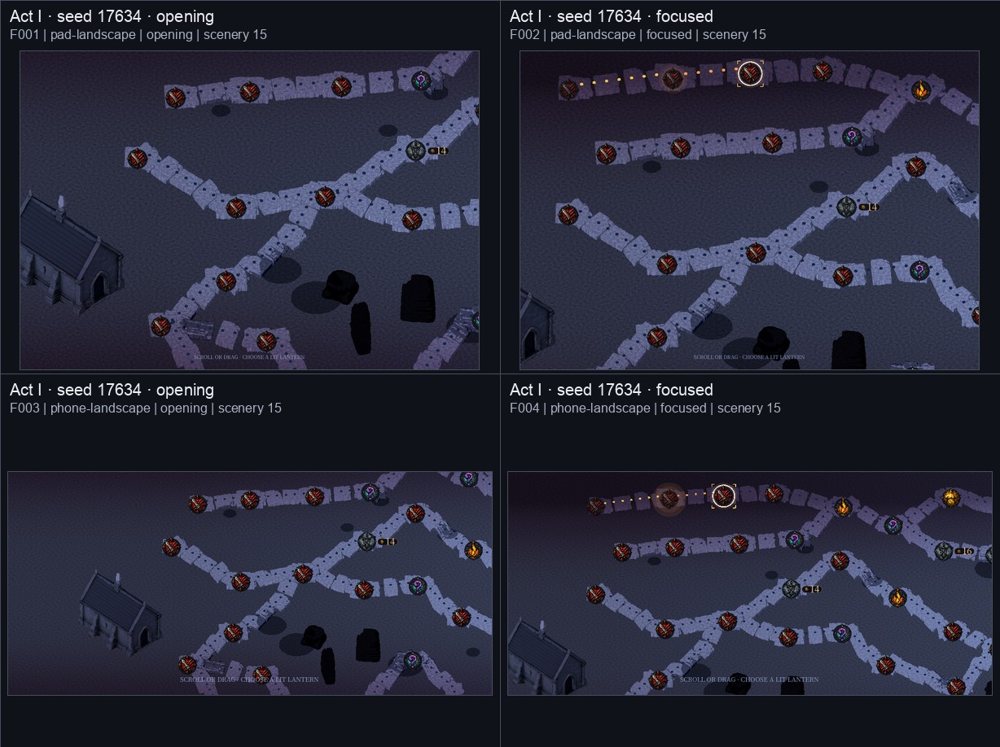
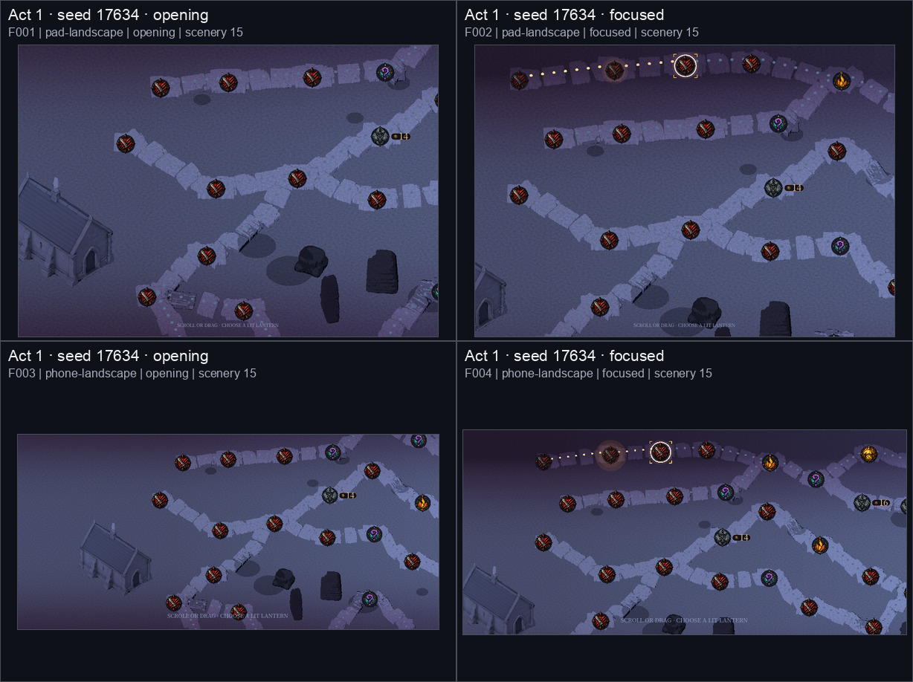
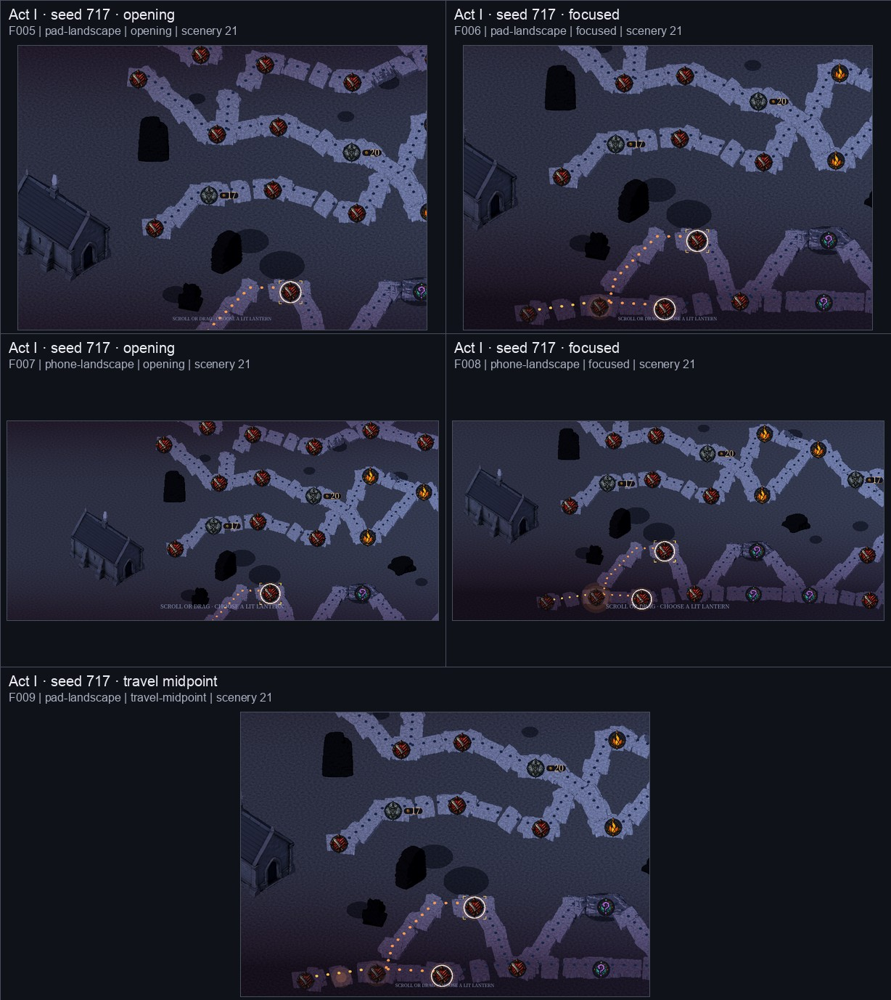
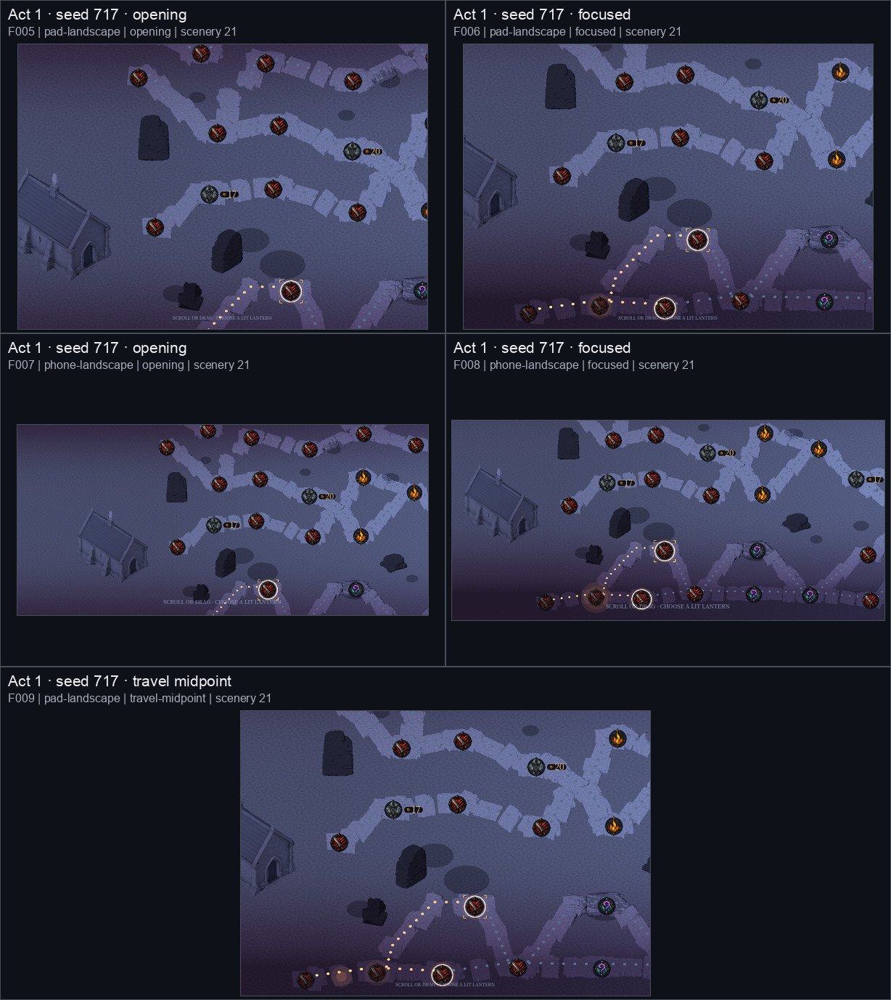
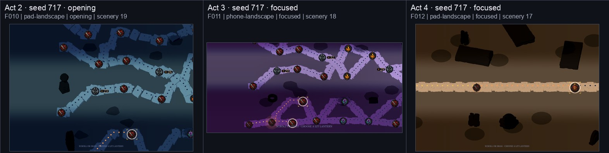
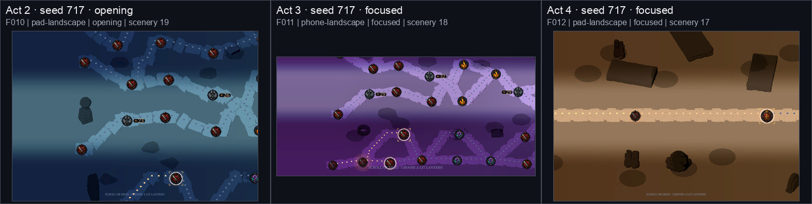

# Issue #461 Stage 1 — scenery Forward Mobile recapture

**Status: Stage 1 evidence only. #461 stays OPEN. This packet makes no
commercial-grade claim. Stages 2 and 3 were not started.**

This packet recaptures the existing scenery-compiler working-tree candidate on
the project's shipping Forward Mobile backend. It repeats the five compiler
inputs and twelve frames used by `docs/reviews/529/` and
`docs/reviews/461-scenery/`.

## Provenance

| Item | Value |
| --- | --- |
| #529 comparison | `docs/reviews/529/` |
| Compatibility comparison | `docs/reviews/461-scenery/` |
| Candidate base and capture head | `c28ae38824f7ba2168b573002ab8b90dadd5bde1` |
| Candidate tracked-diff SHA-256 | `9de47eef17c91b1b30991762e8c867fb074e243c1d66c41dd513654cbc8d642a` |
| Godot CLI | `4.7.2.stable.official.ed1daf0bf` |
| Runtime renderer | macOS Metal, Forward Mobile (`mobile`) |
| Runtime method source | `RenderingServer.get_current_rendering_method()` |
| Project shipping method | `mobile` |
| Command that executed | `tools/capture_build4_map_corpus.sh --output docs/reviews/461-scenery-mobile` |
| Process result | Exit 0; 12 of 12 frames; 5 of 5 compiler inputs |
| Capture runtime | 846.211 seconds |
| Locale | `en` |
| Asset manifest SHA-256 | `bd9f8566c8395113fd01a4be8a5b56ccf92e14218e83012ba547828c966dc0fd` |
| Capture manifest SHA-256 | `5f1fd5382e35ad378d41678285351a000a026992f534d25a76f0824afd4325ff` |

The local capture-harness patch moved its source guard from the stale
`52a56e72…` snapshot to the candidate base, added an exact guard for the
candidate's pre-existing tracked diff, removed the forced GL Compatibility
override, and recorded the runtime method from `RenderingServer`. The command
above is the command that then ran. No candidate production file was changed by
this Stage 1 work.

## Stage 1 checks

| Check | Result | Evidence |
| --- | --- | --- |
| T1 | **PASS** | Manifest records runtime `mobile` from `RenderingServer.get_current_rendering_method()`; it equals the project shipping method `mobile`. |
| T2 | **PASS** | The command shown under Provenance executed at the full head shown there, with no rendering-method override, and exited 0. |
| T3 | **PASS** | All five layout digest strings are byte-equal to `docs/reviews/461-scenery/`; counts are unchanged and remain inside 14–24. |
| T4 | **SKIPPED** | Stage 2 only. |
| T5 | **SKIPPED** | Stage 2 only. |
| T6 | **REPORTED, NOT GRADED** | Prop median 36.6578; ground median 75.3156; ratio **0.486723**. Method and fixed ROIs are in `analysis/t6-luminance.json` and `analysis/t6-roi.svg`. |
| T7 | **PERFORMED** | All twelve rendered frames were inspected at packet resolution across pad/phone, opening/focused/travel-midpoint, on runtime `mobile`. The owner-eye gate remains open. |

### T3 layout identity

| Act | Seed | Layout digest | Scenery count |
| --- | ---: | --- | ---: |
| I | 17634 | `5a7d6a435082707594c9ec56f6c321291fbba42133622a73997ed3fa298b3545` | 15 |
| I | 717 | `9b182e7c36d840c8850d8df62dbb01485ce90eacab6d7ce3684a24319f0d8091` | 21 |
| II | 717 | `6d5bd644c02867b8e316d4b0f0442d24720719e088a622ff0f9609ddd14089c7` | 19 |
| III | 717 | `54341c63a16c278dc1e807aa0cf32800838437d9b340c79a3e8b800e848ae75d` | 18 |
| IV | 717 | `a995141403bf08da65221c1e2e0837884484508132123c0c51853a7b296dcf5c` | 17 |

The twelve frame keys and all five compiler input digests also remain equal to
both comparison packets. Every recorded corridor, node, node-touch, Vigil and
terminus hard-zero metric is zero.

### T6 report

T6 uses the Act I seed 717 pad opening frame. Two equal 50 × 80 pixel rectangles
sit wholly inside the upper-left compiled monolith and adjacent unobstructed
ground at the same vertical span. Display-referred 8-bit RGB luminance uses Rec.
709 coefficients. The ratio is reported only:

| Capture | Prop median | Ground median | Prop/ground |
| --- | ---: | ---: | ---: |
| `main` Mobile baseline from the lock | 37.4 | 77.0 | 0.486 |
| #529 packet baseline from the lock | 37.7 | 95.9 | 0.393 |
| `461-scenery` Compatibility baseline from the lock | 7.1 | 52.2 | 0.137 |
| **This Stage 1 Forward Mobile packet** | **36.6578** | **75.3156** | **0.486723** |

No numeric acceptance bar is inferred from this result.

### T7 inspection observations

- On Forward Mobile, the compiled scenery retains visibly separate lit top,
  mid front and dark side faces instead of the Compatibility packet's near-flat
  black collapse.
- Routes and waystone silhouettes remained readable in all twelve inspected
  frames. Pad and phone opening/focused views and the Act I travel midpoint were
  inspected from the rendered results.
- Some phone-scale props and faces in Acts II–IV remain very dark. This packet
  records that observation rather than treating the backend correction as an
  owner verdict.
- Fixed painted contact ellipses are still visibly detached from some compiled
  props, while some props have no matching ellipse. That is the known Stage 2
  concern; T5 was not run or graded here.

## Before and after

### Act I — seed 17634

| #529 Forward Mobile baseline | Scenery candidate on Compatibility | Stage 1 candidate on Forward Mobile |
| --- | --- | --- |
|  |  |  |

Stage 1 sheet SHA-256:
`16e533afe579ae5151426f4bc519cdb8075fbfe8ffc15226195dd3c2a81e97b2`

### Act I — seed 717 and travel midpoint

| #529 Forward Mobile baseline | Scenery candidate on Compatibility | Stage 1 candidate on Forward Mobile |
| --- | --- | --- |
|  |  |  |

Stage 1 sheet SHA-256:
`89ec8a281bd7a60f59f86e204dbd46b53fbf6baf4d6bf1829462a41c7c378adb`

### Acts II–IV — seed 717

| #529 Forward Mobile baseline | Scenery candidate on Compatibility | Stage 1 candidate on Forward Mobile |
| --- | --- | --- |
|  |  |  |

Stage 1 sheet SHA-256:
`9579949ca02562767dda3f091e5a14bc31af847f93ce5cdeef3d0131307712c4`

## Verification and boundaries

The capture-script GDScript change was staged before the gates. Results:

| Gate | Result |
| --- | --- |
| `godot --version` | `4.7.2.stable.official.ed1daf0bf` |
| `tools/check_imports.sh` | `asset import OK` |
| `tools/check_scripts.sh` | `scripts OK (255 checked)` |
| `godot --headless -s res://tests/run_all.gd` | Exit 0; `PASS (73 tests)` |
| `python3 tools/check_benchmark_freeze.py` | `benchmark citations frozen (601 in 54 file(s))` |
| `python3 tools/check_anchors.py` | Exit 1 on three pre-existing pathless references in untracked `docs/reviews/461/remaining-commercial-gap.md` (lines 62 and 209); no packet or capture-harness finding |
| `git diff --check` | Exit 0 |

`verification.json`, `dimensions.json`, `pixel-hashes.json`, the twelve raw
PNGs and the reproducible analysis scripts remain in this packet. No commit,
push or merge was made; no issue state or owner communication was changed.

**Capture blockers: none.** The stale drift guard and forced Compatibility
backend were corrected locally in the capture harness before the successful
run. Godot was not busy, and no authentication was needed. The supplemental
repo-wide anchor gate remains red on the three pre-existing pathless references
listed above; they were outside Stage 1 and were left untouched.
