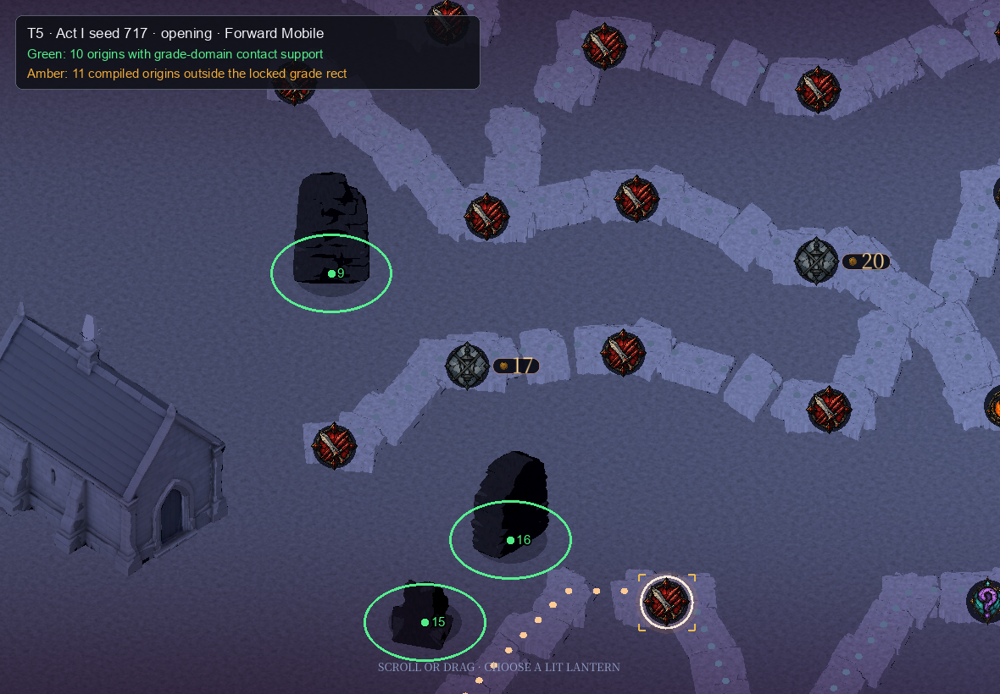
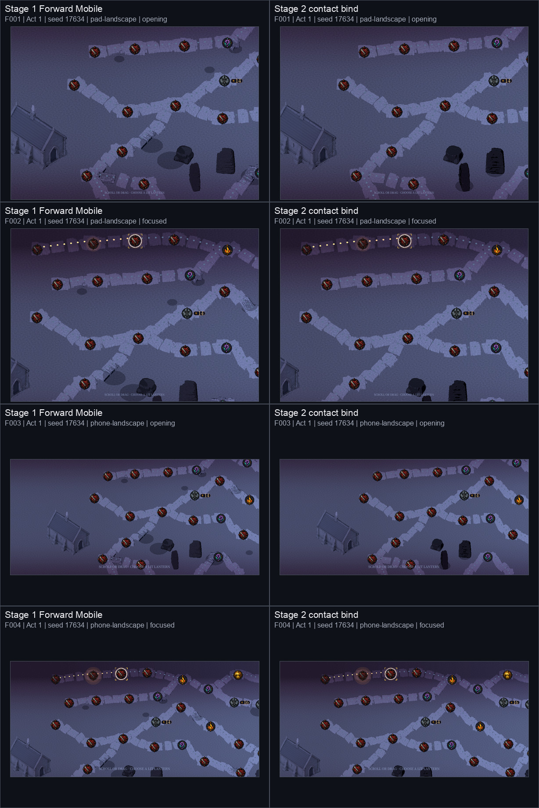
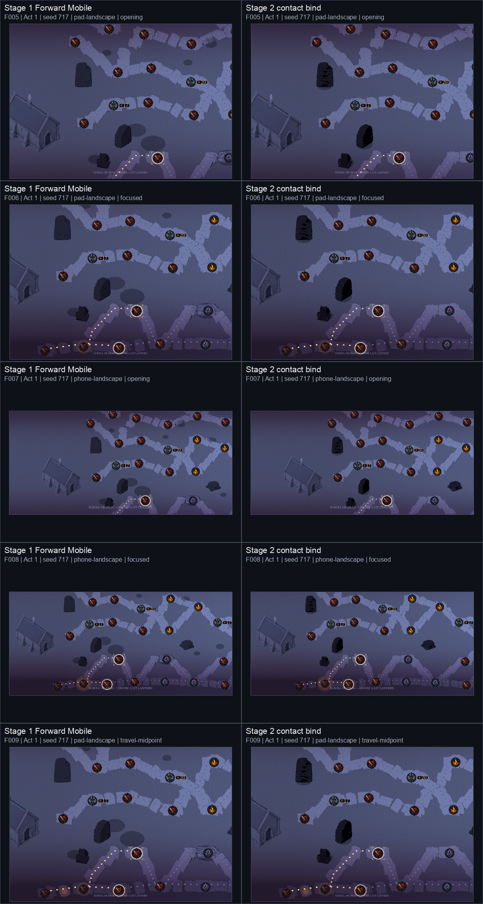
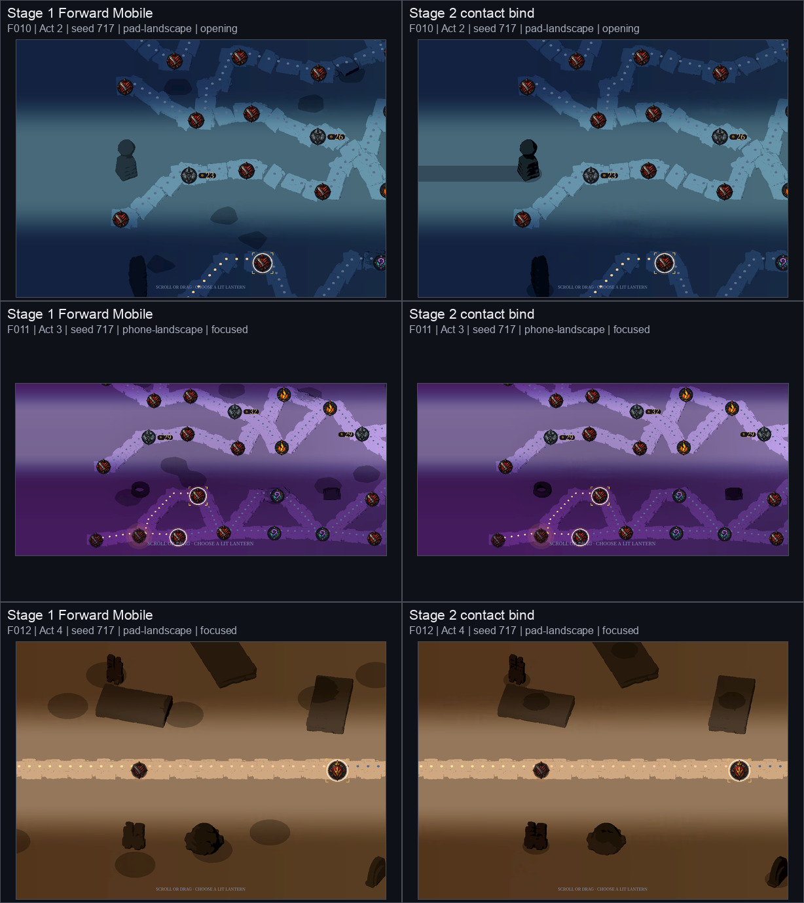

# Issue #461 Stage 2 — compiled scenery contact bind

**Status: Stage 2 implementation and evidence only. #461 stays OPEN. T7 remains
an owner-eye decision, no commercial-grade claim is made, and Stage 3 was not
started.**

This packet isolates the Stage 2 contact-alpha change from the Stage 1 Forward
Mobile correction in `docs/reviews/461-scenery-mobile/`. Painted grade RGB is
retained at source resolution; only alpha is rebuilt from the compiler-owned
`scenery_instances` origins whenever `_place_scenery` runs.

## Provenance

| Item | Value |
| --- | --- |
| Comparison packet | `docs/reviews/461-scenery-mobile/` (copied byte-for-byte from the read-only candidate tree) |
| Base | `c28ae38824f7ba2168b573002ab8b90dadd5bde1` |
| Implementation and capture head | `ca1057f2bbe25654c5f6add28f59e6b7e0115bc5` |
| Local branch | `codex/461-stage2-scenery-contact` |
| Local implementation commit | `ca1057f` — `feat(map): bind compiled scenery contact grade` |
| Placement compiler SHA-256 | `49002f94bb0a1ee16bfbe3a4b33e38ee12d5233d4c699ba478545e3ff9cdd3ca` |
| Godot | `4.7.2.stable.official.ed1daf0bf` |
| Runtime renderer | macOS Metal, Forward Mobile (`mobile`) |
| Runtime method source | `RenderingServer.get_current_rendering_method()` |
| Project shipping method | `mobile` |
| Command that executed | `docs/reviews/461-scenery-stage2/run_capture.sh` |
| Rendering override | None |
| Capture result | Exit 0; 12 of 12 frames; 5 of 5 compiler inputs |
| Capture runtime | 1123.804 seconds |
| Locale | `en` |
| Asset manifest SHA-256 | `bd9f8566c8395113fd01a4be8a5b56ccf92e14218e83012ba547828c966dc0fd` |

`harness-manifest.json` is the unchanged Stage 1 harness output. The packet's
`manifest.json` promotes that observed capture to Stage 2, records the real
base/head comparison, and adds the preflight and grade-domain coverage facts.

## Decode preflight

The bounded preflight passed on this Godot build:

| Observation | Value |
| --- | --- |
| Runtime resource | `CompressedTexture2D` |
| Source and `get_image()` size | 512 × 256 |
| Before decode | compressed; format value 22 |
| `Image.decompress()` | `OK` |
| After decode | 512 × 256, `FORMAT_RGBA8` (format value 5) |

The implementation therefore caches decoded painted RGB once per `bind_act`,
normalises its alpha, duplicates that image for each layout bind, and rewrites
only alpha through the existing 0.18 / 0.35 / 1.75 falloff. It neither reads a
source PNG directly nor introduces a second grade sampler.

`WorldMapScreen.refresh()` calls `_map_scene.set_act()` and then
`_bind_compiled_layout()` synchronously inside `_set_act_theme()`. The empty
contact bind and the compiled-origin rebind therefore complete before the next
process frame; no un-contacted frame is presented between them.

## Stage 2 checks

| Check | Result | Evidence |
| --- | --- | --- |
| T1 | **PASS** | Runtime `mobile` is recorded from `RenderingServer.get_current_rendering_method()` and equals the project shipping method. |
| T2 | **PASS** | The command above executed at the full head above, without a renderer override, and exited 0. |
| T3 | **PASS** | All five layout digests and all five hard-zero dictionaries are byte-equal to Stage 1; occupancy remains 15–21 inside 14–24. |
| T4 | **PASS** | The full suite includes the isolated alpha contract: in-domain floor, far unity, no orphan alpha, compact/full byte equality, and empty unity. |
| T5 | **PASS** | Act I seed 717 opening overlay reports **0 orphan contact ellipses**. Each of the three visible contact ellipses contains its projected compiled origin. |
| T6 | **REPORTED, NOT GRADED** | Prop median 23.0108; ground median 75.3156; ratio **0.305525** using the unchanged Stage 1 ROIs. |
| T7 | **FRAMES CAPTURED; OWNER EYE PENDING** | Twelve Forward Mobile frames are present. Several Act I and Act II faces remain silhouette-dark, so this packet does not close the owner-eye gate and does not enter Stage 3. |

### T3 layout identity

| Act | Seed | Layout digest | Scenery count |
| --- | ---: | --- | ---: |
| I | 17634 | `5a7d6a435082707594c9ec56f6c321291fbba42133622a73997ed3fa298b3545` | 15 |
| I | 717 | `9b182e7c36d840c8850d8df62dbb01485ce90eacab6d7ce3684a24319f0d8091` | 21 |
| II | 717 | `6d5bd644c02867b8e316d4b0f0442d24720719e088a622ff0f9609ddd14089c7` | 19 |
| III | 717 | `54341c63a16c278dc1e807aa0cf32800838437d9b340c79a3e8b800e848ae75d` | 18 |
| IV | 717 | `a995141403bf08da65221c1e2e0837884484508132123c0c51853a7b296dcf5c` | 17 |

Every recorded corridor, node, node-touch, Vigil and terminus hard-zero metric
is both equal to Stage 1 and zero.

### T4 grade-domain coverage

Act I seed 717 has 21 compiled origins. Ten world XZ positions are inside the
locked grade rectangle and therefore have a containing texel; all ten reach the
contact floor in clause 1. The other **11 of 21** origins lie outside the locked
grade sampler domain. They have no containing texel, so this is a coverage fact,
not a bake failure, and neither the rectangle nor placement was changed.

All 21 origins remain inputs to the other clauses. Compact support is byte-equal
to the full-image walk, far texels remain unity, every non-unity texel is within
1.75 m of an origin, and an empty origin set remains unity everywhere.

### T5 projected-origin overlay

Green rings project each visible in-domain origin and its 1.75 m world support
through `MapScene.project_anchors(...)`. Amber denotes compiled origins outside
the grade domain; those origins are outside this opening frame. The three visible
ground contacts contain green centre marks, and no detached painted ellipse
remains in open ground. Machine-readable projection and inspection records are
in `analysis/t5-projections.json` and `analysis/t5-inspection.json`.

### T6 report

The fixed 50 × 80 pixel Stage 1 ROIs and Rec. 709 display-referred luminance
calculation are unchanged:

| Capture | Prop median | Ground median | Prop/ground |
| --- | ---: | ---: | ---: |
| #529 baseline from the lock | 37.7 | 95.9 | 0.393 |
| `461-scenery` Compatibility baseline from the lock | 7.1 | 52.2 | 0.137 |
| Stage 1 Forward Mobile | 36.6578 | 75.3156 | 0.486723 |
| **Stage 2 Forward Mobile** | **23.0108** | **75.3156** | **0.305525** |

This number is reported only; no numeric acceptance bar is inferred.

## Stage 1 versus Stage 2

### Act I seed 17634

SHA-256:
`07c450b74ef54a29d652cb39ec71cde96715a0d51977aef3732bb1e54a84cac2`

### Act I seed 717, including travel midpoint

SHA-256:
`c7385066531deea14bfcb3cf800c47c59747975bab833e167d91f3871c476a56`

### Acts II–IV seed 717

SHA-256:
`eed55f5bdd8f43dfb10d166cd87d547802c9febbaf7586f303901a72e7b70033`

The matched sheets show the fixed painted ellipses disappearing from open
ground and compact contacts moving under the compiled pieces. They also retain
the dark-face evidence needed for the still-open owner eye.

## Verification and boundaries

| Gate | Result |
| --- | --- |
| `godot --version` | `4.7.2.stable.official.ed1daf0bf` |
| `tools/check_imports.sh` | `asset import OK` |
| `tools/check_scripts.sh` | `scripts OK (256 checked)` |
| `godot --headless -s res://tests/run_all.gd` | Exit 0; `PASS (74 tests)` |
| `python3 tools/check_anchors.py` | `anchors OK` |
| `python3 tools/check_benchmark_freeze.py` | `benchmark citations frozen (601 in 54 file(s))` |
| `git diff --check` | Exit 0 |
| `analysis/verify_packet.py` | Exit 0; T1–T5 pass, T6 reported, T7 owner pending |

The dummy headless renderer's expected stderr diagnostics remain in
`logs/run-all.log`; the suite is graded by exit code and its final PASS line.
Supplemental anchor and detached-reference freeze results are also retained in
`logs/`.

`GRADE_MIN`, `GRADE_SIZE`, `GROUND_VALUE`, `PROP_VALUE`, shaders and assets are
unchanged. The compiler is byte-equal to the supplied placement slice at the
locked SHA-256. No push, PR, merge, issue closure, Stage 3 work or owner verdict
was performed.
